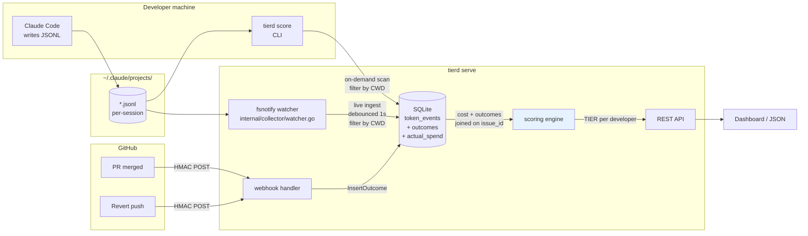
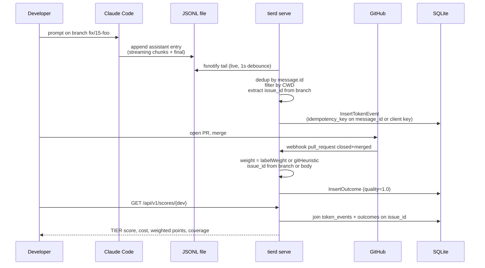

# TIER — How It Works Today

**Grounded in:** the source in this repository. Every behavior below is anchored to a named file, symbol, or issue number rather than a line number or commit hash, so each claim stays checkable against the code you have checked out.

**Audience:** engineers evaluating whether TIER is ready to run on their own repository.

**Tone:** what it does, what it doesn't, no marketing.

---

## Table of contents

1. [What this tool does in one sentence](#1-what-this-tool-does-in-one-sentence)
2. [What LLMs it works for](#2-what-llms-it-works-for)
3. [How it captures the amount of tokens being used](#3-how-it-captures-the-amount-of-tokens-being-used)
4. [How it assigns functionality (outcome attribution)](#4-how-it-assigns-functionality-outcome-attribution)
5. [How it gives purpose (linking cost ↔ outcome)](#5-how-it-gives-purpose-linking-cost--outcome)
6. [How it says "this many tokens + this much code = this much value"](#6-how-it-says-this-many-tokens--this-much-code--this-much-value)
7. [How it scores task size and complexity](#7-how-it-scores-task-size-and-complexity)
8. [How it all comes together](#8-how-it-all-comes-together)
9. [Is it ready to dogfood?](#9-is-it-ready-to-dogfood)

---

## 1. What this tool does in one sentence

TIER captures the dollar cost of every AI API call a developer makes, attributes each call to a GitHub issue via the branch name, and (once outcomes flow in from GitHub) divides shipped outcomes by AI dollars spent to produce a per-developer "TIER score."

> **Verdict today:** Per-developer **cost attribution** works end-to-end on this repo. As of #18, `tierd serve --watch-repo <path> --aggregation developer` ingests Claude Code JSONL live via fsnotify, so the dashboard updates as you work. (`--aggregation team|developer` is **required** — serve refuses to start without it, #185.) The outcomes side still needs three manual ops steps before live TIER scores flow: stand up `tierd serve` on a public URL (ngrok / Tailscale-funnel), configure the GitHub webhook on the target repo, set `TIER_WEBHOOK_SECRET`. So today: live **cost** attribution is dogfoodable as-is; live **TIER scores** are one ops session away.

---

## 2. What LLMs it works for

Two axes matter: which provider, and which capture path.

| Provider                | Local session logs        | Reverse proxy             | Manual REST | Status              |
| ----------------------- | ------------------------- | ------------------------- | ----------- | ------------------- |
| Anthropic (Claude API)  | Yes — Claude Code JSONL (default) | Yes (JSON + SSE on #14)   | Yes         | **Works in v1**     |
| Codex CLI (OpenAI)      | Yes — rollout logs ¶      | Parser exists, **never live-verified** — Responses API (JSON + SSE, #459 task 2) ¶ | Yes | **Works in v1** (`collectors.codex_rollout` / `--codex-rollout`, #464) |
| OpenAI / xAI / DeepSeek | n/a                       | Yes (JSON; SSE on #14) †  | Yes         | **Works in v1**     |
| Google Gemini           | n/a                       | Yes (JSON + SSE) ‡        | Yes         | **Wired, live-unverified** (#459 task 4 — route mounted; no live Gemini traffic has hit it yet) |
| Self-hosted (vLLM etc.) | n/a                       | Yes via OpenAI-compat †   | Yes         | **Works in v1**     |
| Anthropic Admin API     | —                         | —                         | —           | **Works in v1** (org-level poller, `collectors.anthropic_admin`, #138) |
| OpenAI Usage API        | —                         | —                         | —           | **Works in v1** (org-level poller, `collectors.openai_usage`, #139) |
| Cursor                  | —                         | —                         | —           | Deferred to v1.5    |
| GitHub Copilot          | —                         | —                         | —           | Deferred to v1.5    |
| ChatGPT Team / Plus     | —                         | —                         | —           | Deferred to v1.5    |

> **† One OpenAI-compatible upstream at a time.** The proxy exposes a single `/openai/` mount backed by one `openai_target`. Capturing xAI, DeepSeek, or a self-hosted OpenAI-compatible endpoint means **repointing** that single `openai_target` at it — not running it *alongside* OpenAI on a second route.
>
> **‡ Gemini's route is now mounted (JSON and SSE), but no live Gemini traffic has verified it (#459 task 4).** `tierd serve` mounts `/gemini/` (`--gemini-target` / `proxy.gemini_target`, default `https://generativelanguage.googleapis.com`) through the same `registerProxy` path as `/anthropic/` and `/openai/`, wired onto the `parseGemini` / `geminiStreamParser` pair (`internal/proxy/proxy.go`, `internal/proxy/sse.go`) that has existed since v1 (#1), gained thinking/cache-token handling in #122 and host stamping in #300, and has been unit-tested against synthetic bodies the whole time. What changed: pointing a Gemini SDK at TIER no longer 404s. What has NOT changed: no request has ever round-tripped through the mounted route to a real `generativelanguage.googleapis.com` response — that live proof is a credential-gated integration test (`TestLive_GeminiProxy_RealCompletion`, skips loud without `TIER_LIVE_GEMINI_KEY`) that has not been exercised against a real key yet. Treat it as structurally complete, not field-proven. (Manual REST `POST /api/v1/costs` can still import Gemini spend regardless.)
>
> **Admin / Usage pollers are org-level.** The two poller rows (#138 / #139) are opt-in `collectors:` config blocks that poll each provider's org usage/cost API on a settled-day cadence, write coverage-remainder `token_events` (the gap between realtime capture and the provider aggregate) and reconcile `org_actual_spend` deltas. They are org-spend reconciliation feeds, **not** per-developer real-time capture.
>
> **¶ Codex is captured from local logs.** That is the supported path and the only one verified against real Codex data: Codex writes per-session rollout logs to `~/.codex/sessions/YYYY/MM/DD/rollout-*.jsonl`, and `collectors.codex_rollout` (or `--codex-rollout`) reads them directly — local, per-developer, per-call, no credential and no env-var change (#464). Until #459 task 2 the proxy could not have captured Codex under any configuration: Codex speaks the OpenAI **Responses** API (`input_tokens` / `output_tokens`), while both OpenAI proxy paths read only the **Chat Completions** usage shape (`prompt_tokens` / `completion_tokens`), so a Codex response routed through `/openai/` yielded **no** `TokenEvent` (#463). The proxy now parses the Responses shape on both paths, but that changes little for Codex in practice and nothing about the recommendation: it captures only traffic you deliberately point at the proxy with API-key auth (ChatGPT-subscription auth never traverses it), and **no live Responses response has ever reached that parser** — its fixtures are synthetic, and #459 task 3 (credential-blocked) is what would verify it. Use the rollout logs.

**Why Claude is special.** Claude Code writes a per-session JSONL log to `~/.claude/projects/**/*.jsonl` automatically. TIER reads those files — zero configuration, no proxy in front, no env-var change for the developer. That's the "Day 1" capture path.

**Codex works the same way.** Codex also writes local session logs, so it gets the same zero-configuration treatment: enable `--codex-rollout` and TIER reads `~/.codex/sessions/**/rollout-*.jsonl` directly (#464). It is scoped to the same repository targets as the Claude Code watcher — `--watch-repo` under `serve`, `--repo` under `ship` — so a Codex session run in another repo on the same machine is dropped rather than mis-attributed. It inherits the same `--repo-slug` overrides too (#231), which is what keeps a fork's Codex and Claude Code rows on one repo identity instead of splitting its cost in two.

**Why everything else needs the proxy.** Cursor (when using API keys) and any custom OpenAI/Anthropic SDK consumer don't emit local logs. To capture them you point `ANTHROPIC_BASE_URL` / `OPENAI_BASE_URL` at `tierd serve`, which acts as a transparent reverse proxy and reads `usage` blocks off the wire. (A Gemini client can be pointed at `tierd serve`'s `/gemini/` mount the same way — retarget its base URL — but Gemini authenticates upstream with an `x-goog-api-key` header or a `?key=` query parameter rather than an env var — prefer the header, since a `?key=` value can land in the access logs of anything in front of tierd (see the README's proxy section) — and this path is structurally complete and not yet live-verified; see the ‡ note above. Codex is **not** capturable this way at all; see ¶.)

**What the org-level pollers cover.** The Anthropic Admin and OpenAI Usage pollers (#138 / #139) **shipped**: opt-in `collectors:` config blocks poll each provider's org usage/cost API, backfill coverage-remainder `token_events`, and reconcile `org_actual_spend`. Cursor/Copilot/ChatGPT Team remain deferred — they don't expose per-developer real-time token counts, only seat invoices, so seat-cost imputation is still a separate, contained ticket on the roadmap.

---

## 3. How it captures the amount of tokens being used

Four capture paths feed one table: `token_events`. The schema is at `internal/store/store.go:16-30`.

### 3a. JSONL (Claude Code, default)

Two entry points share `parseSessionFile` / `joinSessionsToCommits`, so both produce byte-identical rows for the same input:

- **On-demand scan** — `JSONLCollector.Collect` at `internal/collector/jsonl.go`, invoked by `tierd score`. Walks `~/.claude/projects/` once, parses every file under `since`, exits. As of #27 this is a thin wrapper around `JSONLCollector.Run(ctx, since, ingester)` — the push form new collectors should follow. The shared `collector.Ingester` interface (`internal/collector/collector.go`) has one method `Ingest(ctx, TokenEvent) error`; the production adapter `ingester.Store(*store.DB)` lives in `internal/ingester` and forwards each event to `InsertTokenEvent` after a field-by-field copy. The shipped org-level pollers (Anthropic Admin #138, OpenAI Usage #139) plug in this way — they implement `Run(ctx, since, ingester)` and reuse the same store adapter; the deferred Copilot/Cursor collectors will follow the same shape. Today Run materialises the full event slice before forwarding — at JSONL scale that's fine; a future streaming collector (paginated admin-API polling) would emit events as they're produced.
- **Live tail** — `collector.Watcher.Run` in `internal/collector/watcher.go`, started by `tierd serve --watch-repo <path> --aggregation developer` (closes #18; `--watch-repo` is repeatable for multi-repo developers; `--aggregation` is required, #185). Subscribes to `~/.claude/projects/` via fsnotify, attaches new subdirs dynamically as Claude Code creates them, debounces rapid writes (1 second; a single streaming response writes 30-50 times per second), parses the affected file on quiescence. Re-parses are safe because the SQLite INSERT uses `ON CONFLICT DO UPDATE` with per-field `MAX`, so a session's growing totals replace the prior row's smaller values instead of being silently dropped (this also lets the proxy and JSONL paths share the same INSERT statement without behavior change).
- **Incremental tailing** (closes #30). The watcher caches `{offset, inode, head-CRC, sessionMetadata}` per file across debounces and reads only the bytes appended since the last parse (`parseSessionFileFromOffset` in `internal/collector/jsonl.go`). On a 10 MB session, per-debounce cost drops from **~79 ms / 51 MB allocated / 605k allocs** (full reparse, `BenchmarkParseSession_FullReparse`) to **~11 µs / 5.7 KB / 28 allocs** (incremental, `BenchmarkParseSession_Incremental`) — a ~7,000× speedup on the development machine; the order-of-magnitude story is the point, exact ratios vary with hardware. Full re-parse triggers on inode change (log rotation), size shrink (truncation), or first-`headFingerprintBytes` CRC32 mismatch (truncate-and-rewrite-to-similar-size that would otherwise sneak past the size check). Partial trailing lines (writer mid-flush) are not consumed; the cached offset stays put until the terminating `\n` arrives on the next debounce. Per-path serialization in the debounce timer prevents two callbacks for the same path from racing on the cached offset. Incremental tailing state is in-memory only — a `tierd serve` restart full-re-parses every file; the store's per-message `IdempotencyKey` (#19) + `MAX`-on-conflict UPSERT (#18) absorb the re-emitted events. The CLI's on-demand `parseSessionFile` wrapper bypasses tail-mode trimming so static log inspection still consumes a final line that lacks a trailing newline.

Both paths share these guarantees:

- `bufio.Scanner` with a 10 MB line buffer so an oversized line can't stall or infinite-loop the file (fix for #7).
- **Dedup by `message.id`** inside each session file. Claude Code emits one assistant entry per streaming chunk *and* a final post-stream entry, all sharing the same `message.id`. The placeholder chunks carry partial/zero token counts. Largest-total wins; ties resolve later-wins. This fixes the 10-17x output undercount documented by gille.ai in April 2026 (closes #6).
- **Cross-repo bleed filter**: `filterSessionsByRepo` keeps only sessions whose `cwd` is at or beneath a target repo path (closes #15). The watcher uses the same four-way symlink-aware match in `cwdMatchesAnyTarget` (`watcher.go`). Without this filter, every Claude Code session on the machine got attributed to whichever repo `tierd score` was pointed at — the bug that made this repo report $35,251 of fake cost vs. the real $45.97.
- **Branch → issue id** via `issueref.FromBranch`. The on-demand path additionally joins to the git log within a ±30 min window; the live path skips the git lookup because a session is usually mid-stream when it lands, before any commit exists yet.
- **Per-message TokenEvents** (closes #19). `joinSessionsToCommits` emits one event per assistant `message.id`, not one per session. Each event carries `IdempotencyKey = MessageIdempotencyKey("anthropic", message_id)` — the exact format the proxy uses for the same upstream call. A Claude session captured by both JSONL and the proxy emits identical keys and dedupes on the partial unique index in SQLite.

### 3b. Codex rollout logs (Codex CLI, opt-in)

- Entry point under `serve`: `codexrollout.Collector.Run` at `internal/collector/codexrollout/`, enabled by `--codex-rollout` (env `TIER_CODEX_ROLLOUT`) or the `collectors.codex_rollout` config block. Re-scans `~/.codex/sessions/YYYY/MM/DD/rollout-*.jsonl` every `scan_interval` (default 5 m, floor 30 s). No credential; no env-var change for the developer. The **first** pass backfills every rollout log on disk; after that a **scan cursor** bounds each pass to the files touched since the previous one (plus a two-interval safety overlap), so the per-tick work tracks what changed rather than how much Codex history the machine has. The cursor advances only after a pass's events have all been ingested — an aborted ingest re-scans rather than dropping the tail.
- Entry point under `ship`: `Collector.Collect`, **not** `Run` — one stateless pass over the whole `--since` window, no interval and no cursor, because `Run` loops until cancellation and would hang a cron job forever. A `ship --codex-rollout` tick therefore re-walks the entire sessions tree every time and relies on server-side idempotency to dedup, which is the same stateless contract the Claude Code leg of `ship` already has (#492). `Collect` returns the events from the files that parsed **alongside** an error naming those that did not; `ship` forwards the good events and only then exits non-zero, so one corrupt rollout log cannot zero out a laptop's whole Codex spend.
- 🔴 **Do not enable this AND route Codex through the proxy.** Codex writes its rollout logs whether or not it is proxied, so a Codex call sent through `/openai/` with `--codex-rollout` on is captured **twice**, and the two rows cannot dedup: the proxy keys on the response id (`resp_*`), this collector keys on `(session id, ordinal)` because a rollout log carries no response id at all. Different keys, and the store dedups on the key alone — so the spend **doubles** rather than colliding. `tierd serve` warns at startup when both are enabled. Ordinary (non-Codex) OpenAI traffic through the proxy is unaffected.
- **This is the Codex capture path you should use, and the only live-verified one.** See the ¶ note in §2. Since #459 task 2 both proxy paths also parse the Responses shape — `parseOpenAIResponses` on the JSON path, `openAIResponsesStreamParser` on the SSE path Codex actually uses (Codex streams by default, and Responses SSE nests usage under the `response` object of a `response.completed` event) — but that parser has only ever run against synthetic fixtures, and reaching it requires pointing Codex at the proxy with API-key auth. The rollout logs need neither.
- **Per-call usage is DERIVED BY DIFFERENCING, never summed.** Each `token_count` event carries both a cumulative `total_token_usage` and a per-call `last_token_usage`. Summing the per-call field is wrong: Codex sometimes **re-emits** a `token_count` event, double-counting it. Measured on a real captured session (`internal/collector/codexrollout/testdata/rollout-duplicate-token-count.jsonl`), the cumulative series is `[17129, 37728, 58507, 58507, 80154, 101922, 124386]` — `58507` repeats. Summing `last_token_usage` gives **145,165** tokens against a true total of **124,386**: a 20,779-token, **17 % overcount** straight into the cost figure. Differencing consecutive cumulative snapshots gives per-call granularity, exactness (the deltas telescope to the cumulative total by construction), and automatic dedup (a re-emitted snapshot differences to zero) in one move. This is the same defect class as the Claude Code streaming-chunk duplication in §3a (#6), inverted. Guarded by `TestDuplicateTokenCountEventIsNotDoubleCounted`.
- **Containment invariants are FATAL, not warnings** — matching `score.py` in the `tiermetric/model-bench` repository, the reference implementation that priced the Codex half of the TIER Model Report. `total_tokens == input_tokens + output_tokens`; `cached_input_tokens ⊆ input_tokens`; `reasoning_output_tokens ⊆ output_tokens`; the cumulative series is non-decreasing; the cached *delta* never outruns the input *delta*; and — the one invariant that is absolute rather than relational — no cumulative count exceeds a 10¹²-token sanity ceiling, since a self-consistent but absurd snapshot would otherwise price to a clamped `MaxInt64` cost and overflow SQLite's integer `SUM()` on the read path. A log that violates any of them contributes **zero** events and is named in an error — a silently-wrong cost figure is worse than no figure. Healthy sibling sessions in the same scan are unaffected. A rollout that never names a model is likewise refused rather than priced at the self-hosted guess rate.
- **Token classes never overlap.** `cached_input_tokens` is carved out of `input_tokens` (`InputTok = input − cached`, `CacheRead = cached`), exactly as `parseOpenAI` does. `reasoning_output_tokens` is a **subset** of output and is never added on top. OpenAI publishes no cache-write SKU, so both write buckets stay zero; a nonzero `cache_write_input_tokens` warns once and is billed at the input rate it is already inside.
- **Idempotency**: `IdempotencyKey("codex-rollout", "openai", session_id, ordinal)`, where the ordinal is the `token_count` event's position in the file — stable across re-scans of an append-only log, including across the skipped zero-delta duplicates. Re-scanning collides on the partial unique index and stores one row per call.
- **Cross-repo bleed filter**: shares `collector.RepoScope` with **both** Claude Code paths — the batch scan (`filterSessionsByRepo`) and the live watcher (`matchTarget`) — so all three agree byte-for-byte on which sessions are in scope, including the four-way symlink match, the git-worktree fallback, and the multi-target precedence (`MatchScopes`: every target's direct containment is tried before any target's worktree fallback). Issue attribution shares `collector.IssueResolver` with the JSONL join, so a Codex event and a Claude event on the same branch resolve identically. A rollout captured outside a git checkout keeps its spend in the developer's denominator under a labeled unattributed bucket rather than dropping it.
- Malformed lines are skipped, not fatal — and because the collector differences *cumulative* snapshots, a dropped `token_count` line merges into the next delta, so the session **token** total stays exact and only the per-call split coarsens. Summing per-call values could never offer that. (Exactness is a token property, not a cost one: if the session switched models across a dropped snapshot, the merged delta is priced entirely at the later model's rate.) An **unterminated final line** is treated as a writer mid-flush and skipped silently — a live Codex session is always mid-write, and warning about it every scan would bury the warning that means real damage. A file that exceeds the 64 MB read cap is **failed**, not truncated: a prefix would be a silent under-report.

### 3c. Reverse proxy (Anthropic / OpenAI / Gemini direct)

- Entry point: `proxy.New` at `internal/proxy/proxy.go`; mounted under `/anthropic/`, `/openai/`, and `/gemini/` by `tierd serve` (`cmd/tierd/main.go`, #459 task 4 added the third).
- **JSON path**: `handleJSON`. Buffers the response (10 MB cap), parses with the per-provider unmarshaller, emits one `TokenEvent`. Three mounted parsers:
  - `parseAnthropic` — `msg_*` id, `usage.input_tokens` / `output_tokens` / cache fields. **Routed** (`/anthropic/`).
  - `parseOpenAI` — **two shapes on one route** (`/openai/`), discriminated from the payload by `openAIShape`, never from the request path. Chat Completions: `chatcmpl-*` id, `usage.prompt_tokens` / `completion_tokens`, optional `prompt_tokens_details.cached_tokens`. Responses (`/v1/responses`, what Codex speaks — #459 task 2): `resp_*` id, `usage.input_tokens` / `output_tokens`, optional `input_tokens_details.cached_tokens`. In **both** shapes the input total is INCLUSIVE of the cached count, so cached is carved out of input before pricing; `output_tokens_details.reasoning_tokens` is a subset of `output_tokens` and is deliberately not added (the opposite of Gemini's `thoughtsTokenCount`, which is excluded from its parent and must be). Anything not positively identified as the Responses shape parses exactly as it did before. **Live-unverified** for the Responses half — synthetic fixtures only, see §3b — which is why Codex still uses the rollout-log collector.
  - `parseGemini` — `responseId`, `usageMetadata.promptTokenCount` / `candidatesTokenCount`. **Routed** (`/gemini/`, #459 task 4, through the same `registerProxy` path as `/anthropic/` and `/openai/`), but **live-unverified**: the unmarshaller has existed and been unit-tested against synthetic bodies since v1 (#1, extended by #122 and #300), and the route is now mounted, but no live Gemini API response has ever reached it — that is a credential-gated integration test (skips loud without `TIER_LIVE_GEMINI_KEY`).
- **SSE streaming path**: `internal/proxy/sse.go` (PR #14, merged). Without this the proxy captures **zero** real-world traffic from Claude Code or Codex because they default to `text/event-stream`. The framer normalises `\r\n` / `\r` / `\n` line endings, concatenates multi-line `data:` fields, and emits at body Close with a 10 MB pending-buffer cap.
- **Per-response IdempotencyKey** (closes #9, refined in #19). Each response carries a stable id (Anthropic `msg_*`, OpenAI `chatcmpl-*`, and Gemini `responseId` — routed since #459 task 4, but not yet exercised by live traffic). The proxy hashes `(provider, id)` via `collector.MessageIdempotencyKey` — the same helper the JSONL collector uses for the same upstream call. The two paths emit identical keys, so a Claude call captured by both is stored exactly once.

### 3d. Manual REST

- `POST /api/v1/costs` (`internal/api/handler.go`). Plain JSON in, validated, written to `token_events`. Useful for batch imports, scripts, or systems that can't sit behind the proxy.
- Optional `idempotency_key` field on the request (closes #21). When supplied, retries with the same key dedupe on the partial unique index — identical re-submissions land as one row. When omitted, the row stores NULL and re-posts will duplicate (the previous behaviour, retained for back-compat with scripts that don't track keys).
- Body capped at 1 MiB via `http.MaxBytesReader`. `DisallowUnknownFields` rejects typo'd field names (e.g. `IdempotencyKey` instead of `idempotency_key`) so misnamed inputs surface as 400s rather than silently dropping.
- **Auth** (closes #22, #59): bearer-token gated. When `TIER_API_TOKEN` is set (or `--api-token` passed to `tierd serve`), the write endpoints (`POST /api/v1/costs`, `POST /api/v1/actual_spend`, `POST /api/v1/org_actual_spend`, `POST /api/v1/outcomes`, `POST`/`DELETE /api/v1/developer_alias`, `PUT`/`POST`/`GET /api/v1/org_hierarchy`, `POST /api/v1/period_membership/{developer}/end`, `DELETE /api/v1/developer/{id}`, `GET /api/v1/developer/{id}/export`) AND the sensitive score GETs (`GET /scores`, `/scores/{dev}`, `/metrics`, `GET /api/v1/org_actual_spend`, `GET /api/v1/developer_alias`) must carry `Authorization: Bearer <token>` — per-developer spend and the ranking are sensitive (#59). Constant-time compare; mismatched length and missing-header paths produce identical timing. Only the liveness/health probes (`/health`, `/healthz`, `/livez`) stay open. When the token is unset, the endpoints stay open and a startup warning logs — and `tierd serve` refuses any non-loopback bind in that state, so this is a loopback-only mode fine for laptop testing.
- **Read-only viewer token** (closes #190): `--read-token` (env `TIER_READ_TOKEN`, or `@/path/to/file`) is a SECOND bearer credential scoped to reads only. It is accepted on `GET /scores`, `/scores/{dev}`, `/metrics`, and the dashboard data, and rejected with `403` on every write endpoint and the reverse proxies. Hand it to a CFO/VP-Eng who needs the dashboard without the write/erase power the api-token confers — the least-privilege step short of SSO/OIDC (deferred with multi-tenancy, #65). It shares the api-token's secret provisioning exactly (flag, env, `@file`, and the `read_token` YAML key) and the same failed-auth lockout. Two safety rules: it must **differ** from the api-token (equal values are refused at startup, since a read token equal to the write token would grant writes), and a read token **alone does not** satisfy the fail-closed bind check — a non-loopback listener still requires the write api-token. Startup logs which scopes are armed (`API auth scopes write_armed=… read_armed=…`).
- **Brute-force lockout** (closes #36): defence-in-depth on top of the bearer gate. A per-IP failed-auth counter trips a `429 Too Many Requests` (with `Retry-After`) once an IP exceeds `--auth-max-failures` (default **10**) within `--auth-failure-window` (default **60s**); the IP stays locked for `--auth-lockout` (default **15m**). A *successful* auth clears that IP's counter, so an operator fat-fingering a token a few times is never affected. The gate sits in the shared auth middleware, so it protects **every** auth-gated route (the POST writes *and* the score GETs share one token — limiting only the POSTs would leave `GET /scores` as an unthrottled brute-force oracle). State is in-memory and resets on restart (sufficient for v1). Client IP is the TCP peer (`RemoteAddr`); `X-Forwarded-For` is deliberately **not** trusted — honoring it would let an attacker mint a fresh bucket per request. Set `--auth-max-failures 0` to disable. Behind a trusted reverse proxy, also rate-limit at the proxy.
- **Attribution integrity** (closes #34, #82): a manual REST row can only attribute itself to what it actually is. `source` is forced to `"api"` (an explicit `"jsonl"`/`"proxy"` is rejected with 400) so a client can't forge automated-capture provenance. `fidelity` may be `"daily"` or `"estimated"` and **defaults to `"estimated"`**; `"realtime"` is rejected with 400 because realtime attests a per-request exact capture that only the JSONL collector and proxy perform — letting a batch import claim it would fabricate high-fidelity capture and inflate the `fidelity='realtime'`-keyed Coverage % / Spend Leverage metrics. *Metric-correction note:* before #82 an omitted fidelity defaulted to `"realtime"`, so manual rows were mis-counted as realtime; Coverage % will legitimately **drop** for any caller that relied on that default.
- **Secret provisioning** (closes #37): never pass a literal secret as a flag value — `--api-token mytoken` / `--webhook-secret mysecret` leak the value to `ps aux` (any user on the host), shell history, and process-accounting logs. Use one of, in order of preference: (1) the `TIER_API_TOKEN` / `TIER_WEBHOOK_SECRET` env vars; (2) **`@file` indirection** — `tierd serve --api-token @/run/secrets/tier-token --webhook-secret @/run/secrets/tier-webhook` reads each secret from the named file (trailing CR/LF is trimmed, so `echo "$TOKEN" > file` works). The `@` prefix is what triggers the file read; a bare `@`, an unreadable/missing path, a non-regular file (directory, `/dev/*`), or a file that trims to empty is a fatal startup error — never a silently-empty (auth-disabling) secret. The literal-value form still works for throwaway laptop testing but is flagged in `--help`.
- **`/scores` always returns a `total` block** (closes #25): rollup computed server-side via `scoring.RollupTeam` across every developer in the response. Includes `tier`, `weighted_points`, `total_cost_usd`, `actual_paid_usd`, `spend_leverage`, `coverage_pct`. The dashboard reads it directly — no client-side reconstruction of team aggregates from rounded per-developer percentages (which the pre-#25 code did, losing precision on `coverage_pct`). When `?team=NAME` is set, a separate `team` block is added alongside `total` for the filtered subset; back-compat with the pre-#25 scoped-team workflow.
- **Team-only aggregation mode with a k-anonymity floor** (closes #185): a **REQUIRED** `--aggregation team|developer` setting (env `TIER_AGGREGATION`, config key `aggregation`) on `tierd serve` — there is **no silent default**, so serve refuses to start until an operator explicitly chooses, and an existing deployment's reporting posture can never change on upgrade by accident. In `team` mode, `GET /api/v1/scores`, the dashboard, and `GET /api/v1/scores/{developer}` **never** surface an individual developer name: `/scores` replaces the named `developers` rows with a `teams` array of `scoring.RollupTeam` aggregates (and emits `developers: []`), `/scores/{developer}` is blanket-`404`ed (identical for every path value, so it is not an existence oracle), and the plain-text `FormatReport` prints only the aggregate total. Any team with fewer than the k floor of **contributing** developers (non-zero outcomes/cost/paid — an idle allocated seat does not pad the count) collapses into an aggregate **"other"** bucket. ⚠️ **If that residual is ITSELF below the floor it is withheld entirely, and the grand total and cost-composition sidecar are withheld with it (#593)** — otherwise `total` minus the named rows would reconstruct the hidden cohort by subtraction. So in a suppressed response the visible rows deliberately do **not** sum to the window; the response says so via `data_quality.kanon_suppressed`. When the residual clears the floor it is emitted and totals reconcile as before. The floor is `--k-anonymity` (env `TIER_K_ANONYMITY`, config key `k_anonymity`), **default 5, hard minimum 3** — serve refuses a smaller value. This is DORA-style posture for EU works-council / GDPR Art. 22 co-determination regimes (see [docs/legal-and-privacy.md](legal-and-privacy.md)). The local `tierd score` CLI is a deliberate carve-out (single-operator, reads your own JSONL) and is **not** gated. **Composition with the #133 ranking floor:** the two suppressions are orthogonal and both apply — #133 suppresses a low-**sample** developer from the ranked leaderboard (a data-confidence signal), while #185 suppresses a sub-k **cohort identity** (a privacy signal). A developer can be both low-sample and in a sub-k cohort; in team mode their contribution rolls into "other" (or is withheld with it when that residual is sub-k, #593) while their name and their per-developer ranked/CI signal are not emitted at all. The #136 zero-token data-quality signal survives in team mode as a name-free aggregate `zero_token_outcome_count` (the per-developer list is suppressed).
- **Org-hierarchy write surface** (closes #232): populating `org_hierarchy` is a **REQUIRED onboarding step for `team` mode** — without it, every developer resolves to the unnamed team `""`, the k-anonymity floor renders the whole company as one anonymous row, and `org_actual_spend` allocation opens no `period_membership` seat and reads 0. Four bearer-gated (write-scope) admin endpoints, all of which resolve the developer through the `developer_alias` map first so hierarchy keys match the score-join's canonical keys (#125):
  - `PUT /api/v1/org_hierarchy/{developer}` — upsert one developer's `{team, division?, org?}`; `team` is required. Returns `200` with the stored (canonicalized) row.
  - `POST /api/v1/org_hierarchy` — **bulk import** a JSON array in **one all-or-nothing transaction** (mirrors `POST /api/v1/events`: the whole batch is validated first, any bad element `400`s naming its index, and nothing is written), so a 50-developer onboarding is one call. Returns `201 {"accepted": N}`.
  - `GET /api/v1/org_hierarchy` — list every assignment, developer-ordered.
  - `POST /api/v1/period_membership/{developer}/end` — close a departed developer's open seat in an org effective a `YYYY-MM` period (`{"org": "...", "period_end": "..."}`), so they stop diluting active members' `org_total` allocation for later periods. Idempotent (`200`; no-op when there is no open membership).
  All three write routes take SQLite's write lock before they write (#668), so a lost race for it answers `503` + `Retry-After: 1` — **retryable**, and on the bulk import nothing was written, so the request is safe to replay verbatim. A `500` still means an unexpected store failure. On the end-membership route the `503` is classified *before* the `400` for an out-of-order `period_end`, so a transient lock conflict is never reported to a client as bad input.
  These are org **structure**, not per-developer **score** data, so — like the GDPR admin endpoints below (#185 carve-out) — they stay available in `team` mode: they are how an operator configures that mode, never a surface that names an individual in a report. On boot, `tierd serve` in `team` mode logs a startup WARN when `org_hierarchy` is empty.
- **GDPR data-subject rights — erasure + export** (closes #184): two bearer-gated admin endpoints let an operator honour a GDPR Art. 17 (erasure) or Art. 15 (access) request without hand-editing SQLite.
  - `DELETE /api/v1/developer/{id}` — **right to erasure**. Resolves `{id}` through the `developer_alias` map (single-hop), computes the full identifier set (canonical id + every raw login that aliases to it), then deletes every row keyed by any of those identifiers across **all** developer-PII tables — `token_events`, `outcomes`, `actual_spend`, `org_hierarchy`, `period_membership`, `quality_events`, `quality_history` — plus the `developer_alias` rows themselves, in **one transaction** (all-or-nothing; a partial erasure would be a compliance failure). Returns per-table deleted-row counts: `{"deleted": {"token_events": N, …, "developer_alias": M}, "total_deleted": T}`. **Idempotent**: a second call (or an unknown id) deletes nothing and returns `404` — so replays are safe.
  - `GET /api/v1/developer/{id}/export` — **right of access (DSAR artifact)**. Returns every stored row for the resolved identifier set as JSON, grouped by table, with an `identifiers` list showing which raw logins were merged. `404` when the developer has no data.
  - **Authorization (#190):** both are **write/admin-scoped** — the read-only viewer token is rejected `403`. Export discloses a full individual PII record and erasure is destructive, so neither is a dashboard-viewer operation (stricter than the score GETs, which the read token can reach).
  - **Team-mode carve-out (#185):** unlike `GET /scores/{developer}` (blanket-`404` in team-aggregation mode), these two endpoints **stay available** to the admin token in team mode — they are compliance tooling, not a reporting surface, and an operator must be able to fulfil a DSAR/erasure regardless of the dashboard's reporting posture.
  - **Residual (`webhook_payloads`):** raw GitHub webhook bodies may embed a contributor name/email and are **not** erased by this path; they are retention-bounded (90-day / 50k-row cap, `PruneWebhookPayloads`) and documented as a known gap in [docs/privacy.md](privacy.md). `org_actual_spend` is org-level (no developer column) and is correctly out of scope.
- **`--config <file>`** (closes #29): `tierd serve --config /etc/tier/tier.yaml` reads a YAML file whose schema mirrors the flags one-to-one. Useful before v1.5 adds more knobs and the CLI becomes unmanageable. Schema:

  ```yaml
  http:
    addr: ":8080"
    webhook_secret: "..."   # see note on secrets below
    api_token: "..."        # write/admin scope
    read_token: "..."       # read-only viewer scope (#190); must differ from api_token
    auth:                   # per-IP failed-auth lockout (#36); mirrors --auth-* flags (#85)
      max_failures: 10      # bad auths per IP within failure_window before a 429 lockout; 0 disables
      failure_window: "60s" # Go duration STRING (not a bare int — that would be nanoseconds)
      lockout: "15m"        # Go duration STRING; how long a tripped IP stays locked out
  db: /var/lib/tier/tier.db
  proxy:
    anthropic_target: "https://api.anthropic.com"
    openai_target: "https://api.openai.com"
  watch:
    repos:                  # any --watch-repo on the CLI discards this entire list (no partial merge)
      - /Users/foo/gitrepos/tier
  zero_outcome_window_days: 7   # zero-outcome tripwire look-back (#189); mirrors --zero-outcome-window-days; must be >= 1
  aggregation: team             # REQUIRED reporting mode (#185): team | developer — no silent default, serve fails to start if unset
  k_anonymity: 5                # k-anonymity cohort floor for team mode (#185); default 5, hard minimum 3
  ```

  Precedence: **CLI flag > env var > config file > builtin default**. Unknown YAML keys are rejected at startup (typo'd `webook_secret` won't silently fall back to a default). Missing config file is a fatal error — `--config` is explicit; misconfiguration is worse than no config.

  **Durations are strings.** `http.auth.failure_window` and `http.auth.lockout` must be Go duration **strings** (`"60s"`, `"15m"`, `"1h"`) — a bare integer would be read as **nanoseconds**, silently mis-configuring the lockout. They are parsed by the same `time.ParseDuration` the CLI flags use, so a malformed value fails loud at startup. `http.auth.max_failures: 0` disables the limiter, and the resolved values are held to the same rule as the flags — a non-zero `max_failures` with a zero/negative window or lockout refuses to start, whether the offending value came from the file or the command line.

  **Secrets caveat.** `webhook_secret`, `api_token`, and `read_token` are credentials. The safer pattern is the `TIER_WEBHOOK_SECRET` / `TIER_API_TOKEN` / `TIER_READ_TOKEN` env vars (the config wiring honours env over config so even a committed YAML can't override them) or a file-mounted secret path that the deployment reads. A `config.yaml` checked into a repository that contains these fields leaks them to every viewer of that repo, forever. Treat the YAML fields as a last resort for laptop-only testing.

- **`/healthz` + supervised watcher** (closes #28, extensible body #48): `GET /api/v1/healthz` returns subsystem state via a `health.Registry` that subsystems register into. Body shape: `{"subsystems": {"watcher": {"healthy": true, "detail": {"status": "running"|"restarting"|"stopped"|"not_configured", "last_error": "...", "last_event_ts": "...", "started_at": "...", "restart_count": N, "next_retry_at": "...", "watch_add_failures": N}}}, "healthy": true, "watcher": { ...same WatcherSnapshot as subsystems.watcher.detail... }}`. The top-level `watcher` block is **retained for backward compatibility** (deprecated; pre-#48 consumers read it) and duplicates `subsystems.watcher.detail`; new consumers read the `subsystems` map so v1.5 collectors (Anthropic Admin, OpenAI Usage, ...) add a key without a schema break. Time fields are omitted from JSON when unset rather than serializing as zero values. Status code is 200 when every subsystem is healthy (running or not_configured), 503 when at least one is restarting or stopped-with-error; the top-level `healthy` bool mirrors the code. `last_event_ts` is stamped on every event the live watcher successfully ingests (closes #50, via the `ingester.RecordingStore` decorator wired in `cmd/tierd`) — a zero/absent value with `status: running` means "watcher up, no data yet".
  - **Three probe endpoints, three audiences** (closes #49):
    - `GET /api/v1/livez` — **k8s liveness**. Always 200 as long as the process can answer HTTP (reaching the handler proves it can). Body: `{"status": "alive", "uptime_s": N, "version": "..."}`. Never 503s on watcher backoff: a liveness failure means "kill the pod", and a restarting watcher is exactly what the in-process supervisor exists to handle.
    - `GET /api/v1/healthz` — **k8s readiness** (above). 503s while the watcher is restarting so the pod drops out of Service endpoints until it recovers. Do **not** wire a liveness probe here — it would restart the pod every backoff cycle and defeat the supervisor.
    - `GET /api/v1/health` — basic `{"status": "ok"}` smoke test (200/ok), the older minimal endpoint.
  - The watcher runs under `health.Supervisor` (`internal/health/supervisor.go`): restarts transient failures with exponential backoff (1s → 32s, capped) and only gives up after 5 failures inside a 60-second window. A successful run lasting ≥ `ResetThreshold` resets the backoff but **not** the failure count — flapping subsystems still progress toward terminal stop instead of restarting forever.
- **Structured logging + access logs** (closes #67): `tierd serve` logs via `slog`. `--log-format` (env `TIER_LOG_FORMAT`) is `auto` (default), `json`, or `text` — `auto` emits JSON unless stderr is a terminal, so a container/systemd service gets structured logs with no config while a developer at a TTY gets readable output (TTY detection is stdlib `os.ModeCharDevice`, no `go-isatty` dependency). `--log-level` (env `TIER_LOG_LEVEL`) is `debug|info|warn|error` (default `info`). A `requestLogger` middleware wraps the whole mux and emits one line per request (`method`, `path`, `status`, `duration_ms`, `bytes`, `remote`); health-probe paths (`/health`, `/healthz`, `/livez`) log at `debug` so routine scrapes don't flood the access log. The middleware's `ResponseWriter` wrapper forwards `Flush`/`Unwrap`, so the reverse proxy's SSE streaming is unaffected.
- **Prometheus `/metrics`** (closes #67): `GET /metrics` exposes a small fixed metric set in the text exposition format (v0.0.4) — `tier_http_requests_total{method,route,status}`, `tier_http_request_duration_seconds{method,route}` (histogram), `tier_watcher_events_total`, `tier_proxy_writes_total{provider,outcome}`, and `tier_build_info{version}`. It is **hand-rolled** (`internal/metrics`, ~250 lines, golden-tested) rather than pulling `prometheus/client_golang`: the metric set is small and static, so the library's registry/cardinality/collector machinery would be 6–10 transitive dependencies of unused weight against tier's lean, digest-pinned static binary. Labels are deliberately low-cardinality — the HTTP route label is the **matched ServeMux pattern** (e.g. `/api/v1/scores/{developer}`), never the concrete developer/issue, so a scrape can't blow up cardinality or leak per-developer identity. `/metrics` is **bearer-gated** like the score GETs (it exposes internal counters and, via labels, spend-activity signal) and logs at Debug to avoid scrape spam. `tier_proxy_writes_total{provider,outcome}` (#70) makes a failed capture store-write observable: the proxy already logged the error, but `outcome="error"` is what a scrape/alert can watch, with `outcome="ok"` as the denominator. Those writes are synchronous within the request lifecycle (the JSON path inside `modifyResponse`, the SSE path inside `streamCapture.Close`), so `srv.Shutdown`'s in-flight-request drain already flushes them on SIGTERM — no separate write registry is needed.
- **Zero-outcome tripwire** (closes #189): `tierd serve` fails **loud** when AI cost accrued but **no outcomes** were recorded — the silent-TIER-0 case for trunk-based teams (direct pushes behind feature flags never fire a `pull_request` merged event) or a broken/misconfigured GitHub webhook. A background check runs once at startup and then hourly: it queries `store.WindowActivity` over the last `--zero-outcome-window-days` (env-less flag, config key `zero_outcome_window_days`, default **7**, must be ≥ 1) and trips when `cost_micro > 0` **and** `outcomes == 0` in that window. When tripped it emits a WARN log (naming the accrued dollar figure and the window) **and** sets the `tier_zero_outcome_tripwire` gauge to `1` (a scrape/alert target); the gauge returns to `0` once an outcome lands, and a transient DB-query error keeps the gauge's last value rather than flapping. The check goroutine is cancelled with the rest of serve on shutdown. #189 ships the **detection**; the push-to-default-branch outcome CAPTURE path that lets those teams earn TIER instead of just being warned is **#196** (below, opt-in via `outcomes.push_capture`).

- **WAL size tripwire** (#669): `tierd serve` samples the SQLite `-wal` sidecar at startup and every 5 minutes, publishing `tier_sqlite_wal_bytes` and WARNing once it exceeds **64 MiB**. It exists because the store's connection pool is larger than one: SQLite checkpoints the write-ahead log *passively* at commit, and a passive checkpoint can only **reset** the WAL when no reader holds an older snapshot — so a reader that is open essentially all the time lets the WAL be copied but never reset, and it grows until the disk fills. **Disk is the first symptom; latency stays normal**, which is why this needs its own signal. Measured over 1200 writes: a healthy WAL pins to SQLite's 1000-page autocheckpoint ceiling (~4.1 MB) both at a pool of 1 and at the larger pool *with no concurrent reader*, and reaches 12.9 MB and still climbing under continuous concurrent reads. A gap as short as 500 ms between reads restores the healthy ceiling completely. The most likely cause of a real trip is a long-running `tierd reprice` or `tierd repair-repo` **dry run**, which deliberately holds one read transaction open across a full-table scan so it does not contend with a live `serve`; a `tierd backup` (`VACUUM INTO`) holds a whole-database read snapshot and is an expected transient spike. The threshold is a compile-time constant, not a flag. The WARN fires on **transition** rather than every sample — a starved WAL does not shrink on its own, so re-warning every 5 minutes would emit the same line ~288 times a day — while the gauge keeps tracking continuously. A failure to stat the sidecar leaves the gauge at its last value rather than flapping it to `0` (which would read as "healthy") and increments `tier_sqlite_wal_stat_errors_total`: **alert on that counter too, or a permanent stat failure looks identical to a calm WAL.**

#### Trunk-based support: push-to-default-branch capture (closes #196)

Teams that commit straight to the default branch behind feature flags never fire a `pull_request` merged event, so without this their AI cost scores ~0 (exactly what the #189 tripwire warns about). With `outcomes.push_capture` enabled (`--push-capture` / `TIER_PUSH_CAPTURE` / config `outcomes.push_capture`; **OFF by default**), a qualifying direct commit to the default branch becomes an outcome via the same signature-verified `push` webhook. HMAC verification runs first, exactly as on every other webhook path — capture never sees an unverified body.

**What qualifies and how it is scored (the LOCKED contract):**

| Push commit on the default branch | Handling |
| --- | --- |
| `closes #N` / tracker key / `#N` in the message | Captured as **one** outcome per `(issue, UTC day)` |
| Second commit, same issue, same UTC day | Folds into that **same one** outcome (idempotent upsert — never `0.5×N`) |
| Squash-merge push whose SHA == a stored `merge_commit_sha` | **Skipped** — the PR webhook already captured it (constraint #1) |
| 2-parent merge commit (`Merge …` subject) | **Skipped** — arrives via the PR webhook (constraint #2) |
| `Revert …` | **Skipped** by capture — the revert path degrades the *original* outcome instead |
| No resolvable issue id (or no GitHub author login) | **Not scored, but observable**: INFO log + `tier_push_unattributed_total` counter (never a silent drop) |
| Any commit on a non-default branch | **Ignored** — captured, if at all, when its PR merges |

**Weight-source (degraded fixed weight, zero new dependencies).** A GitHub push payload carries no diff stats and the webhook has no local clone, so a push outcome takes the honest degraded floor `weight = 0.5` (`store.GitHeuristic(0,0)`) with **no outbound GitHub API call**. Its provenance is recorded as `weight_source='push'` — deliberately distinct from `git-heuristic` so a *capture-fidelity* 0.5 is never pooled with a *measured* tiny-diff 0.5.

**Aggregation grain (per-issue-per-UTC-day).** All qualifying direct commits sharing an issue within one UTC calendar day collapse into a single 0.5-weight outcome, enforced by an idempotent upsert keyed on `(issue_id, push_day)` (partial unique index `WHERE source='push'`). This closes the commit-splitting inflation vector at the capture layer — direct commits have no PR/`merge_commit_sha` backstop, so summing `0.5×N-commits` would let a developer farm points by splitting work into many commits. Replaying the same day's push writes nothing.

**Comparability caveat.** Push-grain outcomes are **NOT directly comparable** to PR-grain outcomes: they carry a degraded (0.5) weight and per-issue-per-day granularity rather than a per-PR label/diff weight. Scoring and audit views can segment on `outcomes.source` (`github-webhook` / `api-outcome` / `push`) to keep the grains apart; mixing them in one leaderboard column would under-represent trunk-based work relative to PR-based work of the same size.

**Known quality gap (documented).** #134 CI signals (`workflow_run`) resolve their target outcome by `merge_commit_sha`, which push outcomes leave NULL, so CI pass/fail floors do **not** reach a push-captured outcome. Revert degradation still applies via the issue-id tier. Closing the CI gap — and upgrading a push outcome's `weight_source: push → push_enriched` from a later periodic diff-enrichment reconciler (**Option C**) — is a deliberately **deferred future upgrade**, strictly additive, and not built here.

**Coexistence with the `merge_commit_sha` UNIQUE (#60).** A push outcome aggregates several commits and has no single merge commit, so it stores `merge_commit_sha = NULL` and lives entirely outside the `idx_outcomes_merge_commit_sha_uq` partial index. Its idempotency rests instead on the disjoint `(issue_id, push_day) WHERE source='push'` partial unique index — the two dedup domains never overlap. Both indexes are shaped so a future `tenant_id` can become their leading column without a redesign.

### 3e. Dedup model

The `idempotency_key` column has a **partial unique index** over non-NULL values (`store.go:60-62`):

- **Same-source duplicates** (e.g. JSONL re-scan, proxy retry, the live watcher's per-debounce re-parse) compute the same key and collide on the index. The INSERT uses `ON CONFLICT ... DO UPDATE SET <field> = MAX(<field>, excluded.<field>)` (`store.go:140`), which lets a session's totals grow toward the final value (the watcher's case) while leaving immutable proxy responses unchanged (`MAX(x, x) = x`).
- **Cross-source duplicates** (a Claude Code call captured by both JSONL and the proxy) compute the SAME `MessageIdempotencyKey("anthropic", msg_id)` from either path. The partial unique index collapses them to one row (closes #19).
- **Migration note for pre-#19 DBs**: rows inserted under the previous code carry one row per session keyed as `IdempotencyKey(SourceJSONL, sessionID)`. The new code emits N rows per session keyed by message id. A re-scan of the same session will **not** dedup against the legacy row, so historical totals can double-count. The cleanest fix is to wipe and rebuild: `DELETE FROM token_events WHERE source = 'jsonl' AND idempotency_key NOT LIKE '%';` (or just `rm ~/.tier/tier.db` and let `tierd score` repopulate). For an under-development POC this is the right tradeoff; a more careful migration is filed in #27.
- **Empty keys** (legacy rows, Vertex Gemini without `responseId`) are stored as SQL NULL and bypass the index entirely. They can double-insert. Acceptable for v1.

### 3f. Cost calculation

`ComputeCost` in `internal/store/prices.go`. The reference price table is the embedded `internal/store/prices.yaml` (`//go:embed`, the single source of truth per #68), currently **version 9 with 77 models**, parsed once at startup and overridable at runtime with `tierd --prices /path/to/prices.yaml`. `NormalizeModel` strips date/version suffixes (`claude-sonnet-4-20250514` → `claude-sonnet-4`) before the lookup. Unknown models hit a **self-hosted-medium fallback at $0.50/M combined** plus a one-time WARN per model (closes #3). The WARN exists precisely so a new minor version like `claude-opus-4-8` shipping before the table is updated doesn't quietly bill at the wrong rate.

### 3g. Bulk export of raw rows — paginated JSON / CSV (closes #191)

`/scores` returns only the computed roll-up. A CFO reconciling spend against an invoice, or a BI pipeline loading a warehouse, needs the **underlying rows** — but an all-rows dump would be unbounded for a 500-developer org. Four read endpoints add a bounded, paginated export:

- `GET /api/v1/events` — the raw `token_events` rows.
- `GET /api/v1/outcomes` — the raw `outcomes` rows.
- `GET /api/v1/quality_events` — the raw `quality_events` rows: the append-only CI/revert signal log (#242).
- `GET /api/v1/quality_history` — the raw `quality_history` rows: the append-only quality transition log (#242).

(The `POST` halves of the events/outcomes paths are the ingest endpoints in 3d; Go's `net/http` ServeMux routes by method+path, so the `GET` export and `POST` ingest coexist on one path.)

The two **quality** exports (#242) make the multiplier chain re-derivable from a BI export — `quality == last new_quality` — closing the gap where the audit chain was only reachable via the erasure-scoped DSAR export (`GET /api/v1/developer/{id}/export`), which is subject-scoped, not BI-scoped. They share the auth, team-mode, windowing, keyset, page-size, and content-negotiation rules below. `quality_history.ts` is written by SQLite `CURRENT_TIMESTAMP` (second precision) rather than in Go form, so its export keysets on that column with second-precision bounds; this is internal and invisible to the client, which still just echoes the opaque cursor.

**Auth (#190):** both are **read-scoped** — the read-only viewer token is accepted alongside the write/admin token (this is the CFO/BI *read* use case), so a viewer can pull the data without the write/erase power the api-token confers. No token → `401`; a wrong token → `401`.

**Team-aggregation mode (#185) → `403`.** Raw rows carry a per-developer `developer` column. In `team` mode the deployment has committed (works-council / GDPR) to **not** exposing individual-level data, and a row-level export cannot be k-anonymized while staying a useful export — so **both endpoints return `403` in team mode**, checked before any query. In `developer` mode they work normally. (Do not "fix" this by filtering/aggregating the developer column — that silently breaks the same guarantee `/scores` and `/scores/{developer}` enforce.)

**Windowing.** `?since=` and `?until=` accept `YYYY-MM-DD`, `YYYY-MM`, or `YYYY` and are interpreted as **UTC** (the same `since`-window handling as `/scores`, #180). The window is **half-open `[since, until)`** — a row exactly at `since` is included, a row exactly at `until` is excluded. `since` omitted defaults to 90 days ago; `until` omitted is an open upper bound (all newer rows).

**Keyset (cursor) pagination.** Rows are returned in strict `(ts, id)` order. Each response carries an **opaque `next_cursor`** (JSON body field `next_cursor` *and* the `X-Next-Cursor` response header on both JSON and CSV); pass it back as `?cursor=` to fetch the next page. An **empty** cursor means the window is exhausted — stop paging. Keyset (not limit/offset) is used deliberately: these are append-heavy tables, so a cursor is stable under concurrent inserts and never does a deep-offset scan (a `(ts, id)` covering index backs the scan). A malformed cursor is a `400`, never a `500` or a full-table scan.

**Page size.** `?limit=` defaults to **1000** and is hard-capped at **10000**. A request over the cap is **rejected with `400`** (loud, not silently clamped); `limit=0`, a negative, or a non-integer is also `400`. The store enforces the cap again server-side, so a single page never buffers more than 10000 rows in memory regardless of the request.

**Content negotiation.** `Accept: text/csv` yields CSV (RFC 4180, with a header row; commas/quotes/newlines in any field are escaped by the standard encoder). Anything else — including no `Accept` header — yields JSON, the default. CSV clients read the next cursor from the `X-Next-Cursor` header.

**CSV column order (a stable compatibility contract — columns are only ever appended, never reordered or removed).** `ts` is RFC3339 UTC; `cost_micro` is integer micro-dollars (`1 USD = 1_000_000`).

`GET /api/v1/events`:

```
id, ts, developer, issue_id, model, input_tokens, output_tokens,
cache_read_tokens, cache_write_5m_tokens, cache_write_1h_tokens,
cost_micro, source, fidelity, idempotency_key, repo, session_id,
price_version, host, billing_mode
```

`GET /api/v1/outcomes`:

```
id, ts, developer, issue_id, pr_number, weight, weight_source, quality,
merge_commit_sha, additions, deletions, changed_files, source,
work_type, work_type_source, repo, push_day
```

On the events header, `repo` (#231) and `session_id` (#238) are likewise **appended at the end** — a consumer pinned to the earlier columns is unbroken. `session_id` is the opaque Claude Code session UUID and is empty for rows a session-blind producer (proxy / poller) captured.

On the outcomes header, `repo` (#231) and `push_day` (#242) are the trailing **append-only** columns. `push_day` is the UTC calendar day a `source='push'` outcome aggregates to — the per-issue-per-day dedup key the #196 partial unique index is built on — and is **empty** for a PR outcome (the NULL column), matching `merge_commit_sha`. Without it a push row exported with `pr_number=0` and `merge_commit_sha=""` had no visible aggregation key, so an external org running trunk-based capture could not verify the one-outcome-per-day dedup from its own export.

`price_version` (#233), `host`, and `billing_mode` (#304) are the newest **append-only trailing columns** — a consumer pinned to any earlier column index keeps reading the same field. `price_version` is the price-provenance column (which price table produced `cost_micro`); `host` and `billing_mode` are the host-aware pricing discriminator (the serving host that priced the row, and whether `cost_micro` is canonical per-token or a derived/approximate figure).

`work_type` and `work_type_source` (#187) are **appended at the end** of the existing order — the append-only contract means a consumer pinned to the pre-#187 columns is unbroken. The GDPR data-subject export (`ExportDeveloper`, #184) carries the same two fields on every outcome row.

`GET /api/v1/quality_events` (#242) — `event_ts` and `recorded_at` are RFC3339 UTC:

```
id, outcome_id, developer, issue_id, event_type, source_ref, event_ts, recorded_at
```

`GET /api/v1/quality_history` (#242) — `ts` is RFC3339 UTC; `old_quality`/`new_quality` are the multiplier before/after the transition:

```
id, outcome_id, developer, issue_id, old_quality, new_quality, reason, source_ref, ts
```

The JSON row objects carry the same fields under the same names (e.g. `input_tokens`, `cost_micro`), plus the top-level `next_cursor`; the row arrays are keyed `events` / `outcomes` respectively.

---

<a id="attribution"></a>

## 4. How it assigns functionality (outcome attribution)

The outcomes side runs on GitHub webhooks. Handler at `internal/webhook/handler.go`.

The handler processes **three** GitHub event types (`internal/webhook/handler.go` — `pull_request`, `push`, `workflow_run`); every other delivery is ignored.

| GitHub event                | Trigger                          | Effect                                                                                              |
| --------------------------- | -------------------------------- | --------------------------------------------------------------------------------------------------- |
| `pull_request` closed+merged | PR merged into base              | Inserts an `outcomes` row: weight from PR labels (or git heuristic fallback), quality = 1.0         |
| `workflow_run` completed     | A CI run finishes on the merge commit's default-branch pipeline (#134) | A **failure** within the 48h observation window appends a `ci_fail` event that floors that outcome's quality to **0.7**; a success is recorded as `ci_pass` (no penalty), and a same-SHA success within the flaky-rerun window neutralises an earlier failure. |
| `push` (revert)              | A commit whose subject starts with `Revert ...` | Resolves the original outcome (by the `merge_commit_sha` footer, then by issue-id) and appends a revert quality event within a 60-day window (#134): a **quality** revert floors to **0.1**, a **strategic** revert (keyword-classified as a business decision) floors to **0.8**. |
| `push` (default branch, **opt-in** `outcomes.push_capture`) | A qualifying direct commit to the default branch (#196) | Captures a **degraded** outcome so trunk-based teams aren't scored ~0: weight `0.5` (`weight_source='push'`), `source='push'`, aggregated to **one outcome per (issue, UTC day)**. Skips reverts, 2-parent merge commits, and squash-merge pushes already captured by the PR path (SHA dedup). Unattributed commits are logged + counted (`tier_push_unattributed_total`). |

**HMAC signature.** When `TIER_WEBHOOK_SECRET` is set, every request must carry `X-Hub-Signature-256` validated via `verifySignature` (`handler.go`). When unset, the handler logs a startup warning (`handler.go`) and accepts all requests — fine for laptop testing, unsafe for any public endpoint.

**Weight assignment.** `handlePR` extracts `weight` in two steps (`handler.go:153-156`):

1. Look at PR labels. `labelWeight` (`handler.go:171`) maps `size/xs … size/xl` (or `xs … xl`) to:

   | Label    | Weight |
   | -------- | -----: |
   | size/xs  |    0.5 |
   | size/s   |    1.0 |
   | size/m   |    3.0 |
   | size/l   |    5.0 |
   | size/xl  |    8.0 |

2. **If no recognised label**, fall back to `gitHeuristic(lines+files*10+1)` in `handler.go`. Formula: `min(8, ceil(log2(lines + files*10 + 1)))`, floor of 0.5. A 50-line PR touching 3 files weighs `ceil(log2(50 + 30 + 1)) = ceil(log2(81)) = 7`. A 1-line README tweak weighs 0.5.

> **The diff-size heuristic is a fallback PROXY, not a measure of value (won't-fix, #287).** The **PR size-label path is the defensible weight source**: when a `size/*` label is present, `ResolveWeight` (`internal/store`) takes the label weight verbatim and stamps `weight_source='label'`, and the raw diff numbers are ignored entirely. Only an **unlabeled** PR falls through to `GitHeuristic(additions+deletions, changed_files)`, stamped `weight_source='git-heuristic'` -- the honest fallback for a PR nobody sized by hand.
>
> **Accepted trade-off:** on the unlabeled path, generated or vendored churn inflates the weight, because the fallback buckets on the PR's *aggregate* `additions`/`deletions`/`changed_files` and cannot subtract generated lines it never sees. The `pull_request` webhook payload carries **only** those aggregates -- no per-file line data -- and TIER makes **no outbound GitHub API call** and keeps **no local clone by design** (it never fetches `GET /pulls/{n}/files`), so the heuristic physically has no per-file breakdown to exclude generated paths from. Fetching per-file data was considered (#287 Option A) and **rejected**: it would add an outbound-API dependency (auth, rate limits, failure modes) that TIER deliberately avoids.
>
> **Mitigation:** an operator applies a `size/*` label. That moves the outcome onto the `weight_source='label'` path above, which discards the diff entirely -- so a human-sized PR is immune to generated-churn inflation regardless of how much boilerplate the diff contains. The label path is the intended weight source for any PR whose diff size is not a faithful proxy for its value; the diff-size heuristic is only the floor for PRs left unlabeled.

**Quality is DERIVED, not mutated (#134).** Every merged PR starts at quality **1.0**. Each CI and revert signal is appended to the append-only `quality_events` log, and the affected outcome's quality is recomputed as the **worst-of** the applicable floors (`internal/quality.Resolve`). The unique `(outcome_id, event_type, source_ref)` key makes replayed deliveries idempotent — re-deriving the same event set yields the same quality. The shipped floors are:

| Signal (quality event)                          | Floor | Window | Trigger event  |
| ----------------------------------------------- | ----: | ------ | -------------- |
| Clean merge (`ci_pass`, or no signal)           |   1.0 | —      | —              |
| CI failure on the merge commit (`ci_fail`)      |   0.7 | 48h    | `workflow_run` |
| Strategic revert — business decision (`revert_strategic`) | 0.8 | 60d | `push`         |
| Quality revert — code problem (`revert_quality`) |  0.1 | 60d    | `push`         |

When several floors apply to one outcome, the **minimum** wins; the result is clamped to `[0.1, 1.0]`. There is no path to 0.0 in v1. (This is a *subset* of the full 8-event model in [quality-degradation-spec.md](quality-degradation-spec.md) — follow-up fixes, partial reverts, incidents, hotfixes, and downstream-CI penalties are specified but **not** yet enforced.)

**Revert targeting.** `handlePush` resolves *which* outcome a revert degrades in two resolution tiers, plus a fallback (#20), then classifies the revert reason (strategic vs quality) by keyword before appending the event:

1. **"This reverts commit \<sha\>" footer** — `git revert` adds this footer to every auto-generated revert message. The handler matches it against `revertsCommitRE` (full 40-char lowercase SHA only) and looks up the original outcome via `store.OutcomeByMergeCommit`.
2. **Issue id in the revert message** — fires when the original commit subject contained `(closes #N)` and `git revert` propagated it. The handler looks up the most recent outcome for that issue via `store.LatestOutcomeByIssue`.

**Fallback (no resolution).** When neither tier succeeds, the handler logs the revert commit hash, subject, and author via `slog.Info` so the gap is at least discoverable. Previously this case no-opped silently.

**The penalty target is always the developer who shipped the bug, never the developer who reverted it.** Before #20 the handler called `UpdateQuality(c.Author.Username, issueID, 0.5)` — passing the reverter's username — and the UPDATE silently matched no row because the outcome row was owned by the original author. Both lookup paths now resolve through the original outcome explicitly.

The merge commit SHA is captured at PR-merge time from `pull_request.merge_commit_sha` and stored in `outcomes.merge_commit_sha` (#20). A partial index on the column makes the lookup O(log N).

### Work-type taxonomy and type-scoped scoring (closes #187)

An output-per-token metric with only a "feature" notion scores whole job families near zero: a security engineer, an SRE on-call, or a researcher spends many tokens and ships few merge-shaped "features", so their TIER craters against feature developers. That is a **category error** — their work is a different category, not worse feature work. Every outcome therefore carries a `work_type` drawn from a **fixed taxonomy**, and scores are compared *within* a type, never across types.

**The taxonomy (fixed enum):** `feature | bug | security | incident | tech-debt | research | compliance`. This set is closed — every ingress validates against it (`store.ValidWorkType`), and adding a member is a schema + docs change, not a config toggle.

**How `work_type` is derived, with provenance (`work_type_source`):**

| Path | Derivation | `work_type_source` |
| --- | --- | --- |
| GitHub webhook (merged PR) | From the PR labels — see the label convention below | `label` (matched) / `default` (no match → `feature`) |
| `POST /api/v1/outcomes` | Optional `work_type` field, validated against the enum (invalid → **400**) | `api` (set) / `default` (absent → `feature`) |
| Push-to-default-branch capture (#196) | Bare commits carry no labels → always `feature` | `default` |
| Pre-#187 rows (migration backfill) | Category unknowable → `feature` | `legacy` |

**Label convention.** A PR label maps to a category when it equals a canonical type name (`security`) **or** carries a `type:<name>` / `kind:<name>` prefix (`type:incident`, `kind:research`), matched case-insensitively after trimming whitespace. When several type labels are present, a **fixed impact precedence** breaks the tie deterministically (regardless of the order GitHub serialises the labels), so a PR labelled both `security` and `feature` is scored as security:

> **security > incident > compliance > bug > tech-debt > research > feature**

`feature` sits last, so it only wins as the sole type label — indistinguishable in score terms from the no-label default.

**Type-scoped reads.** `GET /api/v1/scores` returns a `work_types[]` array: one segment per category present, each a self-contained leaderboard whose TIER denominator is the cost of **only that category's** `(developer, issue)` pairs (cost is attributed at issue grain, so a security engineer's security TIER divides their security points by the cost of their security issues, not their whole-window spend). `?work_type=<type>` restricts the response to one segment (an invalid value is a **400**). Each segment composes with team-aggregation mode (#185): in team mode a segment's rows are k-anonymized **team** aggregates within the type — a developer who is sub-k within a category collapses into `other` and is never re-exposed by the segmentation. The dashboard renders these as per-type sections rather than one global sort.

**The segment cost basis, stated explicitly (#466).** A segment's denominator is **outcome-linked cost only**. `work_type` is a property of the *outcome*, so spend on an issue that produced no outcome in the window — abandoned work, work still in flight, a PR that never merged — has no category to be filed under and appears in **no segment**. The pooled headline score does not work this way: it divides by the developer's whole-window spend with no join to outcomes, so that spend stays in its denominator and correctly lowers the score.

Left unreported, that difference makes every per-type TIER systematically better than the pooled score, and it hides the thrash it is evidence of exactly where a reader goes looking for it. So `GET /api/v1/scores` also returns a top-level **`segment_reconciliation`** block that accounts for the whole window:

```
outcome_linked_cost_micro + no_outcome_cost_micro + unattributed_cost_micro == window_cost_micro
```

- **`outcome_linked`** — spend on `(developer, repo, issue)` keys that join at least one outcome under the tolerant repo rule. This is the spend the segmented view can categorize.
- **`no_outcome`** — spend on a **real** issue id that produced no outcome in the window. This is the gap the block exists to surface.
- **`unattributed`** — spend the collector could not tie to any issue at all (the `unattributed` sentinel family). A *different* thing from `no_outcome`, never merged with it: here the issue is unknown, there the outcome is missing.

Two properties are worth knowing before you consume it. First, the invariant holds on the **`_cost_micro`** integer fields and **only** on those — the `_usd` companions are independent float conversions, so `a + b + c === d` on them is false for roughly one realistic triple in ten (22601 of 216000 in a synthetic sweep spanning $0.008–$78 per component; the same sweep fails 0 of 216000 on the integers). Assert on the integers, display the dollars. Second, the block reconciles against the underlying cost **rows**, each counted exactly once — **not** against the sum of the segments' totals. The segments can legitimately double-count a row (an issue carrying two work types is charged to both segments; a repo-blind cost row is charged to every qualified outcome sharing its issue id), so "segments + gap == window" is false on ordinary data. Both over-counts are deliberate — they lower TIER, so ambiguity never flatters a developer — but together they mean a *subtractive* gap (window minus the segments) could come out **negative** on ordinary data, which is why the reconciliation partitions rows rather than subtracting totals.

The block is per-developer plus a name-free rollup; in an anonymized mode (#185, #270) the named rows are dropped and only the rollup ships, and a k-anonymity suppression withholds it entirely (declared via `withheld_segment_reconciliation`, since its window total restates what `cost_composition` just withheld). It is **not** narrowed by `?work_type` — the gap is a property of the window, not of the segment you asked for.

> ⚠️ **This ships the data, not a view.** `internal/dashboard` does not render `segment_reconciliation` yet, so the segmented panel in the UI still shows outcome-linked cost alone. Today the gap is visible over the API only; the dashboard pass is separate work.

> **Cross-type TIER comparison is UNSUPPORTED — by design.** There is deliberately no single cross-type leaderboard. The top-level `developers` / `teams` list is retained for backward compatibility and drives only the org-total summary; it is **not** a cross-type ranking. Comparing a security TIER to a feature TIER is a category error the taxonomy exists to prevent. The org `total` block is a legitimate whole-org aggregate (all categories), not a comparison.

---

## 5. How it gives purpose (linking cost ↔ outcome)

The shared key on both sides is the **issue id**. Extraction lives in one place — `internal/issueref/extract.go` — so all data paths agree.

```
Branch  "fix/15-jsonl-cwd-filter"       → FromBranch → "issue-15"
Branch  "feature/TIER-42-auth"          → FromBranch → "TIER-42"
PR body "closes #11"                    → FromPRBody → "issue-11"
PR body "## Section" (markdown heading) → FromPRBody → ""        (correctly rejected)
```

Functions used:

- `FromBranch` at `extract.go:30` — numeric segment, prefixed key (`TIER-42`), or empty.
- `FromPRBody` at `extract.go:51` — `closes/fixes/resolves #N` preferred over bare `#N`.
- `FromBranchOrBody` at `extract.go:66` — branch first, body fallback. Used by the webhook (`webhook/handler.go:147`).
- `ClosedIssues` — every issue a PR body closes, deterministic left-to-right, deduplicated. Used to log the un-credited secondaries of a multi-issue PR (see below).

**Multi-issue PR attribution rule (#189).** A PR can close several issues at once — `closes #12, #15`, `fixes #12 and #15`, `closes #12, closes #15`. TIER attributes the one merged PR to a single **PRIMARY** issue, chosen deterministically: the branch-derived id if the branch carries one, else the **leftmost** close directive in the body (`FromBranchOrBody` == `ClosedIssues(body)[0]`). The remaining closed issues are **not** each given their own outcome — one merged PR yields exactly one outcome because `outcomes.merge_commit_sha` is UNIQUE (#60), and crediting full outcome weight to every closed issue would multiply a single PR's contribution to team TIER. So the secondaries are not silently dropped: when a PR closes more than one issue the webhook logs an INFO line (`PR closes multiple issues; outcome attributed to the primary only (#189)`) naming the primary and the full closed set, so the un-credited issues are observable. If you want each issue scored independently, open a separate PR per issue.

The **same function set** is called from the JSONL collector's `gitLog` (`jsonl.go:481-489`) — meaning a JSONL session and a webhook event will land in `token_events` and `outcomes` carrying byte-identical `issue_id` values. That is what allows the scoring engine to do its join.

---

## 6. How it says "this many tokens + this much code = this much value"

The formula is one line, in `internal/scoring/engine.go:58`:

```
TIER = Σ(outcome_weight × quality_multiplier) / (total_AI_cost_USD / $1,000)
```

A team that ships 100 weighted outcome points on $1,000 of AI spend scores **TIER = 100**. Spend $10,000 for the same outcomes and they score 10. Same outcomes for $250 and they score 400.

> **Before you trust a TIER number, read [Interpreting the Number](interpreting-the-number.md).** The numerator (outcome) and denominator (cost) are windowed **independently**: cost is timestamped when tokens are spent, but an outcome is timestamped when its issue **closes** -- days or weeks later. So a recent or short window shows cost that has already landed against outcomes that have not been credited yet, and the score reads **artificially low** until that work closes. This is a measurement-timing artifact, not a productivity signal -- trust wide, settled windows; distrust recent, short ones.

**Why dollars, not tokens:**

- An Opus call and a Haiku call producing the same tokens cost wildly different amounts. Tokens are not comparable across models.
- An OpenAI call and an Anthropic call producing the same tokens cost wildly different amounts. Tokens are not comparable across vendors.
- Dollars normalise both axes. Two teams using different models can be compared honestly.

**Why this exact formula:**

- It's outcome-per-spend, which is what an engineering leader actually cares about.
- It's scale-invariant: a one-person team and a thousand-person team produce numbers on the same scale (because both numerator and denominator scale with team size).
- It uses summed outcomes / summed cost at the team level (`engine.go:71-83`) — **not** an average of individual TIERs, because averaging ratios hides the contribution of high-spend / low-output developers.

### Sidecars — Coverage % and Spend Leverage

Two CFO-facing numbers ship next to TIER itself (added in #17):

**Coverage %** (`internal/scoring/engine.go`, `CoveragePercent`) is the fraction of `total_cost_usd` that came from realtime sources (JSONL + proxy) vs. imputed/extrapolated sources. "Realtime" is keyed strictly on `fidelity='realtime'`, which only the collector and proxy can assert — manual REST imports land as `estimated` and never count toward Coverage (#82). With JSONL-only collection it is always 100%. It becomes meaningful once the org-level Admin/Usage pollers (#138 / #139, shipped) backfill provider-aggregate remainder, or when v1.5 seat-cost imputation for opaque tools (Cursor, Copilot) lands — at that point a developer whose TIER score is "good" but whose Coverage is 40% is making a claim that rests on 60% extrapolation. The dashboard surfaces this next to TIER so the trust line is visible.

**Spend Leverage** (`internal/scoring/engine.go`, `SpendLeverage` = `total_cost_usd / actual_paid_usd`) is the multiplier between Reference-Price-Table list value and the enterprise-contract invoice total. Finance posts the per-month invoice via `POST /api/v1/actual_spend` (`internal/api/handler.go:137`, period as `YYYY-MM`). If list value is $1,000 and the contract billed $400, Spend Leverage is 2.5× — that's the number the CFO compares to retail Claude pricing.

- When no `actual_spend` row exists for a developer in the window, `SpendLeverage` is `0` (not NaN — JSON-safe), and the dashboard renders "—".
- Team Spend Leverage is `Σ(total_cost) / Σ(actual_paid)`, not an average of individual ratios — same principle as team TIER (`internal/scoring/engine.go:86`).
- Two grains, with per-developer winning when both exist (closes #23):
  - **Per-developer**: `actual_spend(developer, period)`. Used by tools that emit per-seat invoices (Cursor Business, etc.). Posted via `POST /api/v1/actual_spend`.
  - **Org-level fallback**: `org_actual_spend(org, period)`. Used by the common enterprise pattern of one contract for N seats (Anthropic / OpenAI). Posted via `POST /api/v1/org_actual_spend`. The store resolves a developer's allocated spend as `org_total / seat count`, where the **seat count is the developers whose `period_membership` is active in the queried window** (#41) — not the all-time `org_hierarchy` roster. A developer who left the org (their membership's `period_end` is set before the window) no longer counts as a seat *and* receives no slice, so departed employees stop diluting active members' allocations. Membership is opened automatically when a developer is enrolled through the hierarchy write surface (`PUT`/`POST /api/v1/org_hierarchy`, #232) and closed via `POST /api/v1/period_membership/{developer}/end`; pre-#41 rows were backfilled as active since the beginning of time. **So an org running the org-level fallback MUST populate `org_hierarchy` (#232) or every allocation reads 0.** Developers with no active-in-window membership, or whose org has no invoice for the period, get 0 — the dashboard renders "—" rather than guessing.
  - **Mixed-tier reconciliation** (closes #40): when an org has both per-developer (tier-1) rows and an org-level (tier-2) invoice in the same period, the org-fallback members split the **remainder** — `(org_total[p] − Σ tier-1 of active members in p) / (active seats in p − tier-1 members in p)` — so that, for the org's **active members**, tier-1 allocations + org-fallback slices sum back to `org_total` (the Option-A accounting identity) instead of leaving the pre-#40 gap. (A per-developer invoice from a non-member is independent spend, outside that identity by design — **#94 item 1, decision A**: `actual_spend` has no org column, so a non-member's invoice has no org to reconcile against; the identity is active-member-scoped, not a gap.) Resolution is per-period: a developer is tier-1 in periods they have a per-dev row and org-fallback in the rest. `MAX(remainder,0)`/`NULLIF(seats,0)` keep it non-negative and division-safe; when active members' tier-1 sum exceeds `org_total` the org-fallback share clamps to 0 (`store.OverBudgetPeriods` + a WARN logged at ingestion surface that clamp as a finance data-quality signal — **#94 item 2**).
  - **Team/total rollup over all in-period seats** (closes #39): `/scores` surfaces active members who hold an allocated slice but logged zero token events this period as zero-cost rows (TIER 0, leverage 0), so team and total `ActualPaidUSD` include every in-period seat. Without this, team Spend Leverage inflated by `seats / active_count`.
- **Accumulating rows + credit memos** (closes #24): both `actual_spend` and `org_actual_spend` accept multiple rows per period; the SUM at query time yields the net. Credit memos and refunds enter as negative-amount rows; corrections enter as deltas. The audit trail lives in row history rather than being overwritten. Existing pre-#24 DBs are migrated on next `Open()` to drop the prior `CHECK (actual_paid_usd >= 0)` constraint (table-rebuild migration in `internal/store/store.go`).
- **Over-credited rendering rule**: when the net `actual_paid_usd` for a developer or org is ≤ 0 (credit memos exceeded invoices), `SpendLeverage` stays 0 and the dashboard renders "—". The negative actual_paid value itself IS rendered truthfully in the Paid column — finance should see the net credit balance — but the derived leverage multiplier doesn't have a meaningful interpretation in the over-credited case (a negative ratio is mathematically real but operationally confusing). Product decision documented during #24 review; revisit if any user wants to surface "over-credited" as an explicit dashboard label.

---

## 7. How it scores task size and complexity

**v1 today.** Two signals, in order:

1. **PR size labels** (`size/xs` … `size/xl`) if a human applied one. Fibonacci-ish weights 0.5 / 1.0 / 3.0 / 5.0 / 8.0.
2. **Git heuristic** otherwise: `ceil(log2(lines + files*10 + 1))`, capped at 8, floor 0.5.

That's the whole "complexity model" today. **No semantic understanding, no AST diff, no churn analysis, no test-coverage weighting.** A subtle 5-line concurrency fix that prevents a data race scores the same as a 5-line typo fix. This is a known approximation.

**v2 (deferred).** `tier-outcome-weight-algorithm.md` specifies a 10-signal auto-scorer (code complexity, blast radius, novelty, test coverage delta, etc.) and a separate Context Complexity Index sidecar. Not in v1.

**Practical implication for dogfooding.** Either label every PR with `size/*` or accept that small-but-hard PRs will under-weight. The label path takes ~2 seconds per PR and is the cleanest input you can give the system.

---

## 8. How it all comes together



The watcher node is the live path (`tierd serve --watch-repo <path>`); the `tierd score` CLI is the on-demand path. Both share `parseSessionFile` and `joinSessionsToCommits`, so a session ingested either way produces the same row. `actual_spend` enters via `POST /api/v1/actual_spend` (omitted from the diagram for brevity; see section 6).

Sequence of a single Claude Code session through to a TIER score:



---

## 9. Is it ready to dogfood?

Short answer: **yes for cost attribution, not yet for TIER scores.**

### Works today

- `tierd score --repo .` from this repo produces a per-developer **cost attribution** report (`cmd/tierd/main.go:44-124`).
- The cross-repo bleed fix (closes #15) lands in `filterSessionsByRepo` (`jsonl.go:224`). The same scan on this repo dropped from a reported $35,251 (cross-contaminated) to $45.97 (real) — verified yesterday.
- The streaming-placeholder dedup (closes #6) means output-token counts are now accurate, not the 10-17x undercount from naive summing.
- Reverse proxy captures Anthropic / OpenAI JSON responses (SSE streaming, PR #14, merged). Gemini's route mounted since #459 task 4 (structurally complete) but is not yet live-verified against real Gemini traffic.
- HMAC webhook validation works when `TIER_WEBHOOK_SECRET` is set.
- `POST /api/v1/costs`, `POST /api/v1/actual_spend`, `POST /api/v1/org_actual_spend`, `GET /api/v1/scores`, `GET /api/v1/scores/{dev}` all live.
- Org-level Anthropic Admin (#138) and OpenAI Usage (#139) pollers — opt-in `collectors:` config blocks that reconcile `org_actual_spend` and backfill coverage-remainder `token_events`.
- Embedded dashboard at `/` (server-rendered HTML).

### Required before TIER produces actual scores (not just costs)

| Need                                                              | Status                           |
| ----------------------------------------------------------------- | -------------------------------- |
| `tierd serve` running somewhere with a public URL                 | You need ngrok / tailscale-funnel; not yet set up |
| GitHub webhook configured on the target repo(s)                   | Manual step in repo settings     |
| `TIER_WEBHOOK_SECRET` set in `tierd serve` env                    | Manual                           |
| `TIER_API_TOKEN` set if exposing POST endpoints beyond loopback   | Manual; closes #22                |
| `size/*` labels on PRs, or accept the gitHeuristic                | Workflow choice                  |
| Finance posts per-month `actual_spend` (for Spend Leverage)       | New endpoint live as of #17       |
| JSONL live tailer (fsnotify) feeding `tierd serve` directly       | **Done** — issue #18             |
| Coverage % / Spend Leverage metric visible in the dashboard       | **Done** — issue #17             |

Live ingestion: pass one or more `--watch-repo <path>` flags to `tierd serve` (along with the required `--aggregation team|developer`, #185). The watcher (`internal/collector/watcher.go`) attaches to `~/.claude/projects/` via fsnotify, debounces rapid writes (1 second by default — a single streaming Claude Code response writes 30-50 times per second, and we want one re-parse after the stream settles), filters incoming sessions by CWD against the configured repos (the #15 cross-repo bleed protection), and inserts via the same SQLite path the proxy uses. Session-id keyed `IdempotencyKey` collapses re-parses of the same file into one row via the partial unique index. New project subdirs created after the watcher starts are picked up dynamically; backfilling historical files is out of scope (use `tierd score` for that).

### Not in v1 at all

- Cursor (no per-call telemetry available without their admin API)
- GitHub Copilot (seat-based, no per-call dollars)
- ChatGPT Team / Plus (no token telemetry exposed)
- Semantic complexity scoring (v2)
- Context Complexity Index (v2)
- Rework Rate / Work Type Distribution sidecars (v2)

### Honest recommendation for adopting TIER

1. Run `tierd serve --watch-repo . --aggregation developer` on the dev box. JSONL is now ingested live. (`--aggregation team|developer` is **required** — serve will not start without it, #185.)
2. Apply `size/*` labels on PRs as you merge them.
3. Expose the listener via Tailscale-funnel with `TIER_WEBHOOK_SECRET` and `TIER_API_TOKEN` both set; point the GitHub webhook at it. Outcomes start flowing on merge. Without `TIER_API_TOKEN`, `tierd serve` will log a startup warning and the POST endpoints stay unauthenticated — fine on loopback, not fine on the funnel.
4. Open `http://localhost:8080/` (or the tunnel address). Coverage % and Spend Leverage render once finance posts an invoice — either per-developer via `POST /api/v1/actual_spend` (Cursor-style per-seat bills) or org-level via `POST /api/v1/org_actual_spend` (the common Anthropic/OpenAI one-bill-for-N-seats pattern; the store divides by the active-in-period seat count automatically, #41).
5. `tierd score --repo .` still works for ad-hoc historical scans without the server.

The honest framing: TIER's measurement primitives are correct on `main`. The wiring that makes them produce a live TIER score with zero setup is two tickets away.
