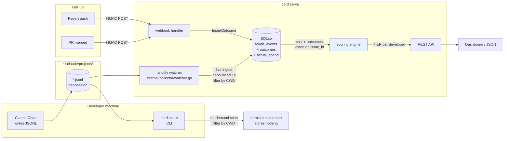
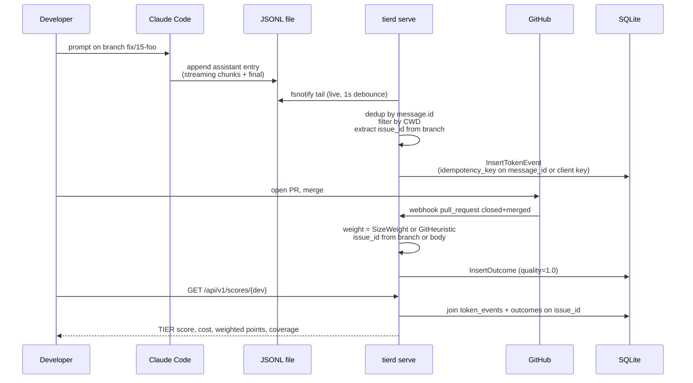

# TIER — How It Works Today

**Grounded in:** the source in this repository. Every behavior below is anchored to a named file, symbol, or issue number rather than a line number or commit hash, so each claim stays checkable against the code you have checked out.

**Audience:** engineers evaluating whether TIER is ready to run on their own repository.

**Tone:** what it does, what it doesn't, no marketing.

---

## Table of contents

1. [What this tool does in one sentence](#1-what-this-tool-does-in-one-sentence)
2. [What LLMs it works for](#2-what-llms-it-works-for)
3. [How it captures the amount of tokens being used](#3-how-it-captures-the-amount-of-tokens-being-used)
4. [How it assigns functionality (outcome attribution)](#4-how-it-assigns-functionality-outcome-attribution)
5. [How it gives purpose (linking cost ↔ outcome)](#5-how-it-gives-purpose-linking-cost--outcome)
6. [How it says "this many tokens + this much code = this much value"](#6-how-it-says-this-many-tokens--this-much-code--this-much-value)
7. [How it scores task size and complexity](#7-how-it-scores-task-size-and-complexity)
8. [How it all comes together](#8-how-it-all-comes-together)
9. [Is it ready to dogfood?](#9-is-it-ready-to-dogfood)

---

## 1. What this tool does in one sentence

TIER captures the dollar cost of every AI API call a developer makes, attributes each call to a GitHub issue via the branch name, and (once outcomes flow in from GitHub) divides shipped outcomes by AI dollars spent to produce a per-developer "TIER score."

> **Verdict today:** Per-developer **cost attribution** works end-to-end on this repo. As of #18, `tierd serve --watch-repo <path> --aggregation developer` ingests Claude Code JSONL live via fsnotify, so the dashboard updates as you work. (`--aggregation team|division|developer` is **required** — serve refuses to start without it, #185.) The outcomes side still needs three manual ops steps before live TIER scores flow: stand up `tierd serve` on a public URL (ngrok / Tailscale-funnel), configure the GitHub webhook on the target repo, set `TIER_WEBHOOK_SECRET`. So today: live **cost** attribution is dogfoodable as-is; live **TIER scores** are one ops session away.

---

## 2. What LLMs it works for

Two axes matter: which provider, and which capture path.

| Provider                | Local session logs        | Reverse proxy             | Manual REST | Status              |
| ----------------------- | ------------------------- | ------------------------- | ----------- | ------------------- |
| Anthropic (Claude API)  | Yes — Claude Code JSONL (default) | Yes (JSON + SSE on #14)   | Yes         | **Works in v1**     |
| Codex CLI (OpenAI)      | Yes — rollout logs ¶      | Parser exists, **never live-verified** — Responses API (JSON + SSE, #459 task 2) ¶ | Yes | **Works in v1** (`collectors.codex_rollout` / `--codex-rollout`, #464) |
| Opencode (any provider it serves) | Yes — its SQLite session store ◊ | Possible in principle, and **do not do both** — the two keys cannot dedup, so the spend DOUBLES ◊ | Yes | **Works in v1**, for routes with an audited rate (`collectors.opencode` / `--opencode`, #719) |
| Muse Code (Meta)        | Yes — its session logs (§3d) | No — the proxy has no Meta route | Yes | **Works in v1** (`collectors.muse` / `--muse`, #895), measured on one real Muse Code 1.4.0 session; subagent spend is filed under the parent run that spawned it (#901), and some subagent spend is **excluded**, with a warning (§3d lists the cases) |
| OpenAI                  | n/a                       | Yes (JSON; SSE on #14) †  | Yes         | **Wired; not yet tested against live traffic** |
| xAI (Grok) / DeepSeek   | n/a                       | Expected via the OpenAI-compatible parser; **not tested against live traffic** † | Yes | **Untested** |
| Google Gemini           | n/a                       | Yes (JSON + SSE) ‡        | Yes         | **Wired, live-unverified** (#459 task 4 — route mounted; no live Gemini traffic has hit it yet) |
| Self-hosted (vLLM etc.) | n/a                       | Yes via OpenAI-compat †   | Yes         | **Works in v1**     |
| Anthropic Admin API     | —                         | —                         | —           | **Wired; not yet tested against live traffic** (org-level poller, `collectors.anthropic_admin`, #138) |
| OpenAI Usage API        | —                         | —                         | —           | **Wired; not yet tested against live traffic** (org-level poller, `collectors.openai_usage`, #139) |
| Cursor                  | —                         | —                         | —           | Deferred to v1.5    |
| GitHub Copilot          | —                         | —                         | —           | Deferred to v1.5    |
| ChatGPT Team / Plus     | —                         | —                         | —           | Deferred to v1.5    |

> **† One OpenAI-compatible upstream at a time.** The proxy exposes a single `/openai/` mount backed by one `openai_target`. Capturing xAI, DeepSeek, or a self-hosted OpenAI-compatible endpoint means **repointing** that single `openai_target` at it — not running it *alongside* OpenAI on a second route. xAI (Grok) and DeepSeek serve OpenAI-compatible APIs, so capture through that mount is expected to work, but neither has been tested against live traffic: verify that the recorded token counts match the provider's own usage report before relying on them.
>
> **‡ Gemini's route is now mounted (JSON and SSE), but no live Gemini traffic has verified it (#459 task 4).** `tierd serve` mounts `/gemini/` (`--gemini-target` / `proxy.gemini_target`, default `https://generativelanguage.googleapis.com`) through the same `registerProxy` path as `/anthropic/` and `/openai/`, wired onto the `parseGemini` / `geminiStreamParser` pair (`internal/proxy/proxy.go`, `internal/proxy/sse.go`) that has existed since v1 (#1), gained thinking/cache-token handling in #122 and host stamping in #300, and has been unit-tested against synthetic bodies the whole time. What changed: pointing a Gemini SDK at TIER no longer 404s. What has NOT changed: no request has ever round-tripped through the mounted route to a real `generativelanguage.googleapis.com` response — that live proof is a credential-gated integration test (`TestLive_GeminiProxy_RealCompletion`, skips loud without `TIER_LIVE_GEMINI_KEY`) that has not been exercised against a real key yet. Treat it as structurally complete, not field-proven. (Manual REST `POST /api/v1/costs` can still import Gemini spend regardless.)
>
> **Admin / Usage pollers are org-level.** The two poller rows (#138 / #139) are opt-in `collectors:` config blocks that poll each provider's org usage/cost API on a settled-day cadence, write coverage-remainder `token_events` (the gap between realtime capture and the provider aggregate) and reconcile `org_actual_spend` deltas. They are org-spend reconciliation feeds, **not** per-developer real-time capture. For one org, the poller and manual `POST /api/v1/costs` rows are alternatives: while a provider's poller runs, `/costs` refuses that provider's rows unless they declare they are billed elsewhere ([`POST /api/v1/costs`](api-compatibility.md#post-apiv1costs), #854).
>
> **◊ Opencode is captured from its SQLite store, and only where a rate exists.**
> Opencode does not write JSONL — it keeps one JSON blob per message in a
> `message` table in `~/.local/share/opencode/opencode.db`. `collectors.opencode`
> (or `--opencode`) opens that database **read-only** and reads it directly: local,
> per-developer, per-call, no credential and no env-var change (#719). Two things
> about it are unlike the other local paths and are easy to get wrong.
> **First, its token arithmetic is the OPPOSITE of Codex's**: Opencode reports
> `reasoning` tokens BESIDE `output` rather than inside it, so billable output is
> `output + reasoning`. Measured on 2026-08-28 across the maintainer's entire GLM-5.3 corpus,
> `total == input + output + reasoning + cache.read` on 3,943 of 3,943 rows, and
> reasoning EXCEEDS output on 77% of them — mapping it the Codex way would drop
> 84.8% of the output-side bill. **Second, it captures only routes with an audited
> per-token rate**, because Opencode serves several providers and its own `cost`
> field is `0` on every row. Today that means the Z.ai coding plan
> (`zai-coding-plan`) and nothing else; Ollama's cloud tier is deliberately
> excluded because it publishes no per-token rate, and capturing it would price
> ~342M measured tokens at the guessed `self-hosted-medium` fallback ($0.50/M) —
> roughly $171 of invented spend in the denominator of a cost-per-outcome metric.
> The exclusion and its reason are logged at startup and its row count after every
> scan, so what is left out is visible rather than inferred. The embedded table prices
> `glm-5.3` and `glm-5.3-flash` per token at list price (#786), so GLM-5.3 needs no
> price-table override; a GLM model with no embedded row prices at the guessed
> fallback, and `tierd serve` logs a WARN naming it the first time it prices one.
>
> **¶ Codex is captured from local logs.** That is the supported path and the only one verified against real Codex data: Codex writes per-session rollout logs to `~/.codex/sessions/YYYY/MM/DD/rollout-*.jsonl`, and `collectors.codex_rollout` (or `--codex-rollout`) reads them directly — local, per-developer, per-call, no credential and no env-var change (#464). Until #459 task 2 the proxy could not have captured Codex under any configuration: Codex speaks the OpenAI **Responses** API (`input_tokens` / `output_tokens`), while both OpenAI proxy paths read only the **Chat Completions** usage shape (`prompt_tokens` / `completion_tokens`), so a Codex response routed through `/openai/` yielded **no** `TokenEvent` (#463). The proxy now parses the Responses shape on both paths, but that changes little for Codex in practice and nothing about the recommendation: it captures only traffic you deliberately point at the proxy with API-key auth (ChatGPT-subscription auth never traverses it), and **no live Responses response has ever reached that parser** — its fixtures are synthetic, and #459 task 3 (credential-blocked) is what would verify it. Use the rollout logs.

**Why Claude is special.** Claude Code writes a per-session JSONL log to `~/.claude/projects/**/*.jsonl` automatically. TIER reads those files — zero configuration, no proxy in front, no env-var change for the developer. That's the "Day 1" capture path.

**Codex works the same way.** Codex also writes local session logs, so it gets the same zero-configuration treatment: enable `--codex-rollout` and TIER reads `~/.codex/sessions/**/rollout-*.jsonl` directly (#464). It is scoped to the same repository targets as the Claude Code watcher — `--watch-repo` under `serve`, `--repo` under `ship` — so a Codex session run in another repo on the same machine is dropped rather than mis-attributed. It inherits the same `--repo-slug` overrides too (#231), which is what keeps a fork's Codex and Claude Code rows on one repo identity instead of splitting its cost in two.

**Muse Code works the same way, with two differences.** Meta's Muse Code CLI writes one session log per session to `~/.local/share/muse/sessions/YYYY/MM/DD/<session-id>/session.jsonl`, and `--muse` reads them under the same repository scoping and `--repo-slug` overrides as Codex (#895). First, a call is recorded only after the run it belongs to has finished, because Muse writes the run's git branch after the run's last model call. Second, a subagent's session log records no working directory and no branch, so its calls take both from its parent: the repository from the session log it sits under, and the branch from the parent run that the parent's log says spawned it (#901). Some subagent spend is left out, with a warning, rather than guessed onto a branch; §3d lists the cases.

**Why everything else needs the proxy.** Cursor (when using API keys) and any custom OpenAI/Anthropic SDK consumer don't emit local logs. To capture them you point `ANTHROPIC_BASE_URL` / `OPENAI_BASE_URL` at `tierd serve`, which acts as a transparent reverse proxy and reads `usage` blocks off the wire. (A Gemini client can be pointed at `tierd serve`'s `/gemini/` mount the same way — retarget its base URL — but Gemini authenticates upstream with an `x-goog-api-key` header or a `?key=` query parameter rather than an env var — prefer the header, since a `?key=` value can land in the access logs of anything in front of tierd (see the README's proxy section) — and this path is structurally complete and not yet live-verified; see the ‡ note above. Codex is **not** capturable this way at all; see ¶.)

**What the org-level pollers cover.** The Anthropic Admin poller (#138) and the OpenAI Usage poller (#139) both **shipped**, and neither is **yet tested against live traffic** (both are exercised only against local mock servers; the Anthropic one's key-gated live test has not yet run): opt-in `collectors:` config blocks poll each provider's org usage/cost API, backfill coverage-remainder `token_events`, and reconcile `org_actual_spend`. Cursor/Copilot/ChatGPT Team remain deferred — they don't expose per-developer real-time token counts, only seat invoices, so seat-cost imputation is still a separate, contained ticket on the roadmap.

---

## 3. How it captures the amount of tokens being used

The capture paths in §3a–3f feed one table: `token_events`. The schema is the `token_events` table in `schemaTables` (`internal/store/store.go`).

### 3a. JSONL (Claude Code, default)

Two entry points share `parseSessionFile` / `joinSessionsToCommits`, so both produce byte-identical rows for the same input:

- **On-demand scan** — `JSONLCollector.Collect` at `internal/collector/jsonl.go`, invoked by `tierd score`. Walks `~/.claude/projects/` once, parses every file under `since`, exits. As of #27 this is a thin wrapper around `JSONLCollector.Run(ctx, since, ingester)` — the push form new collectors should follow. The shared `collector.Ingester` interface (`internal/collector/collector.go`) has one method `Ingest(ctx, TokenEvent) error`; the production adapter `ingester.Store(*store.DB)` lives in `internal/ingester` and forwards each event to `InsertTokenEvent` after a field-by-field copy. The shipped org-level pollers (Anthropic Admin #138, OpenAI Usage #139) plug in this way — they implement `Run(ctx, since, ingester)` and reuse the same store adapter; the deferred Copilot/Cursor collectors will follow the same shape. Today Run materialises the full event slice before forwarding — at JSONL scale that's fine; a future streaming collector (paginated admin-API polling) would emit events as they're produced.
- **Live tail** — `collector.Watcher.Run` in `internal/collector/watcher.go`, started by `tierd serve --watch-repo <path> --aggregation developer` (closes #18; `--watch-repo` is repeatable for multi-repo developers; `--aggregation` is required, #185). Subscribes to `~/.claude/projects/` via fsnotify, attaches new subdirs dynamically as Claude Code creates them, debounces rapid writes (1 second; a single streaming response writes 30-50 times per second), parses the affected file on quiescence. Re-parses are safe because the SQLite INSERT uses `ON CONFLICT DO UPDATE` with per-field `MAX`, so a session's growing totals replace the prior row's smaller values instead of being silently dropped (this also lets the proxy and JSONL paths share the same INSERT statement without behavior change).
- **Incremental tailing** (closes #30). The watcher caches `{offset, inode, head-CRC, sessionMetadata}` per file across debounces and reads only the bytes appended since the last parse (`parseSessionFileFromOffset` in `internal/collector/jsonl.go`). On a 10 MB session, per-debounce cost drops from **~79 ms / 51 MB allocated / 605k allocs** (full reparse, `BenchmarkParseSession_FullReparse`) to **~11 µs / 5.7 KB / 28 allocs** (incremental, `BenchmarkParseSession_Incremental`) — a ~7,000× speedup on the development machine; the order-of-magnitude story is the point, exact ratios vary with hardware. Full re-parse triggers on inode change (log rotation), size shrink (truncation), or first-`headFingerprintBytes` CRC32 mismatch (truncate-and-rewrite-to-similar-size that would otherwise sneak past the size check). Partial trailing lines (writer mid-flush) are not consumed; the cached offset stays put until the terminating `\n` arrives on the next debounce. Per-path serialization in the debounce timer prevents two callbacks for the same path from racing on the cached offset. Since #71 the tail state is also saved to the `watcher_checkpoint` table, so after a `tierd serve` restart the first new write to a file resumes from its last parsed offset. If the saved state cannot be loaded, the watcher starts from byte 0 and re-parses; the store's per-message `IdempotencyKey` (#19) + `MAX`-on-conflict UPSERT (#18) absorb the re-emitted events. The CLI's on-demand `parseSessionFile` wrapper bypasses tail-mode trimming so static log inspection still consumes a final line that lacks a trailing newline.

Both paths share these guarantees:

- `bufio.Scanner` with a 10 MB line buffer so an oversized line can't stall or infinite-loop the file (fix for #7).
- **Dedup by `message.id`** inside each session file. Claude Code emits one assistant entry per streaming chunk *and* a final post-stream entry, all sharing the same `message.id`. The placeholder chunks carry partial/zero token counts. Largest-total wins; ties resolve later-wins. This stops TIER counting one response once per streaming entry (closes #6). It is a different problem from the one gille.ai reported on 2026-02-24, in an article it labels preliminary: that Claude Code's session file records fewer tokens than Claude Code's own status bar shows even after this kind of dedup (output 10–17× low, input 100–174× low), because placeholder values are never updated and thinking tokens are absent from the file. Whether that still holds for current Claude Code is being measured in #837.
- **Cross-repo bleed filter**: `filterSessionsByRepo` keeps only sessions whose `cwd` is at or beneath a target repo path (closes #15). The watcher uses the same four-way symlink-aware match in `cwdMatchesAnyTarget` (`watcher.go`). Without this filter, every Claude Code session on the machine got attributed to whichever repo `tierd score` was pointed at — the bug that made this repo report $35,251 of fake cost vs. the real $45.97 (measured 2026-05-19, the day PR #16 fixed #15).
- **Branch → issue id** via `issueref.FromBranch`. The on-demand path additionally joins to the git log within a ±30 min window; the live path skips the git lookup because a session is usually mid-stream when it lands, before any commit exists yet.
- **Per-message TokenEvents** (closes #19). `joinSessionsToCommits` emits one event per assistant `message.id`, not one per session. Each event carries `IdempotencyKey = MessageIdempotencyKey("anthropic", message_id)` — the exact format the proxy uses for the same upstream call. A Claude session captured by both JSONL and the proxy emits identical keys and dedupes on the partial unique index in SQLite.

### 3b. Codex rollout logs (Codex CLI, opt-in)

- Entry point under `serve`: `codexrollout.Collector.Run` at `internal/collector/codexrollout/`, enabled by `--codex-rollout` (env `TIER_CODEX_ROLLOUT`) or the `collectors.codex_rollout` config block. Re-scans `~/.codex/sessions/YYYY/MM/DD/rollout-*.jsonl` every `scan_interval` (default 5 m, floor 30 s). No credential; no env-var change for the developer. The **first** pass backfills every rollout log on disk; after that a **scan cursor** bounds each pass to the files touched since the previous one (plus a two-interval safety overlap), so the per-tick work tracks what changed rather than how much Codex history the machine has. The cursor advances only after a pass's events have all been ingested — an aborted ingest re-scans rather than dropping the tail.
- Entry point under `ship`: `Collector.Collect`, **not** `Run` — one stateless pass over the whole `--since` window, no interval and no cursor, because `Run` loops until cancellation and would hang a cron job forever. A `ship --codex-rollout` tick therefore re-walks the entire sessions tree every time and relies on server-side idempotency to dedup, which is the same stateless contract the Claude Code leg of `ship` already has (#492). `Collect` returns the events from the files that parsed **alongside** an error naming those that did not; `ship` forwards the good events and only then exits non-zero, so one corrupt rollout log cannot zero out a laptop's whole Codex spend.
- 🔴 **Do not enable this AND route Codex through the proxy.** Codex writes its rollout logs whether or not it is proxied, so a Codex call sent through `/openai/` with `--codex-rollout` on is captured **twice**, and the two rows cannot dedup: the proxy keys on the response id (`resp_*`), this collector keys on `(session id, ordinal)` because a rollout log carries no response id at all. Different keys, and the store dedups on the key alone — so the spend **doubles** rather than colliding. `tierd serve` warns at startup when both are enabled. Ordinary (non-Codex) OpenAI traffic through the proxy is unaffected.
- **This is the Codex capture path you should use, and the only live-verified one.** See the ¶ note in §2. Since #459 task 2 both proxy paths also parse the Responses shape — `parseOpenAIResponses` on the JSON path, `openAIResponsesStreamParser` on the SSE path Codex actually uses (Codex streams by default, and Responses SSE nests usage under the `response` object of a `response.completed` event) — but that parser has only ever run against synthetic fixtures, and reaching it requires pointing Codex at the proxy with API-key auth. The rollout logs need neither.
- **Per-call usage is DERIVED BY DIFFERENCING, never summed.** Each `token_count` event carries both a cumulative `total_token_usage` and a per-call `last_token_usage`. Summing the per-call field is wrong: Codex sometimes **re-emits** a `token_count` event, double-counting it. Measured on a real captured session (`internal/collector/codexrollout/testdata/rollout-duplicate-token-count.jsonl`), the cumulative series is `[17129, 37728, 58507, 58507, 80154, 101922, 124386]` — `58507` repeats. Summing `last_token_usage` gives **145,165** tokens against a true total of **124,386**: a 20,779-token, **17 % overcount** straight into the cost figure. Differencing consecutive cumulative snapshots gives per-call granularity, exactness (the deltas telescope to the cumulative total by construction), and automatic dedup (a re-emitted snapshot differences to zero) in one move. This is the same defect class as the Claude Code streaming-chunk duplication in §3a (#6), inverted. Guarded by `TestDuplicateTokenCountEventIsNotDoubleCounted`.
- **Containment invariants are FATAL, not warnings** — matching `score.py` in the `tiermetric/model-bench` repository, the reference implementation that priced the Codex half of the TIER Model Report. `total_tokens == input_tokens + output_tokens`; `cached_input_tokens ⊆ input_tokens`; `reasoning_output_tokens ⊆ output_tokens`; the cumulative series is non-decreasing; the cached *delta* never outruns the input *delta*; and — the one invariant that is absolute rather than relational — no cumulative count exceeds a 10¹²-token sanity ceiling, since a self-consistent but absurd snapshot would otherwise price to a clamped `MaxInt64` cost and overflow SQLite's integer `SUM()` on the read path. A log that violates any of them contributes **zero** events and is named in an error — a silently-wrong cost figure is worse than no figure. Healthy sibling sessions in the same scan are unaffected. A rollout that never names a model is likewise refused rather than priced at the self-hosted guess rate.
- **Token classes never overlap.** `cached_input_tokens` is carved out of `input_tokens` (`InputTok = input − cached`, `CacheRead = cached`), exactly as `parseOpenAI` does. `reasoning_output_tokens` is a **subset** of output and is never added on top. OpenAI publishes no cache-write SKU, so both write buckets stay zero; a nonzero `cache_write_input_tokens` warns once and is billed at the input rate it is already inside.
- **Idempotency**: `IdempotencyKey("codex-rollout", "openai", session_id, ordinal)`, where the ordinal is the `token_count` event's position in the file — stable across re-scans of an append-only log, including across the skipped zero-delta duplicates. Re-scanning collides on the partial unique index and stores one row per call.
- **Cross-repo bleed filter**: shares `collector.RepoScope` with **both** Claude Code paths — the batch scan (`filterSessionsByRepo`) and the live watcher (`matchTarget`) — so all three agree byte-for-byte on which sessions are in scope, including the four-way symlink match, the git-worktree fallback, and the multi-target precedence (`MatchScopes`: every target's direct containment is tried before any target's worktree fallback). Issue attribution shares `collector.IssueResolver` with the JSONL join, so a Codex event and a Claude event on the same branch resolve identically. A rollout captured outside a git checkout keeps its spend in the developer's denominator under a labeled unattributed bucket rather than dropping it.
- Malformed lines are skipped, not fatal — and because the collector differences *cumulative* snapshots, a dropped `token_count` line merges into the next delta, so the session **token** total stays exact and only the per-call split coarsens. Summing per-call values could never offer that. (Exactness is a token property, not a cost one: if the session switched models across a dropped snapshot, the merged delta is priced entirely at the later model's rate.) An **unterminated final line** is treated as a writer mid-flush and skipped silently — a live Codex session is always mid-write, and warning about it every scan would bury the warning that means real damage. A file that exceeds the 64 MB read cap is **failed**, not truncated: a prefix would be a silent under-report.

### 3c. Opencode session store (opt-in)

- Entry point under `serve`: `opencode.Collector.Run` at `internal/collector/opencode/`, enabled by `--opencode` (env `TIER_OPENCODE`) or the `collectors.opencode` config block. Re-reads `~/.local/share/opencode/opencode.db` every `scan_interval` (default 5 m, floor 30 s). No credential, no env-var change. Entry point under `ship`: `Collector.Collect` — one stateless pass over the whole `--since` window, for the same reason the Codex leg uses it (§3b).
- 🔴 **`mode=ro`, and NEVER `immutable=1`.** Opencode is a live process holding an active write-ahead log. `immutable=1` promises SQLite the file cannot change, so it skips the WAL and the locking protocol entirely — it does not error, it returns pre-WAL or torn data with full confidence, which is a corruption-grade wrong answer in a program whose output is money. `mode=ro` takes the normal shared lock, reads through the WAL, and is refused by SQLite if anything tries to write. Read transactions are one query each and are drained and closed immediately, because a long-lived reader pins Opencode's WAL and bloats *their* file. Measured: a full pass over a 10,206-row `message` table (4.9 MB of JSON) takes 120 ms.
- 🔴 **Reasoning tokens are ADDITIVE here — the opposite of Codex.** See the ◊ note in §2 for the measurement. `OutputTok = output + reasoning`, and the containment check is the ADDITIVE identity `total == input + output + reasoning + cache.read + cache.write`, not a subset assertion. Reusing Codex's `reasoning ⊆ output` check would reject 77% of the real corpus. A row that does not satisfy the identity is skipped **loudly** (WARN plus a per-pass counter) rather than folded in under a guess — including a genuinely Codex-shaped row, which cannot be priced honestly under either convention. A Codex-shaped row whose reasoning is *zero* satisfies the identity too and is accepted, correctly: where the two conventions agree, the arithmetic agrees.
- 🔴 **Completed messages only.** A `message` row is written when the turn starts and UPDATEd as it streams, so an in-flight row carries PARTIAL counts. `store.insertTokenEventSQL` MAXes the token counters on conflict but deliberately never re-MAXes `cost_micro` (#233 — "re-MAXing cost_micro would silently reprice history"), so ingesting a partial row freezes that message's cost at its partial value **forever** while its token counts later ratchet up to the truth. Rows with no `time.completed` are skipped and re-read on a later pass, when the UPDATE that completes them has moved `time_updated` past the watermark.
- **The watermark is `time_updated`, never `message.id`.** Opencode's message ids are NOT monotonic: measured on the maintainer's store 2026-08-28, the lexicographic maximum id belongs to a row written 2026-08-03 while the newest row (2026-08-28) sorts far below it. Resuming from `max(id)` would have skipped 25 days of spend while reporting a clean, quiet, successful scan every five minutes. The watermark is persisted in `watcher_checkpoint` (#71) under the key `opencode-db:<path>:<scope digest>` and advances only after a batch's events have all been ingested. The scope digest is SHA-256 of the sorted configured repository paths (absolute where possible) and slugs, so reordering repositories preserves the key. Adding a repository changes the key and triggers an idempotent backfill that includes its rows older than the previous watermark. Legacy keys without the digest are not resumed: upgrading triggers one idempotent backfill too. Event keys stay unchanged, so previously ingested messages are not charged again. The checkpoint is a derived cache: losing it costs one idempotent re-scan. ⚠️ Because that table is now **shared** with the JSONL watcher, the watcher skips rows whose key is not a filesystem path (`store.IsFileCheckpoint`) — without that it pruned this collector's row on every startup, silently.
- **Idempotency**: `IdempotencyKey("opencode", providerID, message.id)` — the source-prefixed namespace, deliberately **not** `MessageIdempotencyKey`. That function's `msg` namespace exists so one upstream call captured by two paths collides and stores once, which requires both producers to key on the same UPSTREAM response id; Opencode's `message.id` is a client-side row id in a local database, so putting it there would claim a cross-path identity that does not exist.
- 🔴 **Do not enable this AND route Opencode through the proxy.** The spend is captured twice and the rows **cannot** dedup: this collector keys on Opencode's local `message.id`, the proxy keys on the upstream response id, and neither side can compute the other's value — so the two rows **ADD** rather than colliding. No key choice fixes it; only not doing both. `tierd serve` warns at startup when both are enabled.
- **Schema drift fails LOUD, never as an empty successful scan.** An absent database is a clean, named "collector disabled" INFO (Opencode may simply never have run here). A missing or empty `migration` table, a `message` table that no longer exposes `(id, session_id, time_updated, data)`, a full backfill of a non-empty table that matched zero rows, or rows that contain no assistant messages are each a named error — because every one of them otherwise produces zero events, which is exactly what a healthy up-to-date collector produces. Opencode's own `migration` row count is carried in the checkpoint as a drift tripwire and a change is reported.
- **Cross-repo bleed filter**: shares `collector.RepoScope` with every other local path, so they agree byte-for-byte on which sessions are in scope. **Attribution is different, though**: Opencode records no git branch anywhere — not in the message blob, not on `session`, and its `workspace` table (which has a branch column) is empty — so every event lands in `unattributed:detached-head`, whose documented meaning is exactly "a message that recorded no branch at all". Reading the cwd's *current* branch at scan time would attribute months-old spend to whatever is checked out today, which is a confident wrong number; the labelled bucket keeps the spend in the developer's denominator honestly.

### 3d. Muse Code session logs (opt-in)

- Entry point under `serve`: `muse.Collector.Run` at `internal/collector/muse/`, enabled by `--muse` (env `TIER_MUSE`) or the `collectors.muse` config block, which also sets `home` and `scan_interval`. Every `scan_interval` (default 5 m, floor 30 s) it reads each `session.jsonl` under `~/.local/share/muse/sessions/`, where Muse Code writes one per session at `YYYY/MM/DD/<session-id>/session.jsonl`; the first pass reads every one already on disk. No credential, no env-var change. `--muse` needs `--watch-repo`: with no watched repository `serve` refuses to start (under `--read-only`, which disables capture anyway, it only warns). Entry point under `ship`: `Collector.Collect`, one stateless pass, for the reason given in §3b; `--muse-home` overrides the Muse home there.
- **What is billed.** Two record kinds are model calls Meta bills, and each becomes one token event: a `run` record whose event is `model_completed` (one agent model call), and an `approval` record whose event is `automated_review_completed`. The second is Muse asking a model whether a pending tool call is safe; that call is billed like any other. Nothing else in the file is priced.
- **The token mapping** was measured on Muse Code 1.4.0, on one real session's 15 `model_completed` records (`mapAgentUsage`). `input_tokens` includes the cached prefix (`cache_read_tokens ≤ input_tokens` on all 15), so stored input is `input_tokens − cache_read_tokens`, and the cached part is priced once, at the cache-read rate. `reasoning_tokens` is inside `output_tokens`, as with Codex and unlike Opencode, so output is billed as reported and reasoning is never added. `cache_write_tokens` was 0 on all 15, so where it sits is unmeasured: it is assumed to be inside input and is priced there, at the input rate, and a record that contradicts that (`cache_read + cache_write > input`) is refused. The approval-review record has its own usage shape, and its own identities (`cached + non_cached == input`, `total == input + output`) are checked when present.
- **A broken invariant is refused and counted, never guessed.** A missing `input_tokens` or `output_tokens`, a negative count, a count above 2²⁹ in one record, reasoning above output, two cache counts that disagree, no model name, no record id, a repeated record id, no timestamp, or a timestamp more than 24 h ahead of this machine's clock: each skips that one call, is counted by reason in `refused_calls`, and raises the pass's `muse scan complete` log line to WARN. A call reporting zero tokens (an aborted call) is counted separately; it is not spend. A file over the 64 MB read cap, or with a line over 10 MB, fails whole rather than being priced as a truncated prefix.
- **Why a call waits for its run to settle.** Muse writes a run's `workspace_branch` record after the run's terminal event, which is after every model call the run made. The store never rewrites a stored row's issue id (its `ON CONFLICT` updates only the token counters), so a call emitted mid-run, before its branch is known, would stay unattributed for good. A call is therefore emitted only once one of three things is true: its run's branch record is present; its run's terminal event is present and Muse has written something after it, which means Muse chose not to record a branch; or the session file has not been written for 6 h (`settleGrace`), which is taken to mean Muse exited mid-run. A file holding an unsettled call is re-read every pass until it settles, whatever its modification time. ⚠️ **The 6 h rule is a guess, and it can be wrong:** a **live** run that waits more than 6 h at a tool-approval prompt is emitted as `unattributed:detached-head`, and the branch record that arrives later cannot correct it. That spend stays in the developer's total; its issue attribution is wrong permanently.
- **Attribution** starts from Muse's own branch record for the run and goes through the same `collector.IssueResolver` as Claude Code and Codex: a commit naming an issue within ±30 min, else the issue in the branch name. A detached HEAD, a reference that is not a branch, or a workspace that is not a git checkout records no branch; so does a run that settled with no branch record. All of those land in `unattributed:detached-head`. The checkout's *current* branch is never read.
- **Repository scoping** matches the session's recorded `workspace_root` with the same `collector.RepoScope` as the other local paths; a session rooted outside every watched repository is skipped and counted as `foreign_repo`. The root is used for that decision and is not stored.
- **Subagent sessions are filed under the parent run that spawned them (#901).** A subagent's session log sits under its parent's, at `<session-id>/subagent/<id>/session.jsonl`, and records no `workspace_root`, no branch and no pointer to its parent. Two facts tie it to the parent, and only these are used. The directory it sits in names the parent session log, whose `workspace_root` scopes the subagent's calls (a parent rooted outside every watched repository makes its subagents `foreign_repo` too). And the parent's `memory_reminder_child_session_linked` record whose `child_session_id` is the subagent's id names the parent **run** that spawned it. The subagent's calls take that run's branch and wait for that run to settle, under the three rules above applied to the parent run and the parent file; for the 6 h rule the later of the two files' modification times counts, because either file still being written means the parent run may be alive. Each subagent call keeps its own record id. Scanning a parent always scans its subagents, whatever their modification time.
- 🔴 **Some subagent spend is still not captured.** Each case below is excluded and counted, never filed under a guessed branch and never written without a repository, because a stored row's issue id is never rewritten. For each, a Muse user's recorded spend is lower than their real spend by what those subagents cost.
  - **A subagent no single parent run is linked to**: no link record names it (`no_link`), two name it with different runs (`ambiguous_link`), or its parent log is missing or not a regular file (`no_parent_log`). Its calls are held while either log may still be written, then excluded once the later of the two has gone 6 h unwritten. Every pass that finds one logs a WARN, `Muse subagent calls held or excluded: no parent run is linked to this subagent`, carrying `held_calls`, `excluded_calls`, `sessions` and `reason` (a count per cause, as `cause=n` pairs).
  - **A subagent of a subagent.** The session it sits under is itself a subagent, which has no root of its own, so its calls are excluded under the `no_workspace_root` WARN below (or, when that intermediate log is missing, as `no_parent_log` above).
  - **A subagent whose parent recorded no `workspace_root`.** Its calls are excluded at once, with the WARN any root-less session raises: `Muse calls excluded: session has no workspace_root`, carrying `excluded_calls` and `sessions`.
- **Pricing.** The five `muse-spark-*` rows (price table v11) are Meta's published per-token API list rates. Muse calls are priced at them, and stored with billing mode `per_token`, even when the developer pays for Muse by subscription (operator ruling, #895): the session log does not say how the developer pays, and a subscription is never treated as a price. Meta's web-search charge is per query, not per token, and is not priced, so Muse cost is a floor for any session that searched. A model name the table does not carry is priced at the guessed fallback rate, like any unknown model. Rates and sources: [reference-price-table.md](reference-price-table.md).
- **Idempotency**: `IdempotencyKey("muse", "meta", <record id>)`, Muse's own per-record `id`, which is stable across re-reads of an append-only file. There is no per-event cursor, because a held run emits events older than ones already stored; a touched file therefore re-emits its settled calls each pass, and the keys make those no-ops. The scan position (a modification-time floor and the list of held files) lives in memory only, with no checkpoint row, so a restart re-reads every session file once.
- **Observability.** `serve` logs `Muse collector enabled` with the `sessions_dir` it resolved, then, for every pass that found a session file, one `muse scan complete` line with `events`, `subagent_events` (the part of `events` that came from subagent logs), `held_unsettled_runs`, `foreign_repo`, `no_workspace_root`, `unlinked_subagents` (subagent logs no parent run is linked to, held or excluded this pass) and `refused_calls`. `tier_muse_events_total` on `GET /metrics` counts events handed to the store, repeats included (the re-sends described under Idempotency), so a rising value shows capture is alive; it is not a row count.

### 3e. Reverse proxy (Anthropic / OpenAI / Gemini direct)

- Entry point: `proxy.New` at `internal/proxy/proxy.go`; mounted under `/anthropic/`, `/openai/`, and `/gemini/` by `tierd serve` (`cmd/tierd/main.go`, #459 task 4 added the third).
- **JSON path**: `handleJSON`. Buffers the response (10 MB cap), parses with the per-provider unmarshaller, emits one `TokenEvent`. Three mounted parsers:
  - `parseAnthropic` — `msg_*` id, `usage.input_tokens` / `output_tokens` / cache fields. **Routed** (`/anthropic/`).
  - `parseOpenAI` — **two shapes on one route** (`/openai/`), discriminated from the payload by `openAIShape`, never from the request path. Chat Completions: `chatcmpl-*` id, `usage.prompt_tokens` / `completion_tokens`, optional `prompt_tokens_details.cached_tokens`. Responses (`/v1/responses`, what Codex speaks — #459 task 2): `resp_*` id, `usage.input_tokens` / `output_tokens`, optional `input_tokens_details.cached_tokens`. In **both** shapes the input total is INCLUSIVE of the cached count, so cached is carved out of input before pricing; `output_tokens_details.reasoning_tokens` is a subset of `output_tokens` and is deliberately not added (the opposite of Gemini's `thoughtsTokenCount`, which is excluded from its parent and must be). Anything not positively identified as the Responses shape parses exactly as it did before. **Live-unverified** for the Responses half — synthetic fixtures only, see §3b — which is why Codex still uses the rollout-log collector.
  - `parseGemini` — `responseId`, `usageMetadata.promptTokenCount` / `candidatesTokenCount`. **Routed** (`/gemini/`, #459 task 4, through the same `registerProxy` path as `/anthropic/` and `/openai/`), but **live-unverified**: the unmarshaller has existed and been unit-tested against synthetic bodies since v1 (#1, extended by #122 and #300), and the route is now mounted, but no live Gemini API response has ever reached it — that is a credential-gated integration test (skips loud without `TIER_LIVE_GEMINI_KEY`).
- **SSE streaming path**: `internal/proxy/sse.go` (PR #14, merged). Without this the proxy captures **zero** real-world traffic from Claude Code or Codex because they default to `text/event-stream`. The framer normalises `\r\n` / `\r` / `\n` line endings, concatenates multi-line `data:` fields, and emits at body Close with a 10 MB pending-buffer cap.
- **Per-response IdempotencyKey** (closes #9, refined in #19). Each response carries a stable id (Anthropic `msg_*`, OpenAI `chatcmpl-*`, and Gemini `responseId` — routed since #459 task 4, but not yet exercised by live traffic). The proxy hashes `(provider, id)` via `collector.MessageIdempotencyKey` — the same helper the JSONL collector uses for the same upstream call. The two paths emit identical keys, so a Claude call captured by both is stored exactly once.

### 3f. Manual REST

- `POST /api/v1/costs` (`internal/api/handler.go`). Plain JSON in, validated, written to `token_events`. Useful for batch imports, scripts, or systems that can't sit behind the proxy.
- Optional `idempotency_key` field on the request (closes #21). When supplied, retries with the same key dedupe on the partial unique index — identical re-submissions land as one row. When omitted, the row stores NULL and re-posts will duplicate (the previous behaviour, retained for back-compat with scripts that don't track keys).
- Body capped at 1 MiB via `http.MaxBytesReader`. `DisallowUnknownFields` rejects typo'd field names (e.g. `IdempotencyKey` instead of `idempotency_key`) so misnamed inputs surface as 400s rather than silently dropping.
- **Auth** (closes #22, #59): bearer-token gated. When `TIER_API_TOKEN` is set (or `--api-token` passed to `tierd serve`), the write endpoints (`POST /api/v1/costs`, `POST /api/v1/events`, `POST /api/v1/actual_spend`, `POST /api/v1/org_actual_spend`, `POST /api/v1/outcomes`, `POST`/`DELETE /api/v1/developer_alias`, `PUT`/`POST`/`GET /api/v1/org_hierarchy`, `POST /api/v1/period_membership/{developer}/end`, `DELETE /api/v1/developer/{id}`, `GET /api/v1/developer/{id}/export`) AND the sensitive score GETs (`GET /scores`, `/scores/{dev}`, `/metrics`, `GET /api/v1/org_actual_spend`, `GET /api/v1/developer_alias`) must carry `Authorization: Bearer <token>` — per-developer spend and scores are sensitive (#59). Constant-time compare; mismatched length and missing-header paths produce identical timing. Only the liveness/health probes (`/health`, `/healthz`, `/livez`), the build-identity endpoint `/api/v1/version`, and the static dashboard page (`/`) and `/docs/`, which serve no data, stay open; `POST /webhook/github` is checked by its HMAC signature instead (§4, "HMAC signature"). When the token is unset, the endpoints stay open and a startup warning logs — and `tierd serve` refuses any non-loopback bind in that state, so this is a loopback-only mode fine for laptop testing.
- **Read-only viewer token** (closes #190): `--read-token` (env `TIER_READ_TOKEN`, or `@/path/to/file`) is a SECOND bearer credential scoped to reads only. It is accepted on `GET /scores`, `/scores/{dev}`, the dashboard data, and, in `developer` mode only, `/metrics`, and rejected with `403` on every write endpoint and the reverse proxies. Hand it to a CFO/VP-Eng who needs the dashboard without the write/erase power the api-token confers — the least-privilege step short of SSO/OIDC (deferred with multi-tenancy, #65). It shares the api-token's secret provisioning exactly (flag, env, `@file`, and the `read_token` YAML key) and the same failed-auth lockout. Two safety rules: it must **differ** from the api-token (equal values are refused at startup, since a read token equal to the write token would grant writes), and a read token **alone does not** satisfy the fail-closed bind check — a non-loopback listener still requires the write api-token. Startup logs which scopes are armed (`API auth scopes write_armed=… read_armed=… metrics_armed=…`).
- **Metrics token** (closes #944): `--metrics-token` (env `TIER_METRICS_TOKEN`, `@/path/to/file`, or the `metrics_token` YAML key) opens `GET /metrics` and no other route; in `team`/`division` mode it (or the api-token) is the only way to scrape. Rules and the operator-only warning: [security.md § The metrics token](security.md#the-metrics-token-944).
- **Brute-force lockout** (closes #36): defence-in-depth on top of the bearer gate. A per-IP failed-auth counter trips a `429 Too Many Requests` (with `Retry-After`) once an IP exceeds `--auth-max-failures` (default **10**) within `--auth-failure-window` (default **60s**); the IP stays locked for `--auth-lockout` (default **15m**). A *successful* auth clears that IP's counter, so an operator fat-fingering a token a few times is never affected. The gate sits in the shared auth middleware, so it protects **every** auth-gated route (the POST writes *and* the score GETs share one token — limiting only the POSTs would leave `GET /scores` as an unthrottled brute-force oracle). State is in-memory and resets on restart (sufficient for v1). By default the client IP is the TCP peer (`RemoteAddr`) and `X-Forwarded-For` is **not** trusted — honoring it from any peer would let an attacker mint a fresh bucket per request. With `--trusted-proxy-cidr` set (#131), a request whose TCP peer is inside a listed CIDR is keyed on the client IP from `X-Forwarded-For` (the rightmost hop not in a trusted CIDR) instead. Set `--auth-max-failures 0` to disable. Behind a trusted reverse proxy, also rate-limit at the proxy.
- **Attribution integrity** (closes #34, #82): a manual REST row can only attribute itself to what it actually is. `source` is forced to `"api"` (an explicit `"jsonl"`/`"proxy"` is rejected with 400) so a client can't forge automated-capture provenance. `fidelity` may be `"daily"` or `"estimated"` and **defaults to `"estimated"`**; `"realtime"` is rejected with 400 because realtime attests a per-request exact capture that only the JSONL collector and proxy perform — letting a batch import claim it would fabricate high-fidelity capture and inflate the `fidelity='realtime'`-keyed Coverage % / Spend Leverage metrics. *Metric-correction note:* before #82 an omitted fidelity defaulted to `"realtime"`, so manual rows were mis-counted as realtime; Coverage % will legitimately **drop** for any caller that relied on that default.
- **Secret provisioning** (closes #37): the token is any string you generate (`openssl rand -hex 32`; see [README → What you need before you start](../README.md#what-you-need-before-you-start)). Never pass a literal secret as a flag value — `--api-token mytoken` / `--webhook-secret mysecret` leak the value to `ps aux` (any user on the host), shell history, and process-accounting logs. Use one of, in order of preference: (1) the `TIER_API_TOKEN` / `TIER_WEBHOOK_SECRET` env vars; (2) **`@file` indirection** — `tierd serve --aggregation team --api-token @/run/secrets/tier-token --webhook-secret @/run/secrets/tier-webhook` reads each secret from the named file (trailing CR/LF is trimmed, so `echo "$TOKEN" > file` works). The `@` prefix is what triggers the file read; a bare `@`, an unreadable/missing path, a non-regular file (directory, `/dev/*`), or a file that trims to empty is a fatal startup error — never a silently-empty (auth-disabling) secret. The literal-value form still works for throwaway laptop testing but is flagged in `--help`.
- **`/scores` always returns a `total` block** (closes #25): rollup computed server-side via `scoring.RollupTeam` across every developer in the response. Includes `tier`, `weighted_points`, `total_cost_usd`, `actual_paid_usd`, `spend_leverage`, `coverage_pct`. The dashboard reads it directly — no client-side reconstruction of team aggregates from rounded per-developer percentages (which the pre-#25 code did, losing precision on `coverage_pct`). When `?team=NAME` is set, a separate `team` block is added alongside `total` for the filtered subset; back-compat with the pre-#25 scoped-team workflow.
- **Team-only aggregation mode with a k-anonymity floor** (closes #185): a **REQUIRED** `--aggregation team|division|developer` setting (env `TIER_AGGREGATION`, config key `aggregation`) on `tierd serve` — there is **no silent default**, so serve refuses to start until an operator explicitly chooses, and an existing deployment's reporting posture can never change on upgrade by accident. In `team` mode, `GET /api/v1/scores`, the dashboard, and `GET /api/v1/scores/{developer}` **never** surface an individual developer name: `/scores` replaces the named `developers` rows with a `teams` array of `scoring.RollupTeam` aggregates (and emits `developers: []`), `/scores/{developer}` is blanket-`404`ed (identical for every path value, so it is not an existence oracle), and the plain-text `FormatReport` prints only the aggregate total. Any team with fewer than the k floor of **counted people** collapses into an aggregate **"other"** bucket. Since #856 an identifier counts only when it has outcomes or cost in the window (an idle or paid-only seat never pads the count), is on the roster after aliases are joined, is not a bot, and has captured evidence (not only manual `/costs` rows or push-only outcomes); each published measure (captured cost, points, paid spend, and each non-zero part of the `coverage_pct` split) also needs k counted people behind it. See [manager-faq.md](manager-faq.md). ⚠️ **If that residual is ITSELF below the floor the whole response is withheld: the named rows, the residual and the grand total (#593, #864)** — otherwise `total` minus the named rows, or another view that folds a named group into its own residual, would reconstruct the hidden cohort by subtraction. The response says so via `data_quality.kanon_suppressed`. When the residual clears the floor it is emitted and totals reconcile as before. An anonymized response publishes **one breakdown per window** (#864): the team (or division) rows and the grand total. The work-type segments, the segment reconciliation, the cost composition (including its per-model rows) and the cost-share `data_quality` fields are absent, and `?work_type=` is a `400`, because any second breakdown differences against the first to a group below the floor. #937 is the route to bring a work-type or per-model view back. The floor is `--k-anonymity` (env `TIER_K_ANONYMITY`, config key `k_anonymity`), **default 5, hard minimum 3** — serve refuses a smaller value. This is DORA-style posture for EU works-council / GDPR Art. 22 co-determination regimes (see [docs/legal-and-privacy.md](legal-and-privacy.md)). The local `tierd score` CLI is a deliberate carve-out (single-operator, reads your own JSONL) and is **not** gated. **Composition with the #133 ranking floor:** the two suppressions are orthogonal and both apply — #133 marks a low-**sample** developer's row as below the evidence floor (a data-confidence signal; the row is still listed, in identifier order like every other row, with a below-floor tag, and the dashboard never sorts by TIER, #830), while #185 suppresses a sub-k **cohort identity** (a privacy signal). A developer can be both low-sample and in a sub-k cohort; in team mode their contribution rolls into "other" (or is withheld with it when that residual is sub-k, #593) while their name and their per-developer ranked/CI signal are not emitted at all. The #136 zero-token data-quality signal survives in team mode as a name-free aggregate `zero_token_outcome_count` (the per-developer list is suppressed).
- **Org-hierarchy write surface** (closes #232): populating `org_hierarchy` is a **REQUIRED onboarding step for `team` mode** — without it, every developer resolves to the unnamed team `""`, the k-anonymity floor renders the whole company as one anonymous row, and `org_actual_spend` allocation opens no `period_membership` seat and reads 0. Four bearer-gated (write-scope) admin endpoints, all of which resolve the developer through the `developer_alias` map first so hierarchy keys match the score-join's canonical keys (#125):
  - `PUT /api/v1/org_hierarchy/{developer}` — upsert one developer's `{team, division?, org?}`; `team` is required. Returns `200` with the stored (canonicalized) row.
  - `POST /api/v1/org_hierarchy` — **bulk import** a JSON array in **one all-or-nothing transaction** (mirrors `POST /api/v1/events`: the whole batch is validated first, any bad element `400`s naming its index, and nothing is written), so a 50-developer onboarding is one call. Returns `201 {"accepted": N}`.
  - `GET /api/v1/org_hierarchy` — list every assignment, developer-ordered.
  - `POST /api/v1/period_membership/{developer}/end` — close a departed developer's open seat in an org effective a `YYYY-MM` period (`{"org": "...", "period_end": "..."}`), so they stop diluting active members' `org_total` allocation for later periods. Idempotent (`200`; no-op when there is no open membership).
  All three write routes take SQLite's write lock before they write (#668), so a lost race for it answers `503` + `Retry-After: 1` — **retryable**, and on the bulk import nothing was written, so the request is safe to replay verbatim. A `500` still means an unexpected store failure. On the end-membership route the `503` is classified *before* the `400` for an out-of-order `period_end`, so a transient lock conflict is never reported to a client as bad input.
  These are org **structure**, not per-developer **score** data, so — like the GDPR admin endpoints below (#185 carve-out) — they stay available in `team` mode: they are how an operator configures that mode, never a surface that names an individual in a report. On boot, `tierd serve` in `team` mode logs a startup WARN when `org_hierarchy` is empty.
- **GDPR data-subject rights — erasure + export** (closes #184): two bearer-gated admin endpoints let an operator honour a GDPR Art. 17 (erasure) or Art. 15 (access) request without hand-editing SQLite.
  - `DELETE /api/v1/developer/{id}` — **right to erasure**. Resolves `{id}` through the `developer_alias` map (single-hop), computes the full identifier set (canonical id + every raw login that aliases to it), then deletes every row keyed by any of those identifiers across **all** developer-PII tables — `token_events`, `outcomes`, `actual_spend`, `org_hierarchy`, `period_membership`, `hierarchy_membership`, `quality_events`, `quality_history`, `repo_repair_audit`, `push_outcome_commits`, `push_outcome_audit` — plus the `developer_alias` rows themselves and the subject's `watcher_checkpoint` rows (#919: found through the subject's `token_events.session_id`; tombstoned while the session file exists so the watcher skips that file, deleted once the file is gone) (#849: only the subject's own `push_outcome_commits` entries go; a push outcome that also holds another developer's commit is kept and re-owned to that commit, and the subject's commit SHAs are blanked in other developers' `push_outcome_audit` rows), and tombstones (never deletes) the subject's sealed person keys (#913, #914; see [docs/privacy.md](privacy.md)), in **one transaction** (all-or-nothing; a partial erasure would be a compliance failure). Returns per-table changed-row counts: `{"deleted": {"token_events": N, …, "developer_alias": M, "watcher_checkpoint": W, "sealed_person": S}, "total_deleted": T}`, where `watcher_checkpoint` counts rows tombstoned plus rows deleted, `sealed_person` counts rows tombstoned, and `total_deleted` includes both. **Idempotent**: a second call (or an unknown id) deletes nothing and returns `404` — so replays are safe.
  - `GET /api/v1/developer/{id}/export` — **right of access (DSAR artifact)**. Returns every stored row for the resolved identifier set as JSON, grouped by table, with an `identifiers` list showing which raw logins were merged. `404` when the developer has no data.
  - **Authorization (#190):** both are **write/admin-scoped** — the read-only viewer token is rejected `403`. Export discloses a full individual PII record and erasure is destructive, so neither is a dashboard-viewer operation (stricter than the score GETs, which the read token can reach).
  - **Team-mode carve-out (#185):** unlike `GET /scores/{developer}` (blanket-`404` in team-aggregation mode), these two endpoints **stay available** to the admin token in team mode — they are compliance tooling, not a reporting surface, and an operator must be able to fulfil a DSAR/erasure regardless of the dashboard's reporting posture.
  - **Residual (`webhook_payloads`):** raw GitHub webhook bodies may embed a contributor name/email and are **not** erased by this path; they are retention-bounded (90-day / 50k-row cap, `PruneWebhookPayloads`) and documented as a known gap in [docs/privacy.md](privacy.md). `org_actual_spend` is org-level (no developer column) and is correctly out of scope.
- **`--config <file>`** (closes #29): `tierd serve --config /etc/tier/tier.yaml` reads a YAML file whose schema mirrors the flags one-to-one. Useful before v1.5 adds more knobs and the CLI becomes unmanageable. Schema:

  ```yaml
  http:
    addr: ":8080"
    webhook_secret: "..."   # see note on secrets below
    api_token: "..."        # write/admin scope
    read_token: "..."       # read-only viewer scope (#190); must differ from api_token
    auth:                   # per-IP failed-auth lockout (#36); mirrors --auth-* flags (#85)
      max_failures: 10      # bad auths per IP within failure_window before a 429 lockout; 0 disables
      failure_window: "60s" # Go duration STRING (not a bare int — that would be nanoseconds)
      lockout: "15m"        # Go duration STRING; how long a tripped IP stays locked out
  db: /var/lib/tier/tier.db
  proxy:
    anthropic_target: "https://api.anthropic.com"
    openai_target: "https://api.openai.com"
  watch:
    repos:                  # any --watch-repo on the CLI discards this entire list (no partial merge)
      - /Users/foo/gitrepos/tier
  zero_outcome_window_days: 7   # zero-outcome tripwire look-back (#189); mirrors --zero-outcome-window-days; must be >= 1
  aggregation: team             # REQUIRED reporting mode (#185): team | developer — no silent default, serve fails to start if unset
  k_anonymity: 5                # k-anonymity cohort floor for team mode (#185); default 5, hard minimum 3
  ```

  Precedence: **CLI flag > env var > config file > builtin default**. Unknown YAML keys are rejected at startup (typo'd `webook_secret` won't silently fall back to a default). Missing config file is a fatal error — `--config` is explicit; misconfiguration is worse than no config.

  **Durations are strings.** `http.auth.failure_window` and `http.auth.lockout` must be Go duration **strings** (`"60s"`, `"15m"`, `"1h"`) — a bare integer would be read as **nanoseconds**, silently mis-configuring the lockout. They are parsed by the same `time.ParseDuration` the CLI flags use, so a malformed value fails loud at startup. `http.auth.max_failures: 0` disables the limiter, and the resolved values are held to the same rule as the flags — a non-zero `max_failures` with a zero/negative window or lockout refuses to start, whether the offending value came from the file or the command line.

  **Secrets caveat.** `webhook_secret`, `api_token`, and `read_token` are credentials. The safer pattern is the `TIER_WEBHOOK_SECRET` / `TIER_API_TOKEN` / `TIER_READ_TOKEN` env vars (the config wiring honours env over config so even a committed YAML can't override them) or a file-mounted secret path that the deployment reads. A `config.yaml` checked into a repository that contains these fields leaks them to every viewer of that repo, forever. Treat the YAML fields as a last resort for laptop-only testing.

- **`/healthz` + supervised watcher** (closes #28, extensible body #48): `GET /api/v1/healthz` returns subsystem state via a `health.Registry` that subsystems register into. Body shape: `{"subsystems": {"watcher": {"healthy": true, "detail": {"status": "running"|"restarting"|"stopped"|"not_configured", "last_error": "watch_failed", "restart_count": N, "watch_add_failures": N, "last_watch_add_error": "watch_add_failed"}}}, "healthy": true, "watcher": { ...same WatcherSnapshot as subsystems.watcher.detail... }}`. The top-level `watcher` block is **retained for backward compatibility** (deprecated; pre-#48 consumers read it) and duplicates `subsystems.watcher.detail`; new consumers read the `subsystems` map so v1.5 collectors (Anthropic Admin, OpenAI Usage, ...) add a key without a schema break. Nonempty errors are returned only as the classes shown; empty errors are omitted. Full error text remains in logs. The route is outside auth, so this redaction applies to every caller, even one supplying a valid viewer or admin token. Status code is 200 when every subsystem is healthy (running or not_configured), 503 when at least one is restarting or stopped-with-error; the top-level `healthy` bool mirrors the code.
  - **Three probe endpoints, three audiences** (closes #49):
    - `GET /api/v1/livez` — **k8s liveness**. Always 200 as long as the process can answer HTTP (reaching the handler proves it can). Body: `{"status": "alive", "uptime_s": N, "version": "..."}`. Never 503s on watcher backoff: a liveness failure means "kill the pod", and a restarting watcher is exactly what the in-process supervisor exists to handle.
    - `GET /api/v1/healthz` — **k8s readiness** (above). 503s while the watcher is restarting so the pod drops out of Service endpoints until it recovers. Do **not** wire a liveness probe here — it would restart the pod every backoff cycle and defeat the supervisor.
    - `GET /api/v1/health` — basic `{"status": "ok"}` smoke test (200/ok), the older minimal endpoint.
  - The watcher runs under `health.Supervisor` (`internal/health/supervisor.go`): restarts transient failures with exponential backoff (1s → 32s, capped) and only gives up after 5 failures inside a 60-second window. A successful run lasting ≥ `ResetThreshold` resets the backoff but **not** the failure count — flapping subsystems still progress toward terminal stop instead of restarting forever.
- **Structured logging + access logs** (closes #67): `tierd serve` logs via `slog`. `--log-format` (env `TIER_LOG_FORMAT`) is `auto` (default), `json`, or `text` — `auto` emits JSON unless stderr is a terminal, so a container/systemd service gets structured logs with no config while a developer at a TTY gets readable output (TTY detection is stdlib `os.ModeCharDevice`, no `go-isatty` dependency). `--log-level` (env `TIER_LOG_LEVEL`) is `debug|info|warn|error` (default `info`). A `requestLogger` middleware wraps the whole mux and emits one line per request (`method`, `path`, `status`, `duration_ms`, `bytes`, `remote`); health-probe paths (`/health`, `/healthz`, `/livez`) log at `debug` so routine scrapes don't flood the access log. The middleware's `ResponseWriter` wrapper forwards `Flush`/`Unwrap`, so the reverse proxy's SSE streaming is unaffected.
- **Prometheus `/metrics`** (closes #67): `GET /metrics` exposes a small fixed metric set in the text exposition format (v0.0.4) — `tier_http_requests_total{method,route,status}`, `tier_http_request_duration_seconds{method,route}` (histogram), `tier_watcher_events_total`, `tier_proxy_writes_total{provider,outcome}`, and `tier_build_info{version}`. It is **hand-rolled** (`internal/metrics`, ~250 lines, golden-tested) rather than pulling `prometheus/client_golang`: the metric set is small and static, so the library's registry/cardinality/collector machinery would be 6–10 transitive dependencies of unused weight against tier's lean, digest-pinned static binary. Labels are deliberately low-cardinality — the HTTP route label is the **matched ServeMux pattern** (e.g. `/api/v1/scores/{developer}`), never the concrete developer/issue, so a scrape can't blow up cardinality or leak per-developer identity. `/metrics` is **bearer-gated** (see the metrics token above) and logs at Debug to avoid scrape spam. `tier_proxy_writes_total{provider,outcome}` (#70) makes a failed capture store-write observable: the proxy already logged the error, but `outcome="error"` is what a scrape/alert can watch, with `outcome="ok"` as the denominator. Those writes are synchronous within the request lifecycle (the JSON path inside `modifyResponse`, the SSE path inside `streamCapture.Close`), so `srv.Shutdown`'s in-flight-request drain already flushes them on SIGTERM — no separate write registry is needed.
- **Zero-outcome tripwire** (closes #189): `tierd serve` fails **loud** when AI cost accrued but **no outcomes** were recorded — the silent-TIER-0 case for trunk-based teams (direct pushes behind feature flags never fire a `pull_request` merged event) or a broken/misconfigured GitHub webhook. A background check runs once at startup and then hourly: it queries `store.WindowActivity` over the last `--zero-outcome-window-days` (env-less flag, config key `zero_outcome_window_days`, default **7**, must be ≥ 1) and trips when `cost_micro > 0` **and** `outcomes == 0` in that window. When tripped it emits a WARN log (naming the accrued dollar figure and the window) **and** sets the `tier_zero_outcome_tripwire` gauge to `1` (a scrape/alert target); the gauge returns to `0` once an outcome lands, and a transient DB-query error keeps the gauge's last value rather than flapping. The check goroutine is cancelled with the rest of serve on shutdown. #189 ships the **detection**; the push-to-default-branch outcome CAPTURE path that lets those teams earn TIER instead of just being warned is **#196** (below, opt-in via `outcomes.push_capture`).

- **WAL size tripwire** (#669): `tierd serve` samples the SQLite `-wal` sidecar at startup and every 5 minutes, publishing `tier_sqlite_wal_bytes` and WARNing once it exceeds **64 MiB**. It exists because the store's connection pool is larger than one: SQLite checkpoints the write-ahead log *passively* at commit, and a passive checkpoint can only **reset** the WAL when no reader holds an older snapshot — so a reader that is open essentially all the time lets the WAL be copied but never reset, and it grows until the disk fills. **Disk is the first symptom; latency stays normal**, which is why this needs its own signal. Measured over 1200 writes: a healthy WAL pins to SQLite's 1000-page autocheckpoint ceiling (~4.1 MB) both at a pool of 1 and at the larger pool *with no concurrent reader*, and reaches 12.9 MB and still climbing under continuous concurrent reads. A gap as short as 500 ms between reads restores the healthy ceiling completely. The most likely cause of a real trip is a long-running `tierd reprice` or `tierd repair-repo` **dry run**, which deliberately holds one read transaction open across a full-table scan so it does not contend with a live `serve`; a `tierd backup` (`VACUUM INTO`) holds a whole-database read snapshot and is an expected transient spike. The threshold is a compile-time constant, not a flag. The WARN fires on **transition** rather than every sample — a starved WAL does not shrink on its own, so re-warning every 5 minutes would emit the same line ~288 times a day — while the gauge keeps tracking continuously. A failure to stat the sidecar leaves the gauge at its last value rather than flapping it to `0` (which would read as "healthy") and increments `tier_sqlite_wal_stat_errors_total`: **alert on that counter too, or a permanent stat failure looks identical to a calm WAL.**

#### Trunk-based support: push-to-default-branch capture (closes #196)

Teams that commit straight to the default branch behind feature flags never fire a `pull_request` merged event, so without this their AI cost scores ~0 (exactly what the #189 tripwire warns about). With `outcomes.push_capture` enabled (`--push-capture` / `TIER_PUSH_CAPTURE` / config `outcomes.push_capture`; **OFF by default**), a qualifying direct commit to the default branch becomes an outcome via the same signature-verified `push` webhook. HMAC verification runs first, exactly as on every other webhook path — capture never sees an unverified body.

**What qualifies and how it is scored (the LOCKED contract):**

| Push commit on the default branch | Handling |
| --- | --- |
| Close directive (including colon forms such as `fix: #42`) or tracker key in the git `%s` **subject** (first paragraph, folded) | Attribution via `issueref.FromCommitSubject`: the leftmost close directive wins, then a tracker key. Captured as **one** outcome per `(repo, issue, UTC day)`. A bare `#N` or a reference only in the body does **not** attribute: logged and counted as unattributed (`tier_push_unattributed_total`) |
| Second commit, same issue, same UTC day | Folds into that **same one** outcome (idempotent upsert — never `0.5×N`) |
| Squash-merge push whose SHA == a stored `merge_commit_sha` | **Skipped** — the PR webhook already captured it (constraint #1) |
| Squash-merge push that arrives **before** its PR event | Captured, then **removed by the PR outcome** when it lands (#849; see *Reconciliation* below) |
| 2-parent merge commit (`Merge …` subject) | **Skipped** — arrives via the PR webhook (constraint #2). A push carrying `Merge pull request #N` beside other captured commits is logged at WARN and counted in `tier_push_merge_commit_captures_total`: those can be the merged PR's own branch commits, counted twice (#934). A rebase merge leaves no merge commit and is not counted |
| `Revert …` | **Skipped** by capture — the revert path degrades the *original* outcome instead |
| No resolvable issue id (or no GitHub author login, or no usable commit id — #849) | **Not scored, but observable**: INFO log + `tier_push_unattributed_total` counter (never a silent drop) |
| Any commit on a non-default branch | **Ignored** — captured, if at all, when its PR merges |

**Weight-source (degraded fixed weight, zero new dependencies).** A GitHub push payload carries no diff stats and the webhook has no local clone, so a push outcome takes the honest degraded floor `weight = 0.5` (`store.GitHeuristic(0,0)`) with **no outbound GitHub API call**. Its provenance is recorded as `weight_source='push'` — deliberately distinct from `git-heuristic` so a *capture-fidelity* 0.5 is never pooled with a *measured* tiny-diff 0.5.

**Aggregation grain (per-repo, per-issue, per-UTC-day).** All qualifying direct commits sharing a repository and an issue within one UTC calendar day collapse into a single 0.5-weight outcome, enforced by an idempotent upsert keyed on `(repo, issue_id, push_day)` (partial unique index `idx_outcomes_push_daily_repo`, `WHERE source='push'`). This closes the commit-splitting inflation vector at the capture layer — direct commits have no PR/`merge_commit_sha` backstop, so summing `0.5×N-commits` would let a developer farm points by splitting work into many commits. Replaying the same day's push writes nothing.

**Reconciliation with the PR path (#849).** GitHub sends a squash merge's `push` and `pull_request` events in no fixed order, and with push capture on the push-first order used to store the merge twice. Every captured commit is now recorded in a per-commit ledger (`push_outcome_commits`, unique per `(repo, commit SHA)`), and each direction runs in one write-locked store transaction. A push commit whose SHA is already a PR outcome's `merge_commit_sha` is skipped; a PR outcome removes its merge commit from the ledger and deletes the push outcome only if that was its last commit. Otherwise the push outcome stays and its `developer` and `ts` are re-derived from its earliest remaining commit, so the same deliveries give the same rows, owner included, in any order. A redelivered event writes nothing, and concurrent deliveries cannot both insert. Each deletion or re-derivation is recorded in `push_outcome_audit`, which the report manifest watermarks. Push outcomes written before the upgrade hold commits the ledger never saw, so they are never deleted: a double count already stored stays. Every PR insert path reconciles the ledger: the `pull_request` webhook, `tierd backfill` and `POST /api/v1/outcomes`. The merge-commit check and the removal both match the SHA in any repository, as the install-wide `merge_commit_sha` index does. The webhook's writes wait for SQLite's write lock (the 5s busy timeout) rather than answering `503` at once, because GitHub does not redeliver a failed webhook.

**Who owns a push outcome (#938).** A push outcome is credited to the developer of its earliest commit, ordered by GitHub's push time (`repository.pushed_at` in the push payload, which GitHub sets), then by commit time, then by SHA. Commit time alone is not used, because whoever makes a commit sets it: before #938 a later push of a commit dated earlier the same UTC day took another developer's row. The commit's own date still decides which UTC day's row a commit joins, so a push of a commit dated on a later day takes that day's row unless another commit on it was pushed earlier. Commits in one push share its push time, and `pushed_at` counts whole seconds, so two different pushes in the same second also tie; in both cases the commit time decides. The push time is stored as each commit's `push_order` in `push_outcome_commits`. A commit that reaches the default branch in more than one push (removed, then reintroduced) keeps its earliest push time, whichever of those pushes is delivered first. Commits recorded before the upgrade, and the marker for a push outcome written before the ledger, have `push_order` 0, so they keep precedence and no stored outcome changes owner on upgrade. A payload with no usable `pushed_at` (absent, `null`, a non-positive value, or neither an integer of Unix seconds nor an RFC 3339 string) is still recorded, keeping its credit and the double-count guard, but it sorts after every push time and, among commits with no push time, after every one recorded before it, so it never takes a row over; TIER never substitutes its own clock. Such a push is logged at WARN, and each commit it records is counted in `tier_push_missing_pushed_at_total`.

What this does not change: push credit goes to the commit's GitHub author (`author.username`, which GitHub derives from the commit's author email), which the committer asserts, so anyone who can push to the default branch can credit a commit to someone else. For strong attribution, make the default branch PR-only (branch protection or a ruleset), so work arrives through the `pull_request` path. Every re-own is recorded in `push_outcome_audit`: as a `rederived_from` / `rederived_to` pair, except that a re-own caused by erasing a developer writes the `rederived_to` row alone, since the before-image would name the erased developer.

**Comparability caveat.** Push-grain outcomes are **NOT directly comparable** to PR-grain outcomes: they carry a degraded (0.5) weight and per-repo-per-issue-per-day granularity rather than a per-PR label/diff weight. Scoring and audit views can segment on `outcomes.source` (`github-webhook` / `api-outcome` / `push`) to keep the grains apart; mixing them in one column would under-represent trunk-based work relative to PR-based work of the same size.

**Known quality gap (documented).** #134 CI signals (`workflow_run`) resolve their target outcome by `merge_commit_sha`, which push outcomes leave NULL, so CI pass/fail floors do **not** reach a push-captured outcome. Revert degradation still applies via the issue-id tier. Closing the CI gap — and upgrading a push outcome's `weight_source: push → push_enriched` from a later periodic diff-enrichment reconciler (**Option C**) — is a deliberately **deferred future upgrade**, strictly additive, and not built here.

**Coexistence with the `merge_commit_sha` UNIQUE (#60).** A push outcome aggregates several commits and has no single merge commit, so it stores `merge_commit_sha = NULL` and lives entirely outside the `idx_outcomes_merge_commit_sha_uq` partial index. Its idempotency rests instead on the disjoint `(repo, issue_id, push_day) WHERE source='push'` partial unique index — the two dedup domains never overlap. Both indexes are shaped so a future `tenant_id` can become their leading column without a redesign.

### 3g. Dedup model

The `idempotency_key` column has a **partial unique index** over non-NULL values (`idx_token_events_idempotency` in `schemaPostMigration`, `internal/store/store.go`):

- **Same-source duplicates** (e.g. JSONL re-scan, proxy retry, the live watcher's per-debounce re-parse) compute the same key and collide on the index. The INSERT uses `ON CONFLICT ... DO UPDATE SET <field> = MAX(<field>, excluded.<field>)` (`insertTokenEventSQL` in `internal/store/store.go`), which MAXes only the five token-count columns, so a message's counts can grow toward the final value (the watcher's case) while immutable proxy responses stay unchanged (`MAX(x, x) = x`); `cost_micro` and every other column are insert-only (first writer wins, #233).
- **Cross-source duplicates** (a Claude Code call captured by both JSONL and the proxy) compute the SAME `MessageIdempotencyKey("anthropic", msg_id)` from either path. The partial unique index collapses them to one row (closes #19).
- **Migration note for pre-#19 DBs**: rows inserted under the previous code carry one row per session keyed as `IdempotencyKey(SourceJSONL, sessionID)`. The new code emits N rows per session keyed by message id. A re-scan of the same session will **not** dedup against the legacy row, so historical totals can double-count.
  - **No query can select only the legacy rows.** Both kinds of key are bare sha256 hex with no prefix (`collector.IdempotencyKey`), so no `LIKE` pattern separates them, and `session_id IS NULL` also matches every genuine per-message row written before #238. The only clean fix is to remove **all** JSONL rows and ship the session files again. Run on the machine that holds the database, with `DB` set to the path you gave `--db` (default `~/.tier/tier.db`):
    Prerequisite: the separate `sqlite3` CLI (`sudo apt install sqlite3` on Ubuntu/Debian; preinstalled on macOS).
    ```sh
    DB=~/.tier/tier.db
    tierd backup --db "$DB" --out ~/tier-before-jsonl-wipe.db
    sqlite3 "$DB" "SELECT substr(MIN(ts), 1, 10) FROM token_events WHERE source = 'jsonl';"
    sqlite3 "$DB" "DELETE FROM token_events WHERE source = 'jsonl'; SELECT changes();"
    ```
    Then, on **every** machine whose Claude Code sessions this server holds, ship them again, with `--since` set to the day before the date the `SELECT` printed (the printed date can be a day late for rows not stamped in UTC; any earlier date is fine too, because shipping too much is safe and the server dedups) and the same `--repo`, `--repo-slug`, `--developer` and `--claude-dir` values you use today: `tierd ship --server <this tierd's URL> --api-token @$HOME/.tier/api-token --repo <path> --since <date>`, where `$HOME/.tier/api-token` is the file holding this server's API token. The server prices every re-shipped row with the price table it has loaded today, not the one in force when the row was first recorded, so the dollar figures for past days can change. Restarting `tierd serve` does not rebuild anything: the live watcher resumes from its saved offsets and never reads back older sessions, and `tierd score` writes nothing to the store. Codex, Opencode, proxy and `/costs` rows keep their own `source` and are not touched. Deleting rows also changes the digest of every published report whose window covered them, so a `tierd verify-report` manifest saved before the wipe will no longer match.
  - ⚠️ **This loses the spend that no session file still covers.** TIER's store is the only copy of cost from session files Claude Code has since deleted, and a re-ship can only bring back what is still on disk. That includes the legacy rows for sessions whose files are gone, which were never double-counted in the first place. Run the `SELECT` again afterwards: a later date than before is the history you gave up. If most of your history is older than the session files you still have, keeping the double count may be the smaller error. TIER has no automated migration for these rows.
- **Empty keys** (legacy rows, Vertex Gemini without `responseId`) are stored as SQL NULL and bypass the index entirely. They can double-insert. Acceptable for v1.

### 3h. Cost calculation

`ComputeCost` in `internal/store/prices.go`. The reference price table is the embedded `internal/store/prices.yaml` (`//go:embed`, the single source of truth per #68), currently **version 12 with 91 models**, parsed once at startup and overridable at runtime with `tierd serve --aggregation team --prices /path/to/prices.yaml` (an override needs a `version:` the embedded table does not use (conventionally 1000 or more) and that this database has not recorded for a different table, and any change to the resolved table — not only a rate — needs a new one; see [§9](reference-price-table.md#9-version-is-binding--one-number-one-table-714)). `NormalizeModel` strips date/version suffixes (`claude-sonnet-4-20250514` → `claude-sonnet-4`) before the lookup. Unknown models hit a **self-hosted-medium fallback at $0.50/M combined** plus a one-time WARN per model (closes #3). The WARN exists precisely so a new minor version like `claude-opus-4-8` shipping before the table is updated doesn't quietly bill at the wrong rate.

### 3i. Bulk export of raw rows — paginated JSON / CSV (closes #191)

`/scores` returns only the computed roll-up. A CFO reconciling spend against an invoice, or a BI pipeline loading a warehouse, needs the **underlying rows** — but an all-rows dump would be unbounded for a 500-developer org. Four read endpoints add a bounded, paginated export:

- `GET /api/v1/events` — the raw `token_events` rows.
- `GET /api/v1/outcomes` — the raw `outcomes` rows.
- `GET /api/v1/quality_events` — the raw `quality_events` rows: the append-only CI/revert signal log (#242).
- `GET /api/v1/quality_history` — the raw `quality_history` rows: the append-only quality transition log (#242).

(The `POST` halves of the events/outcomes paths are the ingest endpoints in §3f (Manual REST); Go's `net/http` ServeMux routes by method+path, so the `GET` export and `POST` ingest coexist on one path.)

The two **quality** exports (#242) make the multiplier chain re-derivable from a BI export — `quality == last new_quality` — closing the gap where the audit chain was only reachable via the erasure-scoped DSAR export (`GET /api/v1/developer/{id}/export`), which is subject-scoped, not BI-scoped. They share the auth, team-mode, windowing, keyset, page-size, and content-negotiation rules below. `quality_history.ts` is written by SQLite `CURRENT_TIMESTAMP` (second precision) rather than in Go form, so its export keysets on that column with second-precision bounds; this is internal and invisible to the client, which still just echoes the opaque cursor.

**Auth (#190):** all four are **read-scoped** — the read-only viewer token is accepted alongside the write/admin token (this is the CFO/BI *read* use case), so a viewer can pull the data without the write/erase power the api-token confers. No token → `401`; a wrong token → `401`.

**Anonymized aggregation modes (`team` #185, `division` #270) → `403`.** Raw rows carry a per-developer `developer` column. In `team` or `division` mode the deployment has committed (works-council / GDPR) to **not** exposing individual-level data, and a row-level export cannot be k-anonymized while staying a useful export — so **all four endpoints return `403` in either mode**, checked before any query. In `developer` mode they work normally. (Do not "fix" this by filtering/aggregating the developer column — that silently breaks the same guarantee `/scores` and `/scores/{developer}` enforce.)

**Windowing.** `?since=` and `?until=` accept `YYYY-MM-DD`, `YYYY-MM`, or `YYYY` and are interpreted as **UTC** (the same `since`-window handling as `/scores`, #180). The window is **half-open `[since, until)`** — a row exactly at `since` is included, a row exactly at `until` is excluded. `since` omitted defaults to the **start of the UTC day** 90 days ago (#746 — the bound is snapped backward so the window opens on a whole day, which is what makes a default report re-runnable); `until` omitted is an open upper bound (all newer rows).

**Keyset (cursor) pagination.** Rows are returned in strict `(ts, id)` order. Each response carries an **opaque `next_cursor`** (JSON body field `next_cursor` *and* the `X-Next-Cursor` response header on both JSON and CSV); pass it back as `?cursor=` to fetch the next page. An **empty** cursor means the window is exhausted — stop paging. Keyset (not limit/offset) is used deliberately: these are append-heavy tables, so a cursor is stable under concurrent inserts and never does a deep-offset scan (a `(ts, id)` covering index backs the scan). A malformed cursor is a `400`, never a `500` or a full-table scan.

**Page size.** `?limit=` defaults to **1000** and is hard-capped at **10000**. A request over the cap is **rejected with `400`** (loud, not silently clamped); `limit=0`, a negative, or a non-integer is also `400`. The store enforces the cap again server-side, so a single page never buffers more than 10000 rows in memory regardless of the request.

**Content negotiation.** `Accept: text/csv` yields CSV (RFC 4180, with a header row; commas/quotes/newlines in any field are escaped by the standard encoder). Anything else — including no `Accept` header — yields JSON, the default. CSV clients read the next cursor from the `X-Next-Cursor` header.

**CSV formula protection (#1095).** All four bulk exports prefix a single quote (`'`) to text cells beginning with `=`, `+`, `-`, `@`, tab or carriage return. Numeric columns remain numeric (including negative values such as `-1.5`); JSON values are unchanged. Use JSON when the original text is required without the CSV safety prefix.

**CSV column order (a stable compatibility contract — columns are only ever appended, never reordered or removed).** `ts` is RFC3339 UTC; `cost_micro` is integer micro-dollars (`1 USD = 1_000_000`).

`GET /api/v1/events`:

```
id, ts, developer, issue_id, model, input_tokens, output_tokens,
cache_read_tokens, cache_write_5m_tokens, cache_write_1h_tokens,
cost_micro, source, fidelity, idempotency_key, repo, session_id,
price_version, host, billing_mode, billed_to, attribution_rule
```

`GET /api/v1/outcomes`:

```
id, ts, developer, issue_id, pr_number, weight, weight_source, quality,
merge_commit_sha, additions, deletions, changed_files, source,
work_type, work_type_source, repo, push_day
```

On the events header, `repo` (#231) and `session_id` (#238) are likewise **appended at the end** — a consumer pinned to the earlier columns is unbroken. `session_id` is the opaque Claude Code session UUID and is empty for rows a session-blind producer (proxy / poller) captured.

On the outcomes header, `repo` (#231) and `push_day` (#242) are the trailing **append-only** columns. `push_day` is the UTC calendar day a `source='push'` outcome aggregates to — the per-day half of the `(repo, issue_id, push_day)` dedup key the #196 partial unique index is built on — and is **empty** for a PR outcome (the NULL column), matching `merge_commit_sha`. Without it a push row exported with `pr_number=0` and `merge_commit_sha=""` had no visible aggregation key, so an external org running trunk-based capture could not verify the one-outcome-per-day dedup from its own export.

`price_version` (#233), `host`, and `billing_mode` (#304) are **append-only columns** after `session_id` — a consumer pinned to any earlier column index keeps reading the same field. `price_version` is the price-provenance column (which price table produced `cost_micro`); `host` and `billing_mode` are the host-aware pricing discriminator (the serving host that priced the row, and whether `cost_micro` is canonical per-token or a derived/approximate figure).

`billed_to` (#854) is appended after them: `other` on a `POST /api/v1/costs` row that declared its spend is not billed to an org whose usage poller the server runs, and empty on every other row. See [`POST /api/v1/costs`](api-compatibility.md#post-apiv1costs).

`attribution_rule` (#823) is appended after `billed_to`: the rule that assigned the row's `issue_id` — `branch`, `worktree-cwd`, `worktree-toolpath` or `carry` — with `legacy` where no rule was recorded and `unknown` for a stored value outside that set. See [`GET /api/v1/events`](api-compatibility.md#get-apiv1events).

`work_type` and `work_type_source` (#187) were **appended** to the outcomes header, and `repo` and `push_day` follow them — the append-only contract means a consumer pinned to the pre-#187 columns is unbroken. The GDPR data-subject export (`ExportDeveloper`, #184) carries the same two fields on every outcome row.

`GET /api/v1/quality_events` (#242) — `event_ts` and `recorded_at` are RFC3339 UTC:

```
id, outcome_id, developer, issue_id, event_type, source_ref, event_ts, recorded_at
```

`GET /api/v1/quality_history` (#242) — `ts` is RFC3339 UTC; `old_quality`/`new_quality` are the multiplier before/after the transition:

```
id, outcome_id, developer, issue_id, old_quality, new_quality, reason, source_ref, ts
```

The JSON row objects carry the same fields under the same names (e.g. `input_tokens`, `cost_micro`), plus the top-level `next_cursor`; the row arrays are keyed `events` / `outcomes` respectively.

---

<a id="attribution"></a>

## 4. How it assigns functionality (outcome attribution)

The outcomes side runs on GitHub webhooks. Handler at `internal/webhook/handler.go`.

The handler processes **three** GitHub event types (`internal/webhook/handler.go` — `pull_request`, `push`, `workflow_run`); every other delivery is ignored.

| GitHub event                | Trigger                          | Effect                                                                                              |
| --------------------------- | -------------------------------- | --------------------------------------------------------------------------------------------------- |
| `pull_request` closed+merged | PR merged into base              | Inserts an `outcomes` row: weight from PR labels (or git heuristic fallback), quality = 1.0         |
| `workflow_run` completed     | A CI run finishes on the merge commit's default-branch pipeline (#134) | A **failure** within the 48h observation window appends a `ci_fail` event that floors that outcome's quality to **0.7**; a success is recorded as `ci_pass` (no penalty), and a same-SHA success within the flaky-rerun window neutralises an earlier failure. |
| `push` (revert)              | A commit pushed to the repository's **default branch only**, whose subject starts with `Revert ...` | Resolves the original outcome (by the `merge_commit_sha` footer, then by issue-id) and appends a revert quality event within a 60-day window (#134): a **quality** revert floors to **0.1**, a **strategic** revert (keyword-classified as a business decision) floors to **0.8**. |
| `push` (default branch, **opt-in** `outcomes.push_capture`) | A qualifying direct commit to the default branch (#196) | Captures a **degraded** outcome so trunk-based teams aren't scored ~0: weight `0.5` (`weight_source='push'`), `source='push'`, aggregated to **one outcome per (repo, issue, UTC day)**. Issue attribution uses only the commit's git `%s` **subject** (first paragraph, folded) via `issueref.FromCommitSubject`, following the same rule as session/cost attribution (#1017, #1069): the leftmost close directive (`closes/fixes/resolves #N`, including colon forms such as `fix: #42`) wins, then a tracker key (`PROJ-123`); a bare `#N` or no reference is **unattributed**, never `issue-N`. The commit body is not read for attribution. Skips reverts, 2-parent merge commits, and squash-merge pushes already captured by the PR path (SHA dedup); a squash push that arrives first is removed when its PR outcome lands (#849). Unattributed commits are logged + counted (`tier_push_unattributed_total`). |

**HMAC signature.** When `TIER_WEBHOOK_SECRET` is set, every request must carry `X-Hub-Signature-256` validated via `verifySignature` (`handler.go`). When it is unset, the webhook fails closed (#60): `tierd serve` logs a warning and does not mount `POST /webhook/github` at all (`cmd/tierd/main.go`), and the handler itself answers `403` to every request if it is ever built without a secret (`handler.go`). Nothing arrives from GitHub webhooks until you set the secret.

**Weight assignment.** `handlePR` extracts `weight` in two steps, both behind the shared `store.ResolveWeight` branching (`handler.go`):

1. Look at PR labels. `prderive.SizeWeight` (`internal/prderive`) maps `size/xs … size/xl` (or `xs … xl`) to:

   | Label    | Weight |
   | -------- | -----: |
   | size/xs  |    0.5 |
   | size/s   |    1.0 |
   | size/m   |    3.0 |
   | size/l   |    5.0 |
   | size/xl  |    8.0 |

2. **If no recognised label**, fall back to `store.GitHeuristic(linesChanged, filesChanged)` — two arguments, the combining into an effort proxy happens *inside* the function. It is a **bucketed step function**, not a continuous formula, and it emits only the five weights the label table above uses (#132):

   | `effort = lines + files × 10` | Weight |
   | ----------------------------- | -----: |
   | `≤ 15`                        |    0.5 |
   | `≤ 60`                        |    1.0 |
   | `≤ 200`                       |    3.0 |
   | `≤ 1000`                      |    5.0 |
   | otherwise                     |    8.0 |

   A 50-line PR touching 3 files: `effort = 50 + 3 × 10 = 80`, which falls in the `≤ 200` bucket → weight **3.0**. A 1-line README tweak: `effort = 1 + 1 × 10 = 11`, the `≤ 15` bucket → weight **0.5**.

> **The diff-size heuristic is a fallback PROXY, not a measure of value (won't-fix, #287).** The **PR size-label path is the defensible weight source**: when a `size/*` label is present, `ResolveWeight` (`internal/store`) takes the label weight verbatim and stamps `weight_source='label'`, and the raw diff numbers are ignored entirely. Only an **unlabeled** PR falls through to `GitHeuristic(additions+deletions, changed_files)`, stamped `weight_source='git-heuristic'` -- the honest fallback for a PR nobody sized by hand.
>
> **Accepted trade-off:** on the unlabeled path, generated or vendored churn inflates the weight, because the fallback buckets on the PR's *aggregate* `additions`/`deletions`/`changed_files` and cannot subtract generated lines it never sees. The `pull_request` webhook payload carries **only** those aggregates -- no per-file line data -- and TIER makes **no outbound GitHub API call** and keeps **no local clone by design** (it never fetches `GET /pulls/{n}/files`), so the heuristic physically has no per-file breakdown to exclude generated paths from. Fetching per-file data was considered (#287 Option A) and **rejected**: it would add an outbound-API dependency (auth, rate limits, failure modes) that TIER deliberately avoids.
>
> **Mitigation:** an operator applies a `size/*` label. That moves the outcome onto the `weight_source='label'` path above, which discards the diff entirely -- so a human-sized PR is immune to generated-churn inflation regardless of how much boilerplate the diff contains. The label path is the intended weight source for any PR whose diff size is not a faithful proxy for its value; the diff-size heuristic is only the floor for PRs left unlabeled.

**Quality is DERIVED, not mutated (#134).** Every merged PR starts at quality **1.0**. Each CI and revert signal is appended to the append-only `quality_events` log, and the affected outcome's quality is recomputed as the **worst-of** the applicable floors (`internal/quality.Resolve`). The unique `(outcome_id, event_type, source_ref)` key makes replayed deliveries idempotent — re-deriving the same event set yields the same quality. The shipped floors are:

| Signal (quality event)                          | Floor | Window | Trigger event  |
| ----------------------------------------------- | ----: | ------ | -------------- |
| Clean merge (`ci_pass`, or no signal)           |   1.0 | —      | —              |
| CI failure on the merge commit (`ci_fail`)      |   0.7 | 48h    | `workflow_run` |
| Strategic revert — business decision (`revert_strategic`) | 0.8 | 60d | `push`         |
| Quality revert — code problem (`revert_quality`) |  0.1 | 60d    | `push`         |

**The 30-minute flaky re-run rule is scoped to ONE workflow (#687).** A CI failure is neutralised (recorded as `ci_fail_flaky`, leaving quality at 1.0) only by a success that is a genuine **re-run of the failing run**: same merge commit, **same `workflow_id`**, a strictly later `run_attempt`, within 30 minutes. A green run of a *different* workflow on the same commit — the ordinary case in a repo with CI + lint + docs + CodeQL, which all finish seconds apart — leaves the failure standing. Before #687 the match was the commit SHA and the 30-minute window alone, so any green workflow cleared any red one, and anyone with push rights could make a repo's CI failures un-scorable by adding one trivially-green workflow.

When several floors apply to one outcome, the **minimum** wins; the result is clamped to `[0.1, 1.0]`. There is no path to 0.0 in v1. (This is a *subset* of the full 8-event model in [quality-degradation-spec.md](quality-degradation-spec.md) — follow-up fixes, partial reverts, incidents, hotfixes, and downstream-CI penalties are specified but **not** yet enforced.)

**Revert targeting.** `handlePush` resolves *which* outcome a revert degrades in two resolution tiers, plus a fallback (#20), then classifies the revert reason (strategic vs quality) by keyword before appending the event:

1. **"This reverts commit \<sha\>" footer** — `git revert` adds this footer to every auto-generated revert message. The handler matches it against `revertsCommitRE` (full 40-char lowercase SHA only) and looks up the original outcome via `store.OutcomeByMergeCommit`.
2. **Issue id in the git `%s` subject** — reads the first paragraph of the revert message, folding its lines into one subject. Only close directives (such as `closes #N`) or tracker keys (such as `PROJ-42`) identify an issue; a bare `#N` or any reference in the body never does. This fires when `git revert` propagated such a reference from the original commit subject. The handler looks up the most recent outcome for that issue via `store.LatestOutcomeByIssue`.

**Fallback (no resolution).** When neither tier succeeds, the handler logs the revert commit hash, subject, and author via `slog.Info` so the gap is at least discoverable. Previously this case no-opped silently.

**The penalty target is always the developer who shipped the bug, never the developer who reverted it.** Before #20 the handler called `UpdateQuality(c.Author.Username, issueID, 0.5)` — passing the reverter's username — and the UPDATE silently matched no row because the outcome row was owned by the original author. Both lookup paths now resolve through the original outcome explicitly.

The merge commit SHA is captured at PR-merge time from `pull_request.merge_commit_sha` and stored in `outcomes.merge_commit_sha` (#20). A partial index on the column makes the lookup O(log N).

### Work-type taxonomy and type-scoped scoring (closes #187)

An output-per-token metric with only a "feature" notion scores whole job families near zero: a security engineer, an SRE on-call, or a researcher spends many tokens and ships few merge-shaped "features", so their TIER craters against feature developers. That is a **category error** — their work is a different category, not worse feature work. Every outcome therefore carries a `work_type` drawn from a **fixed taxonomy**, and scores are compared *within* a type, never across types.

**The taxonomy (fixed enum):** `feature | bug | security | incident | tech-debt | research | compliance`. This set is closed — every ingress validates against it (`store.ValidWorkType`), and adding a member is a schema + docs change, not a config toggle.

**How `work_type` is derived, with provenance (`work_type_source`):**

| Path | Derivation | `work_type_source` |
| --- | --- | --- |
| GitHub webhook (merged PR) | From the PR labels — see the label convention below | `label` (matched) / `default` (no match → `feature`) |
| `POST /api/v1/outcomes` | Optional `work_type` field, validated against the enum (invalid → **400**) | `api` (set) / `default` (absent → `feature`) |
| Push-to-default-branch capture (#196) | Bare commits carry no labels → always `feature` | `default` |
| Pre-#187 rows (migration backfill) | Category unknowable → `feature` | `legacy` |

**Label convention.** A PR label maps to a category when it equals a canonical type name (`security`) **or** carries a `type:<name>` / `kind:<name>` prefix (`type:incident`, `kind:research`), matched case-insensitively after trimming whitespace. When several type labels are present, a **fixed impact precedence** breaks the tie deterministically (regardless of the order GitHub serialises the labels), so a PR labelled both `security` and `feature` is scored as security:

> **security > incident > compliance > bug > tech-debt > research > feature**

`feature` sits last, so it only wins as the sole type label — indistinguishable in score terms from the no-label default.

**Type-scoped reads.** `GET /api/v1/scores` returns a `work_types[]` array: one segment per category present. Each segment is scored separately: its TIER denominator is the cost of **only that category's** `(developer, issue)` pairs (cost is attributed at issue grain, so a security engineer's security TIER divides their security points by the cost of their security issues, not their whole-window spend). `?work_type=<type>` restricts the response to one segment (an invalid value is a **400**). Segments are a **developer-mode** view: in `team` or `division` mode `work_types` is absent and `?work_type=` is a **400** (#864), because pooled team rows and work-type totals difference to a group below the k floor even when every published row clears it. The dashboard renders these as per-type sections rather than one global sort.

**The segment cost basis, stated explicitly (#466).** A segment's denominator is **outcome-linked cost only**. `work_type` is a property of the *outcome*, so spend on an issue that produced no outcome in the window — abandoned work, work still in flight, a PR that never merged — has no category to be filed under and appears in **no segment**. The pooled headline score does not work this way: it divides by the developer's whole-window spend with no join to outcomes, so that spend stays in its denominator and correctly lowers the score.

Left unreported, that difference makes every per-type TIER systematically better than the pooled score, and it hides the thrash it is evidence of exactly where a reader goes looking for it. So `GET /api/v1/scores` also returns a top-level **`segment_reconciliation`** block that accounts for the whole window:

```
outcome_linked_cost_micro + no_outcome_cost_micro + unattributed_cost_micro == window_cost_micro
```

- **`outcome_linked`** — spend on `(developer, repo, issue)` keys that join at least one outcome under the tolerant repo rule. This is the spend the segmented view can categorize.
- **`no_outcome`** — spend on a **real** issue id that produced no outcome in the window. This is the gap the block exists to surface.
- **`unattributed`** — spend the collector could not tie to any issue at all (the `unattributed` sentinel family). A *different* thing from `no_outcome`, never merged with it: here the issue is unknown, there the outcome is missing.

Two properties are worth knowing before you consume it. First, the invariant holds on the **`_cost_micro`** integer fields and **only** on those — the `_usd` companions are independent float conversions, so `a + b + c === d` on them is false for roughly one realistic triple in ten (22601 of 216000 in a synthetic sweep spanning $0.008–$78 per component; the same sweep fails 0 of 216000 on the integers). Assert on the integers, display the dollars. Second, the block reconciles against the underlying cost **rows**, each counted exactly once — **not** against the sum of the segments' totals. The segments can legitimately double-count a row (an issue carrying two work types is charged to both segments; a repo-blind cost row is charged to every qualified outcome sharing its issue id), so "segments + gap == window" is false on ordinary data. Both over-counts are deliberate — they lower TIER, so ambiguity never flatters a developer — but together they mean a *subtractive* gap (window minus the segments) could come out **negative** on ordinary data, which is why the reconciliation partitions rows rather than subtracting totals.

The block is per-developer plus a name-free rollup, and like the segments it reconciles it is **developer-mode only** (#864). It is **not** narrowed by `?work_type` — the gap is a property of the window, not of the segment you asked for.

> ⚠️ **This ships the data, not a view.** `internal/dashboard` does not render `segment_reconciliation` yet, so the segmented panel in the UI still shows outcome-linked cost alone. Today the gap is visible over the API only; the dashboard pass is separate work.

> **Do not compare TIER across work types.** A security TIER and a feature TIER measure different kinds of work, and the categories exist to keep them apart. The top-level `developers` / `teams` list is kept for backward compatibility and feeds only the org-total summary. The org `total` block adds up all categories; it does not compare them.

---

## 5. How it gives purpose (linking cost ↔ outcome)

The shared key on both sides is the **issue id**. Extraction lives in one place — `internal/issueref/extract.go` — so all data paths agree.

```
Branch  "fix/15-jsonl-cwd-filter"       → FromBranch → "issue-15"
Branch  "feature/TIER-42-auth"          → FromBranch → "TIER-42"
PR body "closes #11"                    → FromPRBody → "issue-11"
PR body "## Section" (markdown heading) → FromPRBody → ""        (correctly rejected)
```

Functions used:

- `FromBranch` — numeric segment, prefixed key (`TIER-42`), or empty.
- `FromPRBody` — `closes/fixes/resolves #N` preferred over bare `#N`.
- `FromBranchOrBody` — branch first, body fallback. Used by the webhook (`handlePR`).
- `ClosedIssues` — every issue a PR body closes, deterministic left-to-right, deduplicated. Used to log the un-credited secondaries of a multi-issue PR (see below).

**Multi-issue PR attribution rule (#189).** A PR can close several issues at once — `closes #12, #15`, `fixes #12 and #15`, `closes #12, closes #15`. TIER attributes the one merged PR to a single **PRIMARY** issue, chosen deterministically: the branch-derived id if the branch carries one, else the **leftmost** close directive in the body (`FromBranchOrBody` == `ClosedIssues(body)[0]`). The remaining closed issues are **not** each given their own outcome — one merged PR yields exactly one outcome because `outcomes.merge_commit_sha` is UNIQUE (#60), and crediting full outcome weight to every closed issue would multiply a single PR's contribution to team TIER. So the secondaries are not silently dropped: when a PR closes more than one issue the webhook logs an INFO line (`PR closes multiple issues; outcome attributed to the primary only (#189)`) naming the primary and the full closed set, so the un-credited issues are observable. If you want each issue scored independently, open a separate PR per issue.

The JSONL collector's `gitLog` (`collector/jsonl.go`) uses `FromBranch`, then `FromCommitSubject` for subject fallback. The latter accepts close directives and tracker keys but leaves bare `#N` mentions unattributed. Matching issue references produce the same `issue_id` values in `token_events` and `outcomes`, allowing the scoring engine to join them.

### Worktree attribution (#823, off by default)

**The problem it solves.** A Claude Code session file records, on every line, the folder the session *started* in (`cwd`) and that folder's branch (`gitBranch`). If you start Claude Code in your main checkout and then work in a git worktree (a second checkout of the same repository, on its own branch, in its own folder, made with `git worktree add`), every line still says `main`. The branch rule above then books that spend to `unattributed:main`, even though the work was for the issue named by the worktree's branch. Subagents inherit their parent's `cwd` and `gitBranch`, so they are booked the same way. Worktree attribution looks instead at the paths the session's tool calls named, finds the worktree they belong to, and reads which branch that worktree had checked out at that moment.

It reads more of the session file than the token parser does (tool-call paths, never contents or commands), so it is **off by default**. [privacy.md](privacy.md#worktree-attribution-off-by-default) lists exactly what it reads and stores.

#### Measured accuracy: read this before turning it on

The switch shipped in v0.5.2 as an opt-in preview, not switched on, because it failed two of its three release gates. The measurement read one developer's Claude Code session files from 2026-09-23 to 2026-10-01 (UTC), with one repository configured: 35,729 messages in the TIER repository's own sessions, run through the code released as v0.5.2.

A **parent** session here is any top-level session file, an ordinary interactive one included; a **subagent** session is the file Claude Code writes for a subagent. The parent figures come from 3 orchestrator session files, one of which holds 88% of the parent carry messages. Plain interactive sessions were not measured; the cause given under gate 2 applies to any session that works in a worktree through shell commands.

- **Gate 1, carry agreement (bar: about 95%): failed.** For each carried message we checked whether its issue matched the next worktree a tool-call path in the same file named. Only carried messages with such a later path can be checked: 2,941 of the 6,426.
  - **parent** sessions: 80 of 1,154 matched (**6.9%**; 1,154 of the 1,667 parent carry messages could be checked);
  - **subagent** sessions: 1,783 of 1,787 matched (**99.8%**; 1,787 of the 4,759 could be checked);
  - overall: 1,863 of 2,941 (63.3%).
- **Gate 2, hand-check of 100 changed messages (bar: none wrong): failed, 13 wrong.** Parent carry was wrong in 12 of the 14 hand-checked (one more could not be decided), subagent carry in 1 of 52, and tool-call paths in 0 of 34. Eight of the 13 credited an issue with work that was not its own; five went to the wrong `unattributed:` label. A parent session reaches its worktrees through shell commands and subagent prompts, which this rule does not read, so its carry outlives its evidence. The `worktree-cwd` rule never fired in that data.
- **Gate 3, recovery (measured and stated; it has no pass mark).** It moved 24.2% of the cost booked `unattributed:main` (27.2% of the tokens) to an issue. 3.5 of those 24.2 points are parent-session carry, which gates 1 and 2 found mostly wrong; tool-call paths and subagent carry moved 20.7%.
- **With a second repository configured** (TIER plus one more), overall carry agreement fell to 57.2%, carry into the second repository agreed in 38.0%, and 5 of 20 hand-checked carry messages into it booked one repository's spend to the other. `tierd score` takes one `--repo`, so it cannot preview this.

Before you turn it on:

- **A stored attribution is permanent.** The server keeps the first issue it stored for each message. Turning the switch off later does not move a wrongly booked message back. No command re-attributes a stored row.
- **Preview first** with `tierd score --worktree-attribution` (below). The audit counts what would change; it cannot tell you whether each change is right.
- **What is next.** Limiting carry to subagent session files is #1016.

#### Turning it on

One switch, `--worktree-attribution`, on the three commands that capture or preview Claude Code spend (`cmd/tierd/worktreeattr.go`, `resolveWorktreeAttribution`). `tierd doctor` also reads Claude Code session files, but it ignores the switch: its attribution check always measures the rule the switch-off path uses. The first source that is set wins:

| Command | Flag | Environment variable | Config file key | If none is set |
|---|---|---|---|---|
| `tierd serve` (its live watcher) | `--worktree-attribution` | `TIER_WORKTREE_ATTRIBUTION` | `watch.worktree_attribution` | off |
| `tierd ship` | `--worktree-attribution` | `TIER_WORKTREE_ATTRIBUTION` | none: `ship` reads no config file | off |
| `tierd score` (runs the audit below) | `--worktree-attribution` | `TIER_WORKTREE_ATTRIBUTION` | none: `score --config` reads `prices_file` (and `subscriptions:`, only to warn), never this key | off |

So the order is **flag, then environment variable, then config file (serve only), then off**. The flag wins in both directions: `--worktree-attribution=false` turns it off even when the environment variable says `true`. The environment variable takes any spelling Go's `strconv.ParseBool` accepts (`1`, `t`, `T`, `TRUE`, `true`, `True` for on; `0`, `f`, `F`, `FALSE`, `false`, `False` for off); an empty value counts as unset. Any other value stops `serve`, `ship` and `score` with an error, whether or not the flag is also given, rather than guessing. The config key sits under `watch:` in the same YAML file you pass to `tierd serve --config`; `config.example.yaml` ships it as `worktree_attribution: false`.

For example, on a machine that ships to a server already upgraded (see below):

```sh
tierd ship --server https://tier.example.com --api-token @/path/to/token --repo ~/src/app --worktree-attribution
# or, for every ship run from this shell:
export TIER_WORKTREE_ATTRIBUTION=1
```

`--server` is your own `tierd serve`'s base URL and `--api-token` its bearer token, as for any `tierd ship` run (the `@` form reads the token from a file); `--repo` is the local checkout whose sessions you ship.

**How to tell it is on.** `tierd ship` prints `ship: worktree attribution (#823): on (from flag --worktree-attribution)` (or `from env TIER_WORKTREE_ATTRIBUTION`) to stderr, and `tierd score` prints the same line prefixed `score:`; both print nothing about it when the switch is off. `tierd serve` always logs `worktree attribution (#823): on (from …)` or `off (from default)` at startup. After a run with the switch on, the events it stored show an `attribution_rule` other than `legacy` in [`GET /api/v1/events`](api-compatibility.md#get-apiv1events). `tierd ship` with the switch on resolves every `--repo` path before it ships anything, so a wrong path stops the run instead of shipping half of it.

**How to turn it off.** Remove whatever turned it on (the startup line names the source): drop the flag, unset the environment variable, or set the config key to `false`. Events stored after that carry no rule (they export as `legacy`); rows already stored keep the issue and rule they were stored with.

**Rolling `tierd serve` back.** A `tierd` older than #823 refuses to start when its config file contains `watch.worktree_attribution`, because it rejects unknown keys. Delete that line before rolling back (the comment above the key in `config.example.yaml` says so).

**Upgrade the server first, before turning the switch on for `tierd ship`.** This applies to `ship` only: `serve`'s watcher writes to its own server's store, so a server needs no upgrade order for its own switch. With the switch on, every Claude Code event `ship` sends carries a new field, `attribution_rule` (a `branch` event included), and some may carry the new issue label `unattributed:foreign-repo`. A `tierd` server older than #823 rejects any batch containing either with HTTP `400`, and `tierd ship` treats a `4xx` as final. **The symptom:** `tierd ship` prints an error starting `ship <repo path>:` that contains `server returned 400`, and exits with status 1. The whole run stops at the first rejected batch, so the later `--repo` targets and that run's `--codex-rollout`, `--opencode` and `--muse` passes do not ship either. **To check the server first:** run `tierd version` on the server's machine, or fetch `GET /api/v1/version` from it (it needs no token), and confirm it is a release that includes #823 (its CHANGELOG entry names worktree attribution).

**If the order went wrong,** upgrade the server, then re-run the host's usual full `tierd ship` command, with all its flags, plus `--worktree-attribution`, with a `--since` date on or before the last `tierd ship` run that succeeded (or omit `--since`: the default, 90 days ago, covers it). `ship` keeps no record of earlier runs, so the missing events are everything after the last run that succeeded, not after the first one that failed. The server de-duplicates by idempotency key, so re-sending events it already has costs nothing. Two limits apply:

- Recovery works only while the source files still exist. Claude Code deletes a session file after `cleanupPeriodDays`, a Claude Code setting that is 30 days unless you change it ([Claude Code data usage: data retention](https://code.claude.com/docs/en/data-usage#data-retention)), so check yours. Codex, Opencode and Muse Code spend is recoverable for as long as their own files keep it.
- A message more than 30 days old at the time of the re-ship is booked by the branch rule (rule 4 below), not to its worktree, because TIER does not trust a worktree's reflog further back than that. Once stored, that issue stays (the server keeps the first issue it stored for a message).

`TestRunShip_WorktreeAttribution_WrongOrderUpgradeRecovers` (`cmd/tierd/worktreeattr_test.go`) pins that recovery. Any rule value added later has the same ordering requirement, because the shipper's list of rules and the server's can differ between versions.

#### The rules, in order

A message is one model reply. Its lines are merged first (`messageMerger`, `internal/collector/messagemerge.go`), so a tool call written on a later line of the same reply counts. Then the first rule that decides wins (`worktreeResolver.resolve`, `internal/collector/worktreeattr.go`):

1. **`worktree-cwd`** — the message's `cwd` is inside a linked worktree of a repository you configured, **and** its `gitBranch` is a real branch name that matches the branch the worktree's reflog says was checked out at the message's first and last line. (A transcript often reports the parent checkout's branch from inside a worktree, so the two must agree.) If `cwd` is inside a worktree of a repository you did not configure, the message goes to `unattributed:foreign-repo`, unless its own tool paths name a configured worktree, which then decides.
2. **`worktree-toolpath`** — the message's own tool paths name exactly one linked worktree of a configured repository, and no other path that counts (the paths that are ignored are listed under "How the carry moves"). The issue comes from that worktree's branch at the message's time. If every path that counts is inside a worktree of an unconfigured repository, the message goes to `unattributed:foreign-repo`.
3. **`carry`** — the message names no worktree, but an earlier message in the same session file did, and nothing since has reset it. The issue comes from the carried worktree's branch at *this* message's time.
4. **`branch`** — none of the above: the rule described at the top of this section, from the transcript's `gitBranch` and the ±30-minute commit window.

Rules 1 to 3 hand a branch to the same issue resolution rule 4 uses, against the commits of the repository the worktree belongs to. If a message names a worktree of one configured repository while its session started in another, it is booked to the repository the worktree belongs to.

**How the carry moves.** Paths under `/tmp` and `~/.claude`, relative paths, and paths in no git repository are ignored: they neither set nor reset the carry. A message whose paths name one worktree sets it. Each of these resets it: a path in the main checkout of any configured repository; a path in any checkout of an unconfigured one; a path in a git folder that does not verify (a moved or removed worktree, or one owned by another OS user); two different worktrees in one message; a message with more paths than are recorded; a branch that cannot be read. A message naming a *different* worktree from the carried one is booked to the new worktree by rule 2, and it clears the carry; the next message that names the new worktree sets it. The carry never crosses session files: a subagent's file starts with nothing carried and carries only from its own first worktree reference. The `cwd` never sets or resets it.

**When the branch cannot be proven, the answer is rule 4.** The branch at a moment comes from the worktree's reflog (`branchAt`, `internal/collector/worktreereflog.go`) and never from running `git` or from guessing at a folder name. It gives no answer, and the message falls back to rule 4, when: the moment is more than 30 days ago (git's default expiry for unreachable reflog entries, `reflogExpireUnreachable`); the worktree was moved after that moment; the reflog is missing, over 1 MiB, not in git's format, owned by another user, or writable by everyone; `HEAD` was detached; the message's first and last lines fall on different branches; or the branch is a name Claude Code's agent harness generates for its own worktrees (those carry no issue, `IsHarnessWorktreeBranch`). On Windows, and any other system that is not Unix-like, no worktree verifies (TIER cannot read the file owner there), so every message takes rule 4.

**What it does not change.** A session whose `cwd` is outside every configured repository still stores nothing, as before. With the switch on, `ship` and `score` do read its tool paths, and the git files of the worktrees those paths name, before they drop it ([privacy.md](privacy.md#worktree-attribution-off-by-default), "Which session files"). Only Claude Code capture uses these rules; TIER's Codex, Opencode and Muse Code collectors, the proxy and `POST /api/v1/costs` record no rule. Stored rows keep the issue they were stored with: turning the switch on attributes new events only (re-attributing stored rows is #489).

**What is recorded.** With the switch on, every Claude Code event records the rule that chose its issue in `token_events.attribution_rule`: `branch`, `worktree-cwd`, `worktree-toolpath` or `carry`. It is written in the same insert as the issue and never updated. With the switch off no rule is recorded; such a row, and every row stored before #823, exports as `legacy` from [`GET /api/v1/events`](api-compatibility.md#get-apiv1events). A stored value outside the set exports as `unknown`. Spend in a worktree of an unconfigured repository has the issue `unattributed:foreign-repo` and the repository `unqualified`, so the other repository is never named; like every `unattributed:` label it stays in the developer's spend, and it is not counted as exploratory spend.

**Messages held back (live watcher only).** One reply can be written as several lines over minutes, so with the switch on the watcher holds back the message still open at the end of a file until it has all its lines, and releases it once the file has had no new line for 600 seconds (`idleRelease`, `internal/collector/watcherattr.go`). A line that arrives after its message was released is stored again under the same message key; the store keeps the larger token counts and the first row's issue, rule, cost and price version, so that row's cost stays priced on its first counts. [privacy.md](privacy.md#worktree-attribution-off-by-default) gives the measurement behind the 600 seconds, and its erasure limits say when a held-back message can be stored after an erasure. `tierd ship` reads each file whole and holds nothing back.

#### Previewing the effect: `tierd score --worktree-attribution`

`tierd score --repo <path> --worktree-attribution` reads the same session files twice, with the switch off and on, prints the usual cost report as it would be **with the switch on**, and then prints an audit of what changed between the two local scans. `score` has no database, so it stores nothing; the audit prints counts, repository names, issue labels, session ids and times, and never a path or message content. Up to 20 changed messages are listed, oldest first (`worktreeAuditSample`).

This is the audit from the test fixture in `TestRunScore_WorktreeAttributionAudit` (`cmd/tierd/worktreeattr_test.go`): one message, whose session started on `main` in a repository with no `origin` remote (so its name is `"unqualified"`), and whose `Read` call named a file in a worktree on branch `feature/44-wt`:

```
Worktree attribution audit (#823): a dry run, nothing is stored
  compared with a local flag-off scan; the server keeps the first issue, repo and rule it stored for a message, so only messages it has not stored yet change
  messages: 1 with the flag off, 1 with it on
  changed attribution (issue or repo): 1
  only with the flag off (booked to another target): 0
  only with the flag on: 0
  unattributed:foreign-repo: 0
  by rule (flag on):
    worktree-toolpath                  1
  by repo (flag on):
    "unqualified"                      1
  changed messages:
    2026-09-30T20:29:32Z  session "sess-wt"  "unqualified" unattributed: main/master -> "unqualified" issue-44 (worktree-toolpath)
```

Read it as: one message moved from `unattributed:main` to `issue-44`, decided by rule 2. The two "only with the flag" lines count messages that one run reports and the other does not. The time on the sample line is the test run's own; the fixture dates its message from the clock.

Two things the audit cannot see, so read it as a comparison of two local scans, not a forecast of what your server will store:

- **Messages your server already stored do not change.** The audit compares two local scans of the whole `--since` window. The server keeps the first issue, repository and rule it stored for each message, so turning the switch on changes only messages it has not stored yet (re-attributing stored rows is #489).
- **`score` knows one repository.** It indexes only the `--repo` you pass, so a worktree of any other repository reads as `unattributed:foreign-repo` here, even one that `tierd ship --repo A --repo B` or a `serve` watching both would book to its own repository.

---

## 6. How it says "this many tokens + this much code = this much value"

The formula is one line, in `ComputeDeveloper` in `internal/scoring/engine.go`:

```
TIER = Σ(outcome_weight × quality_multiplier) / (total_AI_cost_USD / $1,000)
```

A team that ships 100 weighted outcome points on $1,000 of AI spend scores **TIER = 100**. Spend $10,000 for the same outcomes and they score 10. Same outcomes for $250 and they score 400.

> **Before you trust a TIER number, read [Interpreting the Number](interpreting-the-number.md).** The numerator (outcome) and denominator (cost) are windowed **independently**: cost is timestamped when tokens are spent, but an outcome is timestamped when its issue **closes** -- days or weeks later. So a recent or short window shows cost that has already landed against outcomes that have not been credited yet, and the score reads **artificially low** until that work closes. This is a measurement-timing artifact, not a productivity signal -- trust wide, settled windows; distrust recent, short ones.

**Why dollars, not tokens:**

- An Opus call and a Haiku call producing the same tokens cost wildly different amounts. Tokens are not comparable across models.
- An OpenAI call and an Anthropic call producing the same tokens cost wildly different amounts. Tokens are not comparable across vendors.
- Dollars normalise both axes. Two teams using different models can be compared honestly.

**Why this exact formula:**

- It's outcome-per-spend, which is what an engineering leader actually cares about.
- It's scale-invariant: a one-person team and a thousand-person team produce numbers on the same scale (because both numerator and denominator scale with team size).
- It uses summed outcomes / summed cost at the team level (`RollupTeam`) — **not** an average of individual TIERs, because averaging ratios hides the contribution of high-spend / low-output developers.

### Sidecars — Coverage % and Spend Leverage

Two CFO-facing numbers ship next to TIER itself (added in #17):

**Coverage %** (`internal/scoring/engine.go`, `CoveragePercent`) is the fraction of `total_cost_usd` that came from realtime sources (JSONL + proxy) vs. imputed/extrapolated sources. "Realtime" is keyed strictly on `fidelity='realtime'`, which only the collector and proxy can assert — manual REST imports land as `estimated` and never count toward Coverage (#82). With JSONL-only collection it is always 100%. It becomes meaningful once the org-level Admin/Usage pollers (#138 / #139, shipped) backfill provider-aggregate remainder, or when v1.5 seat-cost imputation for opaque tools (Cursor, Copilot) lands — at that point a developer whose TIER score is "good" but whose Coverage is 40% is making a claim that rests on 60% extrapolation. The dashboard surfaces this next to TIER so the trust line is visible.

**Spend Leverage** (`internal/scoring/engine.go`, `SpendLeverage` = `total_cost_usd / actual_paid_usd`) is the multiplier between Reference-Price-Table list value and the enterprise-contract invoice total. Finance posts the per-month invoice via `POST /api/v1/actual_spend` (`handlePostActualSpend`, period as `YYYY-MM`). If list value is $1,000 and the contract billed $400, Spend Leverage is 2.5× — that's the number the CFO compares to retail Claude pricing.

- When no `actual_spend` row exists for a developer in the window, `SpendLeverage` is `0` (not NaN — JSON-safe), and the dashboard renders "—".
- Team Spend Leverage is `Σ(total_cost) / Σ(actual_paid)`, not an average of individual ratios — same principle as team TIER (`RollupTeam`).
- Two grains, with per-developer winning when both exist (closes #23):
  - **Per-developer**: `actual_spend(developer, period)`. Used by tools that emit per-seat invoices (Cursor Business, etc.). Posted via `POST /api/v1/actual_spend`.
  - **Org-level fallback**: `org_actual_spend(org, period)`. Used by the common enterprise pattern of one contract for N seats (Anthropic / OpenAI). Posted via `POST /api/v1/org_actual_spend`. The store resolves a developer's allocated spend as `org_total / seat count`, where the **seat count is the developers whose `period_membership` is active in the queried window** (#41) — not the all-time `org_hierarchy` roster. A developer who left the org (their membership's `period_end` is set before the window) no longer counts as a seat *and* receives no slice, so departed employees stop diluting active members' allocations. Membership is opened automatically when a developer is enrolled through the hierarchy write surface (`PUT`/`POST /api/v1/org_hierarchy`, #232) and closed via `POST /api/v1/period_membership/{developer}/end`; pre-#41 rows were backfilled as active since the beginning of time. **So an org running the org-level fallback MUST populate `org_hierarchy` (#232) or every allocation reads 0.** Developers with no active-in-window membership, or whose org has no invoice for the period, get 0 — the dashboard renders "—" rather than guessing.
  - **Mixed-tier reconciliation** (closes #40): when an org has both per-developer (tier-1) rows and an org-level (tier-2) invoice in the same period, the org-fallback members split the **remainder** — `(org_total[p] − Σ tier-1 of active members in p) / (active seats in p − tier-1 members in p)` — so that, for the org's **active members**, tier-1 allocations + org-fallback slices sum back to `org_total` (the Option-A accounting identity) instead of leaving the pre-#40 gap. (A per-developer invoice from a non-member is independent spend, outside that identity by design — **#94 item 1, decision A**: `actual_spend` has no org column, so a non-member's invoice has no org to reconcile against; the identity is active-member-scoped, not a gap.) Resolution is per-period: a developer is tier-1 in periods they have a per-dev row and org-fallback in the rest. `MAX(remainder,0)`/`NULLIF(seats,0)` keep it non-negative and division-safe; when active members' tier-1 sum exceeds `org_total` the org-fallback share clamps to 0 (`store.OverBudgetPeriods` + a WARN logged at ingestion surface that clamp as a finance data-quality signal — **#94 item 2**).
  - **Team/total rollup over all in-period seats** (closes #39): `/scores` surfaces active members who hold an allocated slice but logged zero token events this period as zero-cost rows (TIER 0, leverage 0), so team and total `ActualPaidUSD` include every in-period seat. Without this, team Spend Leverage inflated by `seats / active_count`.
- **Accumulating rows + credit memos** (closes #24): both `actual_spend` and `org_actual_spend` accept multiple rows per period; the SUM at query time yields the net. Credit memos and refunds enter as negative-amount rows; corrections enter as deltas. The audit trail lives in row history rather than being overwritten. Existing pre-#24 DBs are migrated on next `Open()` to drop the prior `CHECK (actual_paid_usd >= 0)` constraint (table-rebuild migration in `internal/store/store.go`).
- **Over-credited rendering rule**: when the net `actual_paid_usd` for a developer or org is ≤ 0 (credit memos exceeded invoices), `SpendLeverage` stays 0 and the dashboard renders "—". The negative actual_paid value itself IS rendered truthfully in the Paid column — finance should see the net credit balance — but the derived leverage multiplier doesn't have a meaningful interpretation in the over-credited case (a negative ratio is mathematically real but operationally confusing). Product decision documented during #24 review; revisit if any user wants to surface "over-credited" as an explicit dashboard label.

---

## 7. How it scores task size and complexity

**v1 today.** Two signals, in order:

1. **PR size labels** (`size/xs` … `size/xl`) if a human applied one. Fibonacci-ish weights 0.5 / 1.0 / 3.0 / 5.0 / 8.0.
2. **Git heuristic** otherwise: `effort = lines + files*10`, bucketed onto that same 0.5 / 1.0 / 3.0 / 5.0 / 8.0 scale (`≤ 15`, `≤ 60`, `≤ 200`, `≤ 1000`, else) — a step function, not a continuous formula.

That's the whole "complexity model" today. **No semantic understanding, no AST diff, no churn analysis, no test-coverage weighting.** A subtle 5-line concurrency fix that prevents a data race scores the same as a 5-line typo fix. This is a known approximation.

**v2 (deferred).** A design note that is not part of the public tree specifies a 10-signal auto-scorer (code complexity, blast radius, novelty, test coverage delta, etc.) and a separate Context Complexity Index sidecar. Not in v1.

**Practical implication for dogfooding.** Either label every PR with `size/*` or accept that small-but-hard PRs will under-weight. The label path takes ~2 seconds per PR and is the cleanest input you can give the system.

---

## 8. How it all comes together


```mermaid
flowchart LR
    subgraph DEV["Developer machine"]
        CC[Claude Code<br/>writes JSONL]
        TC[tierd score<br/>CLI]
    end
    subgraph FS["~/.claude/projects/"]
        JSONL[(*.jsonl<br/>per-session)]
    end
    subgraph GH["GitHub"]
        PR[PR merged]
        REV[Revert push]
    end
    subgraph TIERD["tierd serve"]
        WATCH[fsnotify watcher<br/>internal/collector/watcher.go]
        WH[webhook handler]
        API[REST API]
        DB[(SQLite<br/>token_events<br/>+ outcomes<br/>+ actual_spend)]
        SCORE[scoring engine]
    end

    CC --> JSONL
    JSONL --> TC
    JSONL --> WATCH
    TC -->|on-demand scan<br/>filter by CWD| RPT[terminal cost report<br/>stores nothing]
    WATCH -->|live ingest<br/>debounced 1s<br/>filter by CWD| DB

    PR -->|HMAC POST| WH
    REV -->|HMAC POST| WH
    WH -->|InsertOutcome| DB

    DB -->|cost + outcomes<br/>joined on issue_id| SCORE
    SCORE -->|TIER per developer| API
    API --> DASH[Dashboard / JSON]

    style SCORE fill:#e6f3ff
```

The watcher node is the live path (`tierd serve --watch-repo <path> --aggregation developer`); the `tierd score` CLI is the on-demand path, which prints a cost report and writes nothing to the store. Both share `parseSessionFile` and `joinSessionsToCommits`, so a session reads the same either way. `actual_spend` enters via `POST /api/v1/actual_spend` (omitted from the diagram for brevity; see section 6).

Sequence of a single Claude Code session through to a TIER score:


```mermaid
sequenceDiagram
    participant Dev as Developer
    participant CC as Claude Code
    participant FS as JSONL file
    participant T as tierd serve
    participant GH as GitHub
    participant DB as SQLite

    Dev->>CC: prompt on branch fix/15-foo
    CC->>FS: append assistant entry<br/>(streaming chunks + final)
    T->>FS: fsnotify tail (live, 1s debounce)
    T->>T: dedup by message.id<br/>filter by CWD<br/>extract issue_id from branch
    T->>DB: InsertTokenEvent<br/>(idempotency_key on message_id or client key)
    Dev->>GH: open PR, merge
    GH->>T: webhook pull_request closed+merged
    T->>T: weight = SizeWeight or GitHeuristic<br/>issue_id from branch or body
    T->>DB: InsertOutcome (quality=1.0)
    Dev->>T: GET /api/v1/scores/{dev}
    T->>DB: join token_events + outcomes on issue_id
    T-->>Dev: TIER score, cost, weighted points, coverage
```

---

## 9. Is it ready to dogfood?

Short answer: **yes for cost attribution, not yet for TIER scores.**

### Works today

- `tierd score --repo .` from this repo produces a per-developer **cost attribution** report (`runScore`).
- The cross-repo bleed fix (closes #15) lands in `filterSessionsByRepo`. The same scan on this repo dropped from a reported $35,251 (cross-contaminated) to $45.97 (real) — measured 2026-05-19, the day PR #16 fixed #15.
- The streaming-placeholder dedup (closes #6) stops TIER counting one response once per streaming entry. Whether Claude Code's session files still record fewer tokens than its status bar, as gille.ai reported in February 2026, is being measured in #837.
- Reverse proxy captures Anthropic JSON and SSE responses (PR #14, merged); the OpenAI-compatible path is wired but not yet tested against live traffic. Gemini's route mounted since #459 task 4 (structurally complete) but is not yet live-verified against real Gemini traffic.
- HMAC webhook validation works when `TIER_WEBHOOK_SECRET` is set.
- `POST /api/v1/costs`, `POST /api/v1/actual_spend`, `POST /api/v1/org_actual_spend`, `GET /api/v1/scores`, `GET /api/v1/scores/{dev}` all live.
- Org-level Anthropic Admin (#138) and OpenAI Usage (#139) pollers, neither yet tested against live traffic — opt-in `collectors:` config blocks that reconcile `org_actual_spend` and backfill coverage-remainder `token_events`.
- Embedded dashboard at `/` (server-rendered HTML).

### Required before TIER produces actual scores (not just costs)

| Need                                                              | Status                           |
| ----------------------------------------------------------------- | -------------------------------- |
| `tierd serve` running somewhere with a public URL                 | You need ngrok / tailscale-funnel; not yet set up |
| GitHub webhook configured on the target repo(s)                   | Manual step in repo settings     |
| `TIER_WEBHOOK_SECRET` set in `tierd serve` env                    | Manual                           |
| `TIER_API_TOKEN` set if exposing POST endpoints beyond loopback   | Manual; closes #22                |
| `size/*` labels on PRs, or accept the GitHeuristic                | Workflow choice                  |
| Finance posts per-month `actual_spend` (for Spend Leverage)       | New endpoint live as of #17       |
| JSONL live tailer (fsnotify) feeding `tierd serve` directly       | **Done** — issue #18             |
| Coverage % / Spend Leverage metric visible in the dashboard       | **Done** — issue #17             |

Live ingestion: pass one or more `--watch-repo <path>` flags to `tierd serve` (along with the required `--aggregation team|division|developer`, #185). The watcher (`internal/collector/watcher.go`) attaches to `~/.claude/projects/` via fsnotify, debounces rapid writes (1 second by default — a single streaming Claude Code response writes 30-50 times per second, and we want one re-parse after the stream settles), filters incoming sessions by CWD against the configured repos (the #15 cross-repo bleed protection), and inserts via the same SQLite path the proxy uses. Each message is keyed by `MessageIdempotencyKey("anthropic", message.id)`; a message with no id falls back to a key built from the session id and the message's position in the file (`internal/collector/jsonl.go`). A re-parse of the same file produces the same keys, so it collides on the partial unique index and adds no rows. New project subdirs created after the watcher starts are picked up dynamically. The watcher reads only session files written to after it starts, and it reads a file it holds no saved offset for from its first line, so resuming an old session loads that session's earlier events too. Load the rest of your history with `tierd ship`, run as in the re-ship step under [3g](#3g-dedup-model) (`tierd score` writes nothing to the store).

### Not in v1 at all

- Cursor (no per-call telemetry available without their admin API)
- GitHub Copilot (seat-based, no per-call dollars)
- ChatGPT Team / Plus (no token telemetry exposed)
- Semantic complexity scoring (v2)
- Context Complexity Index (v2)
- Rework Rate / Work Type Distribution sidecars (v2)

### Honest recommendation for adopting TIER

1. Run `tierd serve --watch-repo . --aggregation developer` on the dev box. JSONL is now ingested live. (`--aggregation team|division|developer` is **required** — serve will not start without it, #185.)
2. Apply `size/*` labels on PRs as you merge them.
3. Expose the listener via Tailscale-funnel with `TIER_WEBHOOK_SECRET` and `TIER_API_TOKEN` both set; point the GitHub webhook at it. Outcomes start flowing on merge. Without `TIER_API_TOKEN`, `tierd serve` will log a startup warning and the POST endpoints stay unauthenticated — fine on loopback, not fine on the funnel.
4. Open `http://localhost:8080/` (or the tunnel address). Coverage % and Spend Leverage render once finance posts an invoice — either per-developer via `POST /api/v1/actual_spend` (Cursor-style per-seat bills) or org-level via `POST /api/v1/org_actual_spend` (the common Anthropic/OpenAI one-bill-for-N-seats pattern; the store divides by the active-in-period seat count automatically, #41).
5. `tierd score --repo .` still works for ad-hoc historical scans without the server.

The honest framing: TIER's measurement primitives are correct on `main`. The wiring that makes them produce a live TIER score with zero setup is two tickets away.
