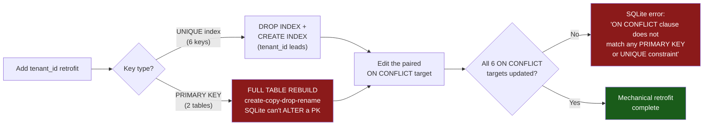
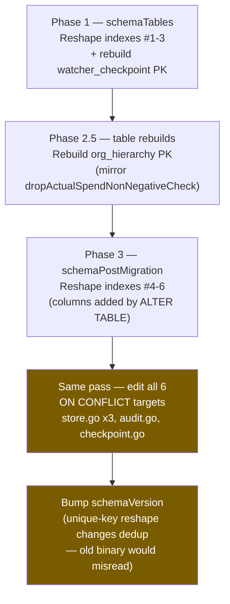

# Tenancy Retrofit Playbook

> **Status:** Planning reference. **No `tenant_id` column exists today** — TIER is single-tenant with global developer identifiers (see the tenancy warning in root `CLAUDE.md`). This document is the map a future retrofit follows; it adds no code and changes no schema.

> **📌 Scope:** This playbook enumerates exactly what a `tenant_id` retrofit touches in `internal/store`, grounded line-by-line in the current schema. It exists so the retrofit is budgeted correctly *before* production data accrues — because the cost of getting the budget wrong is a mid-migration surprise, not a rollback.

---

## Table of Contents

- [Why this must happen before production data accrues](#why-this-must-happen-before-production-data-accrues)
- [The one-way door, at a glance](#the-one-way-door-at-a-glance)
- [Inventory: everything a retrofit touches](#inventory-everything-a-retrofit-touches)
  - [1. Two PK tables need full REBUILDS](#1-two-pk-tables-need-full-rebuilds)
  - [2. Six UNIQUE indexes gain `tenant_id` as the leading column](#2-six-unique-indexes-gain-tenant_id-as-the-leading-column)
  - [3. Six coupled `ON CONFLICT` targets must move in the same pass](#3-six-coupled-on-conflict-targets-must-move-in-the-same-pass)
- [The merge-SHA fork collision: a semantic fix, not a prefix](#the-merge-sha-fork-collision-a-semantic-fix-not-a-prefix)
- [The rebuild dance (precedent in-tree)](#the-rebuild-dance-precedent-in-tree)
- [Retrofit sequence](#retrofit-sequence)
- [What stays tenant-agnostic](#what-stays-tenant-agnostic)
- [Cross-references](#cross-references)

---

## Why this must happen before production data accrues

The tenancy ordering constraint in root `CLAUDE.md` requires that `tenant_id` become the **leading** column of every unique key: today's `(developer, issue, …)` keys become `(tenant_id, developer, issue, …)`. As long as every new unique index is *shaped* so a `tenant_id` can prepend cleanly, the eventual retrofit stays **mechanical** — a schema transform, not a data-model redesign.

The audit that produced issue #243 verified this claim across **every** unique key in the schema. The verdict is reassuring and precise:

> ✅ **No unique key forces a data-model redesign.** Every reshape is mechanical.

But "mechanical" is not "free", and the in-tree comments understate the shape of the work in two ways this playbook corrects:

1. **Two of the keys are PRIMARY KEYs, not indexes.** SQLite cannot `ALTER` a primary key. Prepending `tenant_id` to a PK is a **full table rebuild** (create-copy-drop-rename), not a `DROP INDEX` / `CREATE INDEX` pair.
2. **The `ON CONFLICT` clauses are coupled to the key shapes.** Six `INSERT … ON CONFLICT(<columns>)` statements name their conflict target explicitly. Reshape a unique key without editing its paired `ON CONFLICT` and SQLite fails loudly: `ON CONFLICT clause does not match any PRIMARY KEY or UNIQUE constraint` (this failure mode is already acknowledged in the `insertTokenEventSQL` comment in `store.go`).

> **⚠️ The one-way door is planning-level.** A retrofit budgeted as *"recreate a handful of indexes"* will discover **two table rebuilds** and **six `ON CONFLICT` rewrites** mid-migration. It is cheap to record that today, while it is documentation. It is expensive to discover it with production spend, attribution, and invoice data already on disk — at that point a rebuild is a data-migration risk, not a paragraph in a playbook.

---

## The one-way door, at a glance



---

## Inventory: everything a retrofit touches

Every entry below is anchored to a **durable symbol** — an index name, an `ON CONFLICT` target-column set, or a function name — because `internal/store/store.go` is a ~4,000-line file under active change and absolute line numbers rot on the next edit. Where a line number still aids navigation it is given as **approximate** in `internal/store/store.go`, `internal/store/audit.go`, and `internal/store/checkpoint.go`; trust the symbol, not the number, if they disagree.

### 1. Two PK tables need full REBUILDS

SQLite has no `ALTER TABLE … ADD/ALTER PRIMARY KEY`. A `tenant_id`-leading PK means the table is recreated with the new key, its rows copied, the old table dropped, and the new one renamed into place.

| Table | Current PK | Anchor (`CREATE TABLE`) | Target key | Cost |
|---|---|---|---|---|
| `org_hierarchy` | `developer TEXT PRIMARY KEY` | `CREATE TABLE org_hierarchy` in `store.go` schema | `(tenant_id, developer)` | **Table rebuild.** Authoritative data (team/division/org mapping) — the copy step is load-bearing. |
| `watcher_checkpoint` | `path TEXT PRIMARY KEY` | `CREATE TABLE watcher_checkpoint` in `store.go` schema | `(tenant_id, path)` | **Rebuild or drop.** It is a documented derived cache (see its "derived cache" schema comment): safe to drop and let the `token_events` idempotency dedup rebuild it, so the copy step is optional and the cost is low. |

> **📌 Comment-accuracy note (from the #243 audit):**
> - `watcher_checkpoint` is a **PK, not an index**. Any comment describing its retrofit as index DDL overstates the mechanism — the correct framing is *rebuild-or-drop*, cheap precisely because the table is a derived cache.
> - `org_hierarchy` carries the same rebuild obligation but is **authoritative**, so its rebuild must copy rows; it cannot be dropped-and-rebuilt like the checkpoint cache.

A third PK table — `tier_migrations` (`name TEXT PRIMARY KEY`, `CREATE TABLE tier_migrations` in the `store.go` schema) — is intentionally excluded; see [What stays tenant-agnostic](#what-stays-tenant-agnostic).

### 2. Six UNIQUE indexes gain `tenant_id` as the leading column

Each of these is already column-ordered so `tenant_id` prepends without reordering the existing columns — the mechanical property the `CLAUDE.md` constraint requires. The retrofit is a `DROP INDEX IF EXISTS` + `CREATE UNIQUE INDEX` with the new leading column.

| # | Unique index (durable anchor) | Current columns | Schema block | Target key |
|---|---|---|---|---|
| 1 | `idx_developer_alias_alias` | `(alias)` | `schemaTables` | `(tenant_id, alias)` |
| 2 | `idx_period_membership_open` | `(developer, org)` partial `WHERE period_end IS NULL` | `schemaTables` | `(tenant_id, developer, org)` |
| 3 | `idx_quality_events_uq` | `(outcome_id, event_type, source_ref)` | `schemaTables` | `(tenant_id, outcome_id, event_type, source_ref)` |
| 4 | `idx_token_events_idempotency` | `(idempotency_key)` partial `WHERE idempotency_key IS NOT NULL` | `schemaPostMigration` | `(tenant_id, idempotency_key)` |
| 5 | `idx_outcomes_merge_commit_sha_uq` | `(merge_commit_sha)` partial `WHERE merge_commit_sha IS NOT NULL` | `schemaPostMigration` | `(tenant_id, merge_commit_sha)` — see [semantic note](#the-merge-sha-fork-collision-a-semantic-fix-not-a-prefix) |
| 6 | `idx_outcomes_push_daily_repo` | `(repo, issue_id, push_day)` partial `WHERE source = 'push'` | `schemaPostMigration` | `(tenant_id, repo, issue_id, push_day)` |

> **💡 Note:** Indexes 4–6 live in `schemaPostMigration` (the Phase-3 block), not `schemaTables`, because they reference columns added by `ALTER TABLE` on upgraded DBs (`idempotency_key`, `merge_commit_sha`, `repo`/`push_day`). A retrofit touches them in that same phase. Indexes 1–3 live in `schemaTables` (Phase 1); their columns exist at table creation.

> **✅ Already tenant-shaped (no reshape, listed for completeness):** several **non-unique** indexes were pre-ordered for the same retrofit — `idx_token_events_ts_id`, `idx_outcomes_ts_id`, `idx_token_events_scores`, and `idx_webhook_payloads_event_delivery`. They impose no uniqueness, so they never *force* the ordering — but prepending `tenant_id` keeps scans tenant-local. They are a follow-on, not a correctness blocker.

### 3. Six coupled `ON CONFLICT` targets must move in the same pass

Every `INSERT … ON CONFLICT(<columns>)` names a conflict target that **must** match a live PK or unique constraint. When a key in the table above changes shape, its paired `ON CONFLICT` target must change **in the same migration**, or SQLite rejects the statement at execution time.

The `ON CONFLICT(<columns>)` target-column set in the first column **is** the durable anchor — grep for it. Line numbers are approximate and will drift.

| # | `ON CONFLICT` target (durable anchor) | File (approx. line) | Bound to |
|---|---|---|---|
| 1 | `ON CONFLICT(idempotency_key) WHERE idempotency_key IS NOT NULL` | `store.go` (~1528) | Unique index #4 (`idx_token_events_idempotency`) |
| 2 | `ON CONFLICT (repo, issue_id, push_day) WHERE source = 'push'` | `store.go` (~1947) | Unique index #6 (`idx_outcomes_push_daily_repo`) |
| 3 | `ON CONFLICT(developer)` | `store.go` (~2284) | PK table `org_hierarchy` |
| 4 | `ON CONFLICT(alias)` | `store.go` (~3657) | Unique index #1 (`idx_developer_alias_alias`) |
| 5 | `ON CONFLICT (outcome_id, event_type, source_ref)` | `audit.go` (~250) | Unique index #3 (`idx_quality_events_uq`) |
| 6 | `ON CONFLICT(path)` | `checkpoint.go` (~62) | PK table `watcher_checkpoint` |

Each target gains `tenant_id` as its leading conflict column, e.g. `ON CONFLICT(alias)` → `ON CONFLICT(tenant_id, alias)`, and the partial-index predicates (`WHERE …`) carry through unchanged.

> **⚠️ One `ON CONFLICT` is deliberately NOT in this list.** The `merge_commit_sha` outcome dedup (#60) in `store.go` uses a **target-less** `ON CONFLICT DO NOTHING` (grep `ON CONFLICT DO NOTHING`). Because it names no columns, it matches *any* unique conflict and needs **no edit** on reshape. That is why the count is **six**, not seven — but it is the exception that proves the rule: the target-less form is the only one that survives a key reshape untouched.

> **📌 Provenance:** the comment on `insertTokenEventSQL` in `store.go` already documents this exact coupling failure — SQLite's UPSERT requires the conflict target's columns (and partial-`WHERE`) to match the index *exactly*, "otherwise the UPSERT silently doesn't fire and SQLite returns 'ON CONFLICT clause does not match any PRIMARY KEY or UNIQUE constraint.'" The retrofit inherits that requirement six times over.

---

## The merge-SHA fork collision: a semantic fix, not a prefix

For five of the six unique keys, `tenant_id` is a pure namespace prefix: it partitions otherwise-independent rows so two tenants' `alice` or issue `#42` stop colliding. `idx_outcomes_merge_commit_sha_uq` is different.

That index keys on `merge_commit_sha` **alone** — one merged PR ↔ one merge commit (#60). But a git merge SHA is content-addressed: **two tenants tracking forks of the same upstream repository will legitimately observe the identical merge SHA.** Under today's single-tenant, tenant-blind unique key, tenant B's merged-PR outcome would collide with tenant A's and be **silently dropped** by the `ON CONFLICT DO NOTHING` guard — one tenant's delivered work erased from its TIER score.

> **⚠️ For this key, `(tenant_id, merge_commit_sha)` is a correctness fix, not merely isolation.** The composite key is what makes the SHA unique *per tenant* rather than *globally*. It belongs to the same family of collision fixes as the `repo`-qualification of `idx_outcomes_push_daily_repo` (#231), where two repos sharing low issue numbers collided until `repo` joined the key. Treating it as a cosmetic prefix would under-scope the change and re-introduce the silent-drop bug at the tenant boundary.

---

## The rebuild dance (precedent in-tree)

The two PK-table rebuilds have a working precedent: the `dropActualSpendNonNegativeCheck()` function in `store.go`, which drops a `CHECK` constraint SQLite cannot `ALTER` away. It is the exact create-copy-drop-rename sequence a PK reshape needs, and a retrofit should mirror its structure:

```mermaid
sequenceDiagram
    participant Tx as beginImmediate (write lock up front)
    participant New as __new_&lt;table&gt;
    participant Old as &lt;table&gt;
    Tx->>New: CREATE TABLE with new (tenant_id, …) PK
    Tx->>New: INSERT … SELECT (copy every row, seed tenant_id)
    Tx->>Old: DROP TABLE
    Tx->>New: ALTER TABLE RENAME TO &lt;table&gt;
    Tx->>Tx: COMMIT (all-or-nothing)
```

Key properties inherited from the precedent (`dropActualSpendNonNegativeCheck()` in `store.go`):

- **Take the write lock up front** via `store.beginImmediate` (`internal/store/store.go`), so `busy_timeout=5000` can retry instead of racing to `SQLITE_BUSY`. ⚠️ Do **NOT** use `sql.TxOptions{Isolation: sql.LevelSerializable}` for this: `modernc.org/sqlite` never reads `opts.Isolation` (`tx.go`, `newTx` — the mode comes solely from the `_txlock` DSN param, which this DSN does not set), so it yields a plain **DEFERRED** `BEGIN` and the deferred-to-write upgrade fails with an unretried `SQLITE_BUSY_SNAPSHOT` (517) mid-rename. The precedent function still carries the old shape — see #598.
- **Idempotent guard:** the precedent inspects `sqlite_master` and no-ops if the constraint is already gone. A retrofit must likewise no-op once `tenant_id` is present, so re-running `Open()` is safe.
- **All-or-nothing:** the whole dance is one transaction; a failure mid-rename rolls back to the pre-migration table.

> **💡 For `org_hierarchy` the `INSERT … SELECT` copy is mandatory** (authoritative rows). For `watcher_checkpoint` the copy is optional — dropping the derived cache and letting the `token_events` idempotency dedup rebuild tail state is a legitimate, cheaper path.

---

## Retrofit sequence



> **⚠️ `schemaVersion` must bump.** A `tenant_id`-leading unique-key reshape changes dedup behavior — exactly the case the `schemaVersion` bump-convention comment in `store.go` calls out as "a unique-index reshape that changes dedup behavior." An old binary opening a tenant-partitioned DB would misread it, so the refuse-if-newer gate must lock it out.

---

## What stays tenant-agnostic

| Object | Durable anchor | Why it is excluded |
|---|---|---|
| `tier_migrations` (`name TEXT PRIMARY KEY`) | `CREATE TABLE tier_migrations` in `store.go` | Records which one-shot data migrations ran **on this database file**. Migration identity is a property of the file, not a tenant — every tenant in one DB shares one migration ledger. It never gains `tenant_id`. |
| Target-less `ON CONFLICT DO NOTHING` (merge_commit_sha dedup) | grep `ON CONFLICT DO NOTHING` in `store.go` | Names no columns, matches any unique conflict, survives a key reshape untouched. |
| Non-unique indexes (ts/id, scores, webhook lookup) | `idx_token_events_ts_id`, `idx_outcomes_ts_id`, `idx_token_events_scores`, `idx_webhook_payloads_event_delivery` | Impose no uniqueness, so they never *force* the ordering. Prepending `tenant_id` is a scan-locality follow-on, not a correctness blocker. |
| `session_id` (a future grouping key, not yet indexed) | `session_id` column in the `token_events` `CREATE TABLE` | If a grouping index lands for the cost-composition consumer (#234), it must lead with `tenant_id` → `(tenant_id, session_id, ts)` — recorded here so that retrofit also stays mechanical. |

---

## Cross-references

- **Issue #243** — the structural audit that produced this playbook. Documentation only; honors the #65 YAGNI deferral.
- **Issue #65** — the honesty pass establishing that multi-tenancy (like CockroachDB and NATS JetStream) is *aspirational enterprise-tier design intent*, not current capability. The `tenant_id` column is deferred until a real driving requirement exists.
- **Issue #275 (ruling B)** — the productization-posture decision: ship **self-hosted, single-tenant now, tenancy-ready** rather than building multi-tenancy today. Tenancy-*ready* is precisely the discipline this playbook preserves: keep every unique key shaped so the eventual retrofit stays mechanical, so that self-hosted-now does not foreclose SaaS-later. Auth (#271), the GitHub App (#272), and member management (#273) all create tenant-shaped state, so build order against tenancy is the one-way door this document keeps cheap.
- **Root `CLAUDE.md`** — the authoritative tenancy ordering constraint (`tenant_id` leads every unique key) and the "no tenant isolation exists today" warning.
