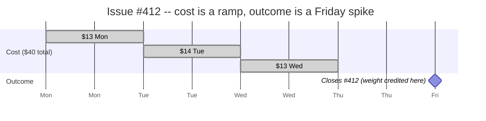
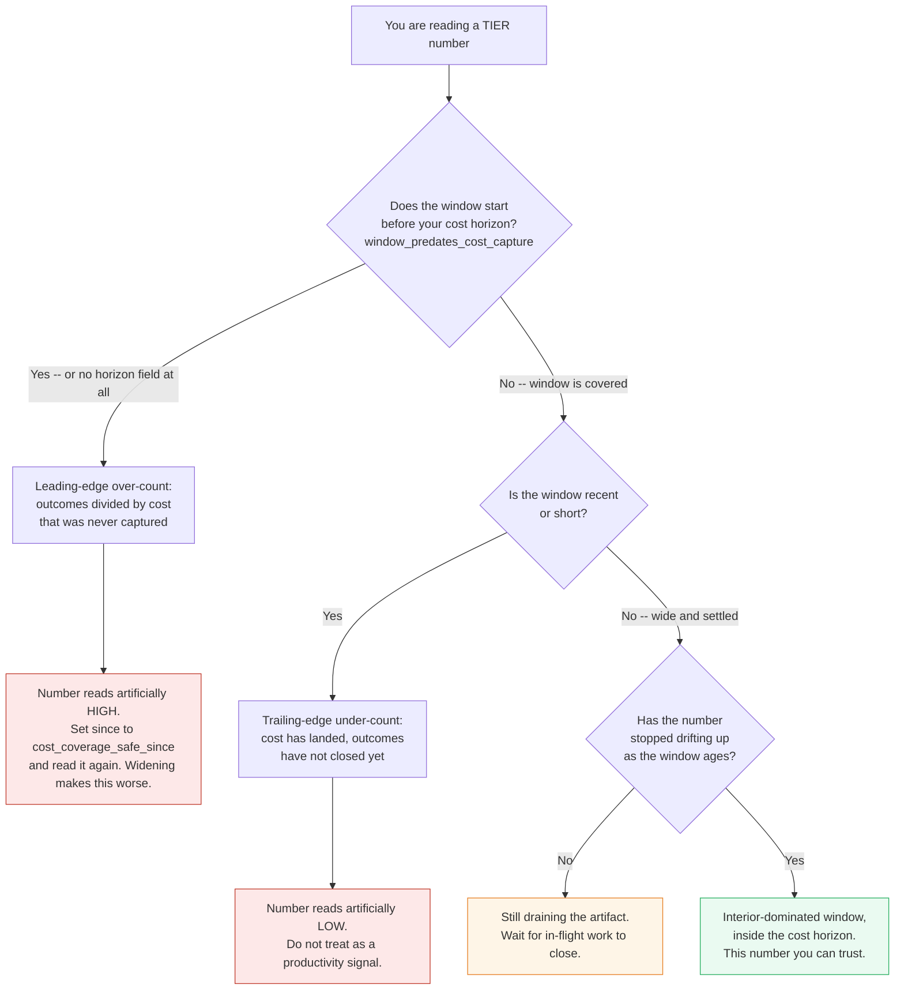

# Interpreting the TIER Number

> **Read this before you trust a TIER score.** TIER is honest about its own
> limits. The single most common way to misread the headline number is to
> trust a **recent or short window** -- and the reason is a measurement-timing
> artifact, not anything about how productive the work was.

## Table of contents

- [The one-sentence version](#the-one-sentence-version)
- [Why the skew exists: cost is forward, outcome is a close-time event](#why-the-skew-exists-cost-is-forward-outcome-is-a-close-time-event)
- [A worked mini-example](#a-worked-mini-example)
- [Both edges of every window are wrong -- in opposite directions](#both-edges-of-every-window-are-wrong----in-opposite-directions)
- [The leading edge is not small on a default install](#the-leading-edge-is-not-small-on-a-default-install)
- [Practical guidance](#practical-guidance)
- [This is a different problem from low attribution coverage](#this-is-a-different-problem-from-low-attribution-coverage)
- [The honesty surfaces that DO exist -- and what each one catches](#the-honesty-surfaces-that-do-exist----and-what-each-one-catches)
- [Summary](#summary)

---

## The one-sentence version

TIER's headline is

```
TIER = Σ(outcome_weight × quality_multiplier) / (cost_usd / $1,000)
```

computed over a half-open window `[since, until)`. **The numerator (outcome)
and the denominator (cost) are windowed independently, each by its own
timestamp** -- and those two timestamps mean different things in time. Cost is
timestamped when the tokens were spent; outcome is timestamped when the work
**closed**. Because closing happens days or weeks after the spend that produced
it, a recent or short window shows cost that has already landed against outcomes
that have not been credited yet. **The ratio reads artificially low early, then
rises as outcomes close.**

---

## Why the skew exists: cost is forward, outcome is a close-time event

Two different clocks feed the two halves of the ratio.

| Half of the ratio | What is summed | Timestamp used to window it | When that timestamp lands |
|---|---|---|---|
| **Denominator (cost)** | `token_events.cost_micro` | `token_events.ts` | **Continuously**, in real time, as tokens are spent |
| **Numerator (outcome)** | `outcomes.weight × outcomes.quality` | `outcomes.ts` | **At the instant the work closes** (see below) |

The scores handler runs `DeveloperCostsWindow(since, until)` and
`AllOutcomesWindow(since, until)` as two **separate** windowed reads over the
same `[since, until)`. It then joins them **by identity** (developer, and for
per-type segments the `(developer, issue)` pair) -- **not by time**. So a cost
row and the outcome it eventually produces only both appear in a window if
*both* of their independent timestamps happen to fall inside it.

### What "outcome timestamp" precisely means (verified against the code)

This is the crux, so it is worth stating exactly. The outcome's `ts` is **not**
backdated to the cost window. It is a **point event stamped at close time**:

- **PR-merge capture** (the `closes #N`-on-merge path, the common case):
  `outcomes.ts` is set to `time.Now().UTC()` at the moment the merge webhook is
  processed -- i.e. **merge / close time**
  (`internal/webhook/handler.go`).
- **Push-to-default-branch capture** (trunk-based teams, opt-in `#196`):
  `outcomes.ts` is the **commit timestamp** of the qualifying push.
- The `outcomes.ts` column itself defaults to SQLite `CURRENT_TIMESTAMP`, but
  every live capture path supplies the event instant explicitly.

So the outcome is credited **all at once, at the close/commit instant** -- it is
**never spread back across the days when the cost was actually spent.** The cost
for that same issue, by contrast, was dribbled in continuously over those
earlier days. The numerator is a spike at the end; the denominator is a ramp
leading up to it. Window them independently and the two rarely line up.

> **On the word "backfilled":** it is fair to say the outcome credit *appears*
> only once the work closes. But do not picture it as filling in the earlier
> cost days -- it does not. It lands as a single dated event at close, which is
> exactly why the trailing edge of a window sees the cost but misses the
> outcome.

---

## A worked mini-example

A developer spends **$40** of AI budget on issue **#412** across **Monday
through Wednesday**. The PR merges and closes #412 on **Friday**.

Now read that same work through three different windows:



| Window `[since, until)` | Cost seen | Outcome seen | TIER reads | Reality |
|---|---|---|---|---|
| **Mon 00:00 -> Thu 00:00** | $40 | **0** (close is Friday) | **0** | Looks catastrophic. Nothing has closed *yet*. |
| **Mon 00:00 -> Sat 00:00** | $40 | full weight of #412 | correct | The window is wide enough to contain both the spend *and* the close. |
| **Fri 00:00 -> Sat 00:00** | ~$0 | full weight of #412 | **huge** | The close is inside; its cost fell before `since`. Flattering and equally wrong. |

The **Mon->Thu** window is the day-1 trap: **the $40 is real, the score of 0
is a lie of timing.** Wait for Friday and the same work scores fine. Nothing
about the work changed between Thursday and Friday -- only the measurement caught
up.

> **A note on the "huge" cell:** the number blows up because a *little* residual
> cost (a Friday tweak) still lands under a large closed-outcome weight. If a
> leading-edge window contains **literally $0** of cost, the engine guards the
> ratio on a positive denominator (`internal/scoring/engine.go`) and reports
> **TIER 0**, not infinity -- so the failure surfaces as a suspicious zero rather
> than a divide-by-zero. Either way the reading is an artifact of the window
> edge, not of the work.

---

## Both edges of every window are wrong -- in opposite directions

The example generalizes. **Every** window has two suspect edges:

- **Trailing edge (near `until`, "now"): under-counts outcome.** Work whose
  cost landed inside the window but which closes *after* `until` contributes
  cost with **no** outcome. This drags the ratio **down**. The default `/scores`
  window is a trailing **90-day open window** (`since` defaults to 90 days ago,
  `until` open) -- so the newest weeks of any live deployment are *always* in
  this under-counted zone.
- **Leading edge (near `since`): over-counts outcome.** An outcome that closes
  inside the window but whose cost was spent *before* `since` contributes weight
  with **no** matching cost. This pushes the ratio **up**.

In a wide, settled window these two edge effects are small relative to the bulk
of fully-contained work. In a **short** window they can dominate the number
entirely.

## The leading edge is not small on a default install

The paragraph above holds only when your window starts *after* TIER began
capturing cost. That is the case worth checking first, because on a default
install it is usually **false**.

Every installation has a **cost horizon**: the date capture began. Outcomes do
not respect it -- issues and PRs are read from your tracker and backfill freely,
including work that closed long before you installed TIER. Cost does not
backfill. It exists from the horizon forward and nowhere earlier.

So if `since` reaches back past the horizon, the leading edge is not a thin
sliver of boundary-crossing work. It is **every outcome in the uncovered
stretch, divided by no cost at all** -- and it pushes the number **up**.
On one real multi-repo installation, the API's default 90-day window read **about
twice** what the same installation reported once the window was narrowed to the
period cost capture actually covered -- most of its cost, but well under half its
outcomes, sat inside the last 30 days. The overstatement is in the flattering
direction, which is the direction nobody questions.

**This is not log retention, and no retention setting fixes it.** TIER's store is
an append-only archive -- extracted cost events outlive the provider session
logs they were read from, and installations routinely hold events from days
whose original logs are long gone. The horizon is simply *when you started*. A
brand-new install has a horizon of **today**, even with years of session logs
sitting on disk.

**How to check it.** A `/api/v1/scores` response carries the answer in its
`data_quality` block:

- `cost_coverage_start` -- your horizon, as a timestamp.
- `window_predates_cost_capture` -- `true` when the window you asked for starts
  before it. This is emitted as an explicit `false` when the window is covered,
  so "checked and clean" is always distinguishable from "not checked".
- `cost_coverage_safe_since` -- the earliest `since` that will *not* predate the
  horizon. Use this value rather than deriving one from the timestamp: because
  `since` is a date and the horizon is an instant, the horizon's own day is
  usually still too early by a few hours.
- `source_coverage_start` -- per capture path, when more than one is recording.
  The global horizon is the loosest bound: a window can clear it and still
  predate one path entirely.

Two cases emit no horizon fields at all, and neither means "covered": a store
holding no cost yet (there is no horizon to compare against), and a failure of
the horizon query itself (logged server-side). Absence is never a clean bill of
health -- that is the whole reason the covered case emits an explicit `false`
rather than staying quiet.

The dashboard renders the same signal as a banner, and `tierd doctor` reports it
as a named `cost horizon` check. **When the flag is true, set `since` to
`cost_coverage_safe_since` before comparing anything to anything.**

Note that this bound is about *coverage in time* only. A window that clears the
horizon can still have most of its spend attached to no issue -- that is
attribution coverage, a separate measurement with its own surface.

---

## Practical guidance

> **Rule of thumb: check the cost horizon first, then do not trust a TIER number
> until the window is wide enough that most of the work started inside it has
> also *closed* inside it.**

The horizon comes first because it is a hard bound, not a tendency: no amount of
widening, waiting or settling improves a window that starts before your cost
data does. Widening makes it worse.

- **Check `window_predates_cost_capture` before anything else.** If it is
  `true`, nothing further in this section applies -- fix the window start first,
  then read the number.
- **Do not read "day 1", or the last few days of any window, as a productivity
  signal.** Early low numbers are the trailing-edge artifact resolving itself,
  not a team underperforming.
- **Prefer windows several times wider than your typical issue lead time --
  but never wider than your cost horizon.** If a PR usually takes ~1 week from
  first token to merge, a 1-week window is almost all edge; a 1-quarter window
  is almost all settled interior. A window that reaches past the horizon,
  however, gets *worse* the wider it goes: it adds outcomes with no cost beside
  them.
- **When comparing two periods, compare two *settled* periods.** Never compare a
  mature quarter against the current, still-open one -- the open one is
  guaranteed to look worse purely because its recent work has not closed. Check
  the horizon on *both* windows: the older one is the more likely to predate it,
  and that alone can manufacture an apparent trend.
- **Expect the number to rise as a fixed window ages** (as its in-flight work
  closes), then stabilize. That drift is the artifact draining out. A number
  that has stopped drifting is one you can trust **provided the window clears
  the horizon** -- a horizon-predating window is stably wrong, and stability is
  not evidence of correctness.
- **The edge effects above are a timing artifact** -- not a capture failure, and
  not a statement about the engineering, just the arithmetic of windowing two
  clocks that tick at different times. **The cost horizon is the exception:**
  that one *is* a coverage bound, and it is the one case in this document where
  the number is wrong because data is genuinely absent rather than merely
  early.

---

## This is a different problem from low attribution coverage

It is easy to conflate the windowing skew with TIER's *other* honesty caveat,
attribution coverage. They are independent, and a window can be perfectly clean
on one and badly skewed on the other:

- **Attribution coverage** asks: *of the cost in this window, how much maps to a
  known issue at all?* Unlabeled / exploratory spend that never links to any
  issue is the failure mode. Surfaced by `attributed_cost_share`.
- **The windowing skew** asks: *of the cost that DOES map to an issue, has that
  issue closed inside the window yet?* Here the cost is perfectly attributed --
  it just has not been paid back in outcome yet.

A window can show **100% attribution coverage and still read a skewed, too-low
TIER**, because every dollar maps to an issue but half those issues have not
closed. No single honesty surface below catches the timing skew on its own --
which is precisely why this document exists. (The cost-horizon signal is the one
exception, and it catches only the leading-edge case: a window that starts
before capture did.)

---

## The honesty surfaces that DO exist -- and what each one catches

TIER ships several trust signals. Each is real and each catches a *different*
distortion. Read them together; none is a substitute for choosing a sane window.

| Surface | Where | What it catches | What it does NOT catch |
|---|---|---|---|
| **`attributed_cost_share`** + the attribution-coverage banner | `data_quality.attributed_cost_share` on `GET /scores`; dashboard banner (`renderAttributionCoverage`). Renders a red **warning** below a 50% coverage threshold. | Windows where a large share of spend maps to **no** issue (exploratory / unlabeled overhead). | The timing skew -- attributed spend whose issue simply has not closed yet still counts as "attributed". |
| **`tierd doctor --min-attribution`** | `cmd/tierd/doctor.go`. Attribution-coverage **floor** (default `0.5`; "healthy" at `>= 0.8`). Below the floor the check is a hard **FAIL** (non-zero exit), not a warning. | An install whose branch/label hygiene is too poor for TIER to attribute cost at all -- refuses to green-light it. | Same blind spot: it measures coverage, not close-timing. |
| **`cost_per_point`** | `internal/scoring/engine.go` (`TotalCostUSD / weighted_points`). The dollars-per-weighted-point unit; a higher TIER is a lower `cost_per_point`. | The **label-culture-robust** reading: because it is a cost *per point*, it is the unit to compare across teams whose absolute weight scales differ, provided the rubric version matches. | The timing skew -- it is the same ratio inverted, so a skewed window skews `cost_per_point` too (it just reads high instead of low). |
| **Zero-outcome tripwire** (`#189`) | `tierd serve` WARN log + `tier_zero_outcome_tripwire` gauge. | The *extreme* end of this skew: cost accrued but **zero** outcomes in the window (broken webhook, or trunk team with no push capture). | Partial skew -- a window with *some* but not-yet-all outcomes closed does not trip it. |
| **`window_predates_cost_capture`** + the cost-horizon banner | `data_quality` on `GET /scores` and on both windows of `GET /scores/compare`; dashboard banner (`renderCostHorizon`); `tierd doctor` **cost horizon** check. Emits an explicit `false` when covered, so silence is never mistaken for clean. | The **leading-edge** case: a window starting before this installation captured any cost, so outcomes are divided by cost that does not exist. Reads too HIGH. | The trailing edge, and attribution. A window can clear the horizon and still be mostly unattributed or mostly unclosed. |

> **Guiding principle.** *Correctness over marketing; dollar value, not token
> count.* This page is TIER being candid about a real limitation of its own
> headline metric. A number that flatters a short window is not a number worth
> shipping.

---

## Summary



- Cost is **forward** and continuous; outcome is a **point event at close**.
- They are windowed **independently**, then joined by identity -- so a window
  only credits work whose spend *and* whose close both fall inside it.
- The **trailing edge under-counts** outcome (reads low); the **leading edge
  over-counts** it (reads high).
- **Trust wide, settled windows; distrust recent and short ones.** The drift you
  see as a window ages is the artifact resolving, not the team changing.

See also: [How It Works -- section 6, the formula](how-it-works.md#6-how-it-says-this-many-tokens--this-much-code--this-much-value)
and [section 4, outcome attribution](how-it-works.md#4-how-it-assigns-functionality-outcome-attribution).
